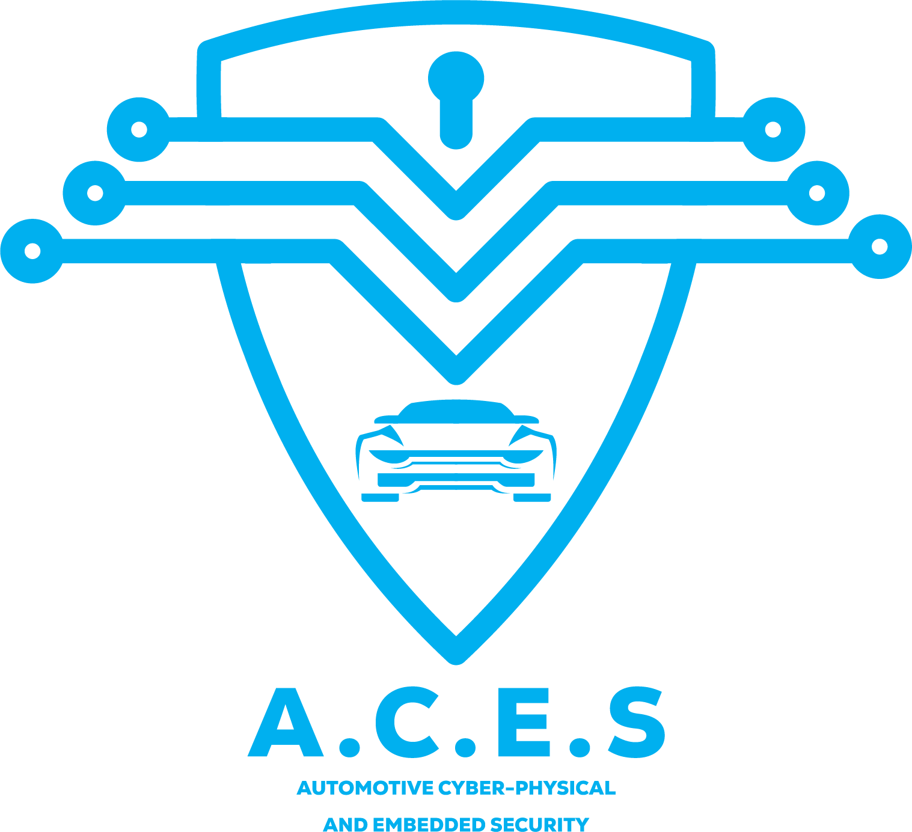

# ACES: Automotive, Cyber-Physical and Embedded Security

## Description
This repository contains all the research output of the ACES (Automotive, Cyber-Physical and Embedded Security) research group of the University of Modena and Reggio Emilia. The group is part of the SECloud group [(website)](https://secloud.ing.unimore.it).

## References
 - [[Automotive] ACS GitHub repository](https://github.com/SECloudUNIMORE/ACS/)
 - [[Embedded] IP Cam CVE report](Tenda/)
