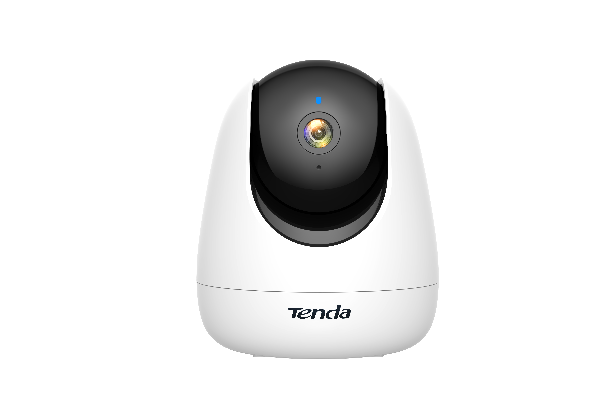

# Tenda CP3 Research output

    

## Description
This page contains the details of different CVEs found in the security analysis of the Tenda CP3 camera.

## Table of content

| CVE ID                  | Name    | Link          |
| ----------------------- | ------- | ------------- |
| [CVE-2023-30351](https://www.cve.org/CVERecord?id=CVE-2023-30351) | Remote access via hard-coded credentials | [1](CP3/tmp_PRA.md), [2](CP3/tmp_RRA.md) |
| [CVE-2023-30352](https://www.cve.org/CVERecord?id=CVE-2023-30352) | RTSP feed access via hard-coded credentials | [1](CP3/tmp_RTSPa.md) |
| [CVE-2023-30353](https://www.cve.org/CVERecord?id=CVE-2023-30353) | Unauthenticated RCE | [1](CP3/tmp_uRCE.md) |
| [CVE-2023-30354](https://www.cve.org/CVERecord?id=CVE-2023-30354) | Physical access and WiFi credentials disclosure | [1](CP3/tmp_NCD.md), [2](CP3/tmp_PBA.md) |
| [CVE-2023-30356](https://www.cve.org/CVERecord?id=CVE-2023-30356) | Missing support for Integrity Check | [1](CP3/tmp_MU.md) |

## Authors

 - [Tobia Bocchi](https://tobiabocchi.me/)
 - [Filip Valgimigli](http://personale.unimore.it/Rubrica/dettaglio/filgimigli)
 - [Dario Stabili](https://www.unibo.it/sitoweb/dario.stabili) 
 - [Mirco Marchetti](https://personale.unimore.it/rubrica/dettaglio/mmarchetti)