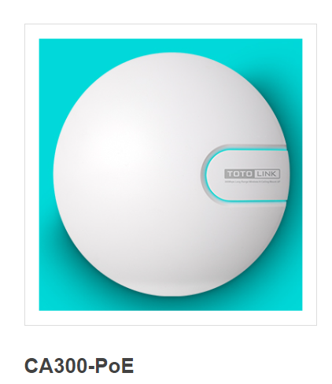
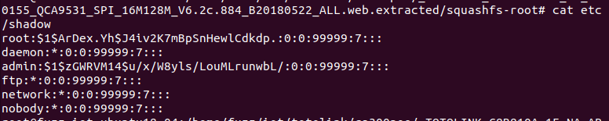
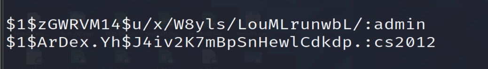

# TOTOLINK  CA300-PoE V6.2c.884 was discovered to contain a hard code password for root stored in the component /etc/shadow.

## Description

There is a hard code password for root in /etc/shadow



## Firmware information

* Manufacturer's address:https://www.totolink.net/
* Firmware download address : https://www.totolink.net/home/menu/detail/menu_listtpl/download/id/139/ids/36.html


## Affected version

**Version: V6.2c.884**


## Vulnerability details



```
root:$1$ArDex.Yh$J4iv2K7mBpSnHewlCdkdp.:0:0:99999:7:::
daemon:*:0:0:99999:7:::
admin:$1$zGWRVM14$u/x/W8yls/LouMLrunwbL/:0:0:99999:7:::
ftp:*:0:0:99999:7:::
network:*:0:0:99999:7:::
nobody:*:0:0:99999:7:::
```



after decrypt the passwd we got `cs2012`

