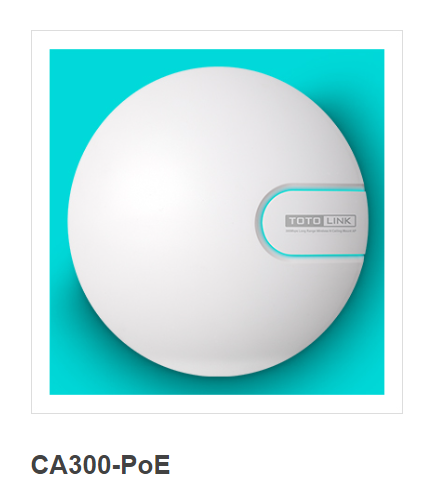

# TOTOLINK  CA300-PoE V6.2c.884 was discovered to contain a hard code password for the telnet service stored in the component /etc/config/product.ini

## Description

There is a hard code password for telnet in **/etc/config/product.ini**

## Firmware information

* Manufacturer's address:https://www.totolink.net/
* Firmware download address : https://www.totolink.net/home/menu/detail/menu_listtpl/download/id/139/ids/36.html

## Affected version

**Version: V6.2c.884**

## Vulnerability details

