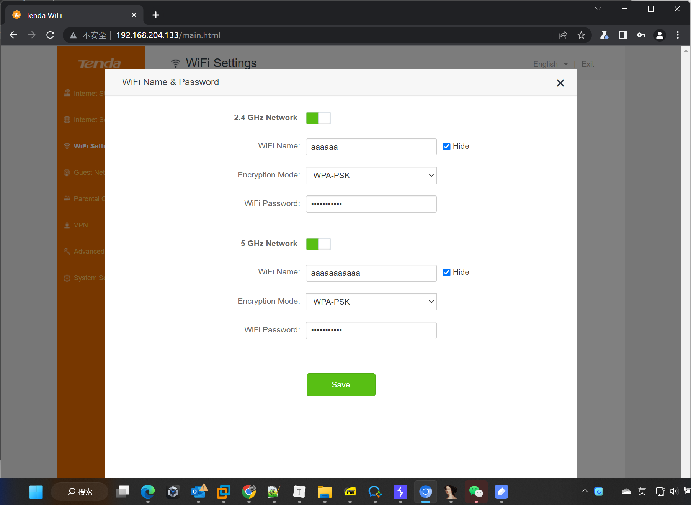

# Tenda AC6V1.0 V15.03.05.19 Stack overflow vulnerability

## Firmware information

* Manufacturer's address: https://www.tenda.com.cn/

* Firmware download address : https://www.tenda.com.cn/download/detail-2681.html

## Affected version

## Vulnerability details

This vulnerability lies in the `/goform/WifiBasicSet` page，While processing the `security` parameters for a post request, the value is directly `strcpy` to a local variable placed on the stack, which overrides the return address of the function, causing buffer overflow. The details are shown below:

## POC

This PoC can result in a Dos.

