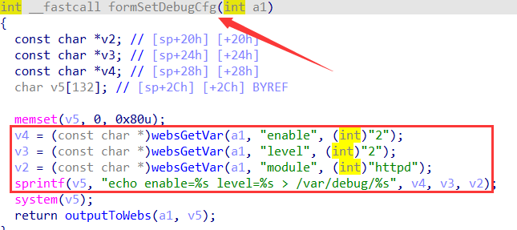
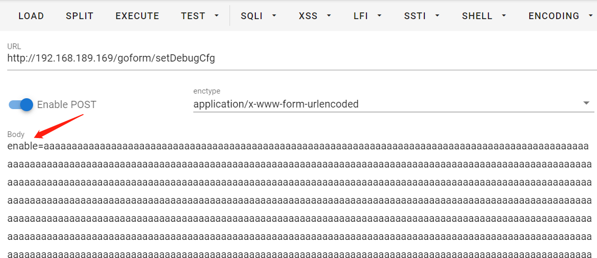
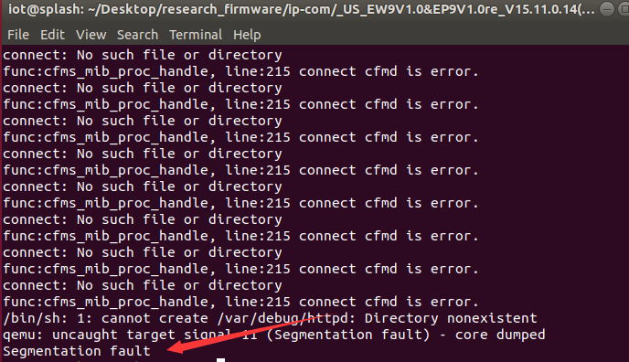

**Brand**:IP-COM

**Firmware link**:https://www.ip-com.com.cn/product/download/EW9.html

**Vulnerability details**

formSetDebugCfg 

**The details of attack**

The httpd service can be emulated using QEMU

Initializing and set password

httpd crash！
