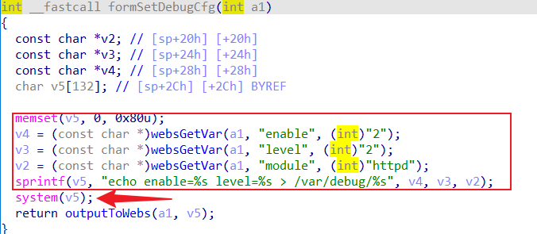
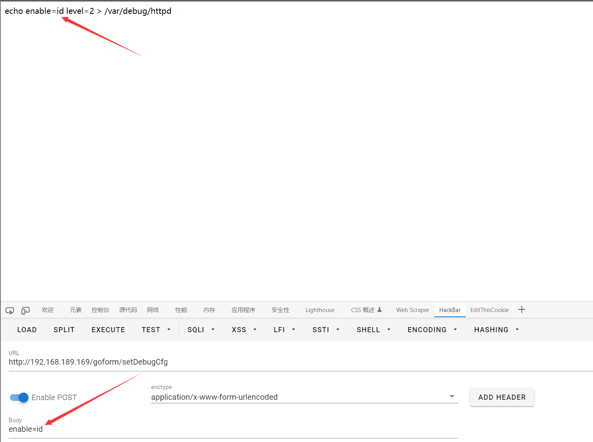
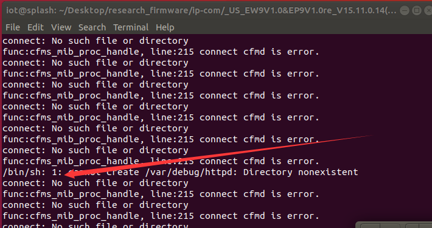
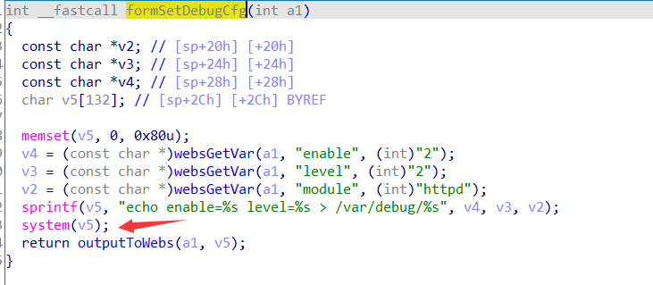

**Brand**:IP-COM

**Firmware link**:https://www.ip-com.com.cn/product/download/EW9.html

**Vulnerability details**

formSetDebugCfg

**The details of attack**

The httpd service can be emulated using QEMU

Initializing and set password

You can see that a system command was invoked and failed due to the lack of a real environment, but from the pseudocode and the preceding text, you can confirm that the command injection vulnerability is present

