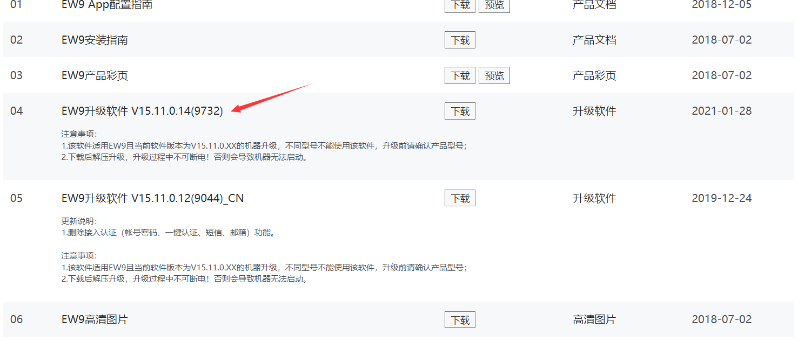
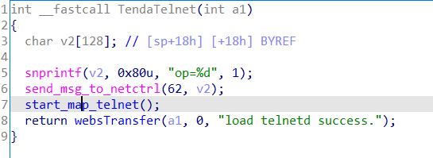
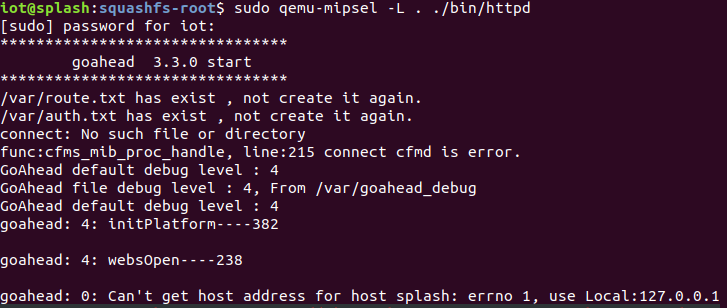
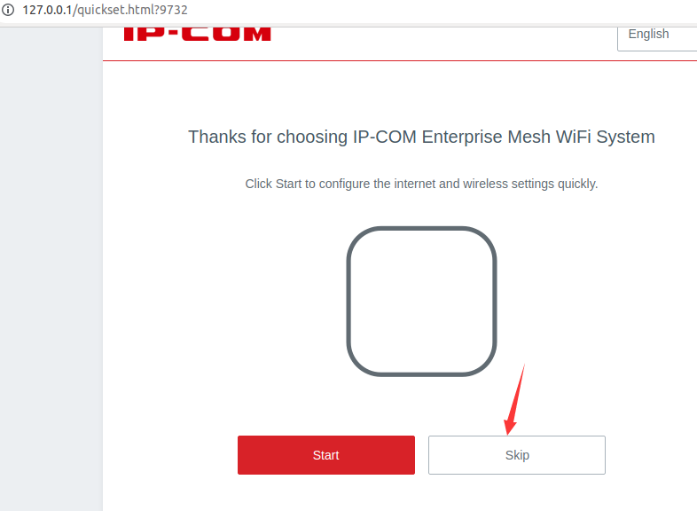
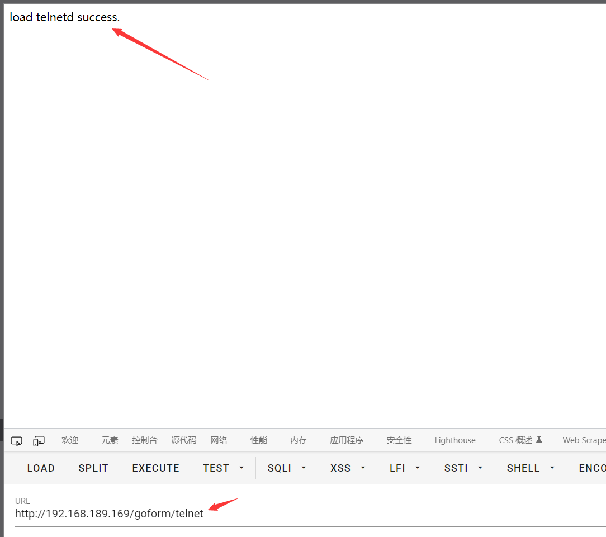

**Brand**:IP-COM

**Firmware link**:https://www.ip-com.com.cn/product/download/EW9.html

**Vulnerability details**

TendaTelnet

**The details of attack**

The httpd service can be emulated using QEMU

Initializing and set password

You can log in with a web password, which failed to open in this case due to the lack of a real-world environment, but the code shows that it can open in a real-world environment or Decrypt credentials in password
