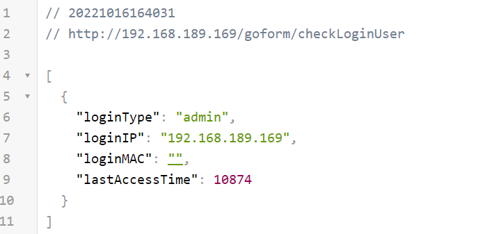
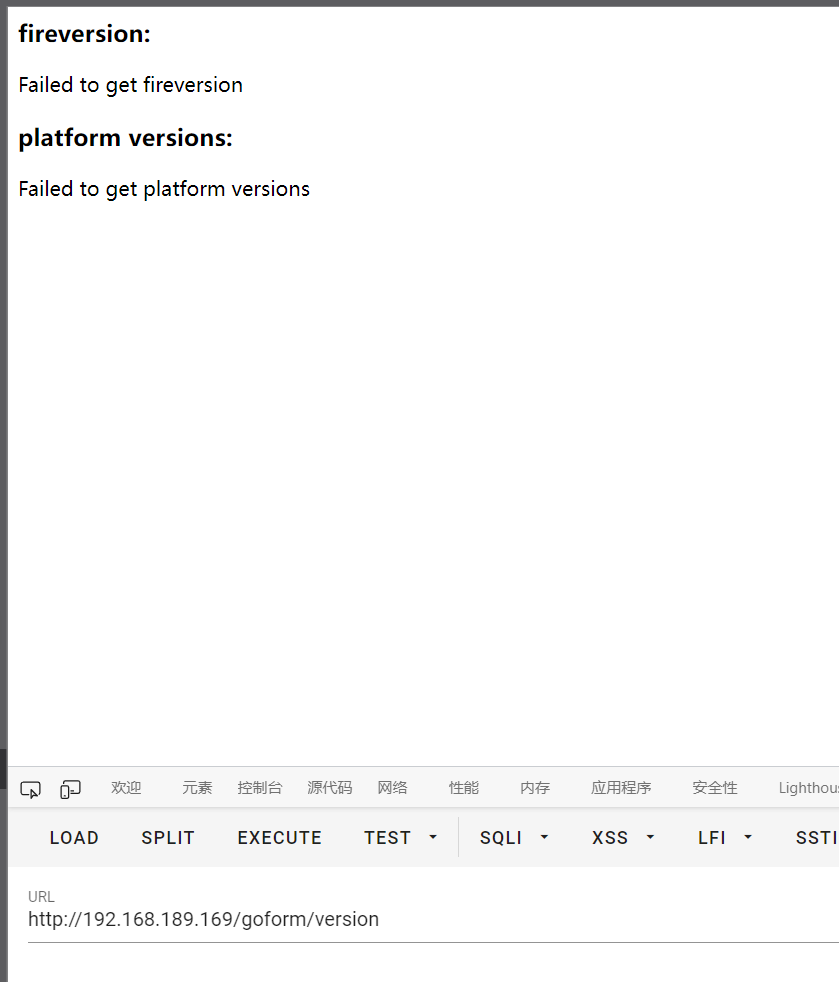

**Brand**:IP-COM

**Firmware link**:https://www.ip-com.com.cn/product/download/EW9.html

**Vulnerability details**

There are multiple unauthorized access interfaces

**The details of attack**

The httpd service can be emulated using QEMU

Initializing and set password

You can then actively log out and accessing the above interface,Note that there are more than the two unauthorized interfaces mentioned above

