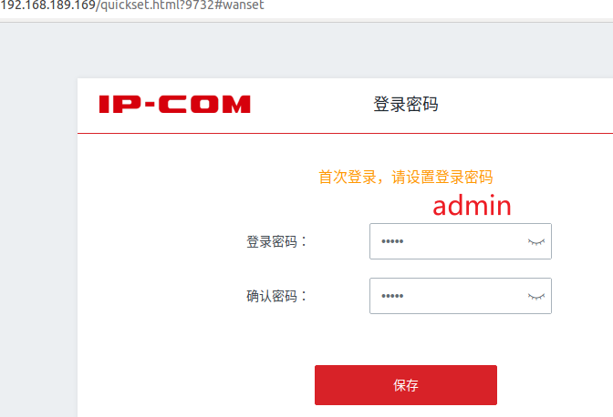
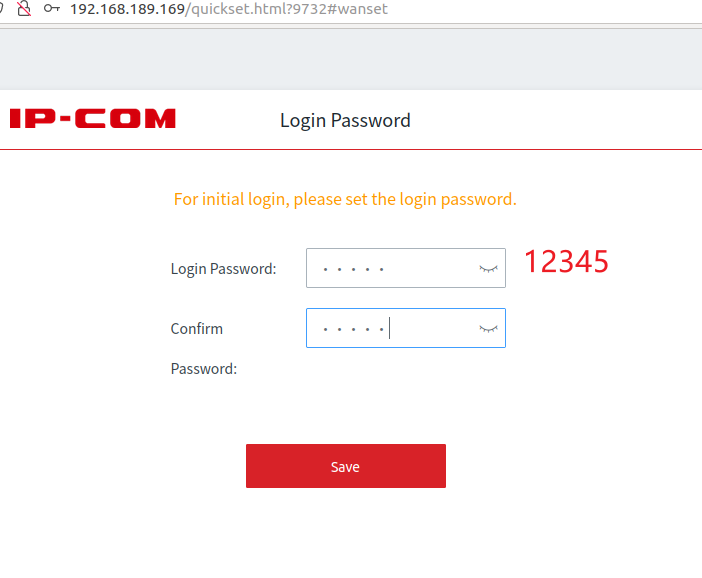

**Brand**:IP-COM

**Firmware link**:https://www.ip-com.com.cn/product/download/EW9.html

**Vulnerability details**

The Reset password page is not properly validated

**The details of attack**

The httpd service can be emulated using QEMU

Initializing and set password，at the same time, use a different browser or an anonymous mode to mimic the attacker scenario，Also visit http://192.168.189.169/quickset.html?9732，

First, the normal initialization password is admin, and login, can be used normally,

The second step uses attacker mode to access the password initialization page

At this point, the password will be reset, and the original password will be reset to 12345 to achieve a bypass

