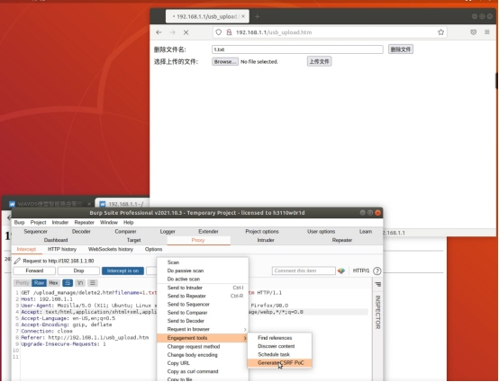
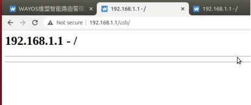

**brand**：WAYOS

**The firmware link：**http://www.wayos.com/products/LQ09.html     08 07 06 05 04

**versions：**

LQ_09-22.03.17V
LQ_08_A2-22.03.17V
LQ_07_A2-22.03.17V
LQ_06_A2-22.03.17V
LQ_05_A2-22.03.17V
LQ_04-22.03.17V

**exploit：**

Usb_upload.htm is not authenticated

Without authentication, deleting the file will fail, capture the packet to generate CSRF Poc, open it with an authenticated browser, click Submit, and the file will be successfully deleted.

This vulnerability affects all routing gateway devices with USB sharing capabilities and affects both the latest and historical firmware