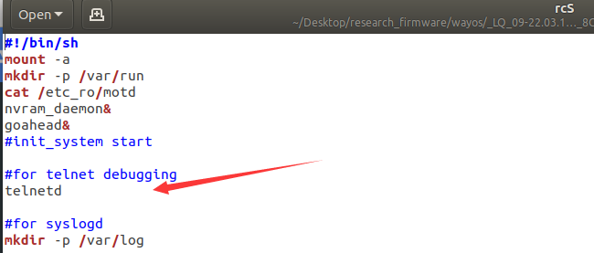
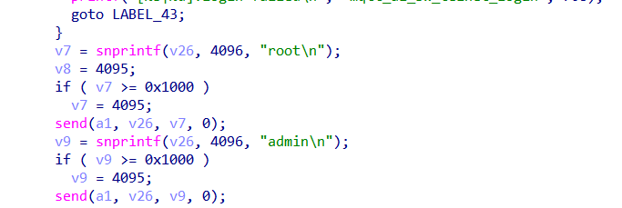
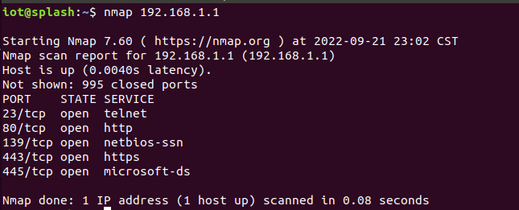
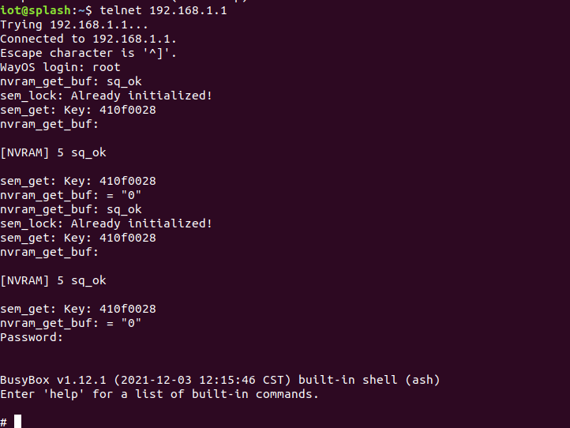

**brand**：WAYOS

**The firmware link：**http://www.wayos.com/products/LQ09.html     08 07 06 05 04

**versions：**

LQ_09-22.03.17V
LQ_08_A2-22.03.17V
LQ_07_A2-22.03.17V
LQ_06_A2-22.03.17V
LQ_05_A2-22.03.17V
LQ_04-22.03.17V

**details：**

The system starts telnetd from scratch，and the account information can be found in the firmware

**exploit：**

You can emulate firmware or use a real device

The default account password is root/admin

After the system starts, probe the port

Login to Telnetd using the default password, root/admin

