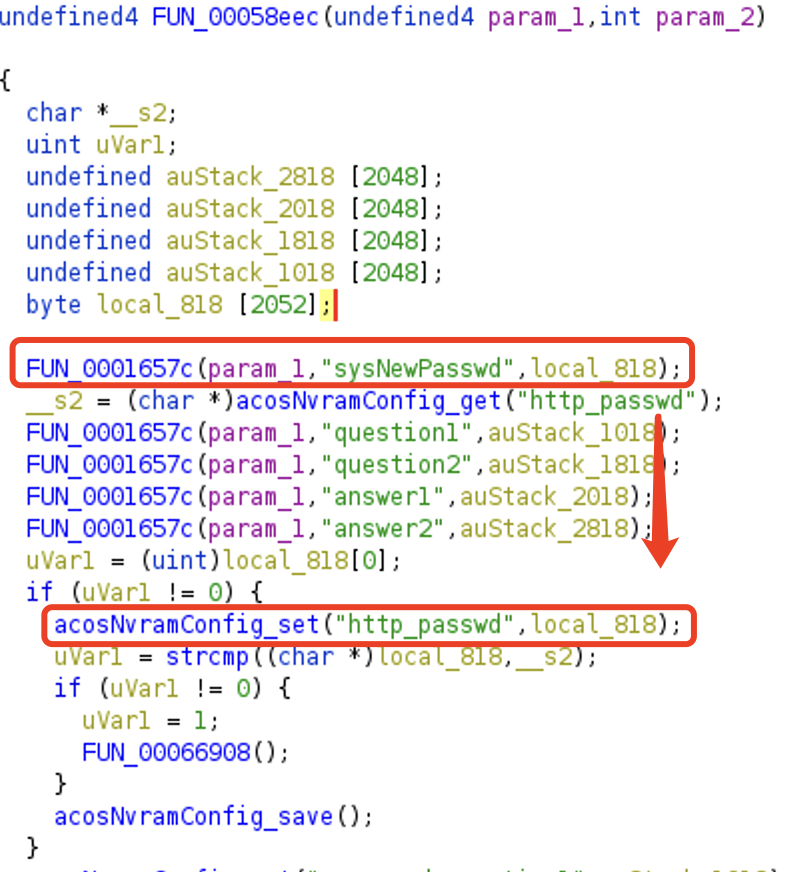
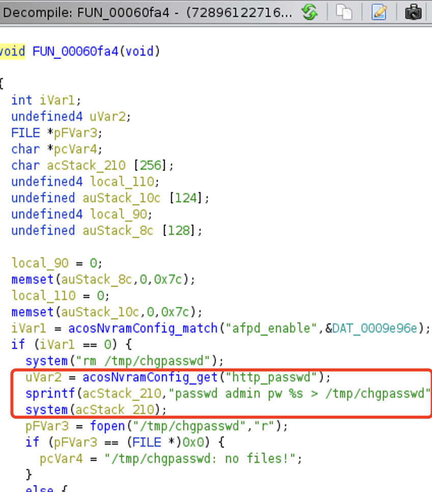
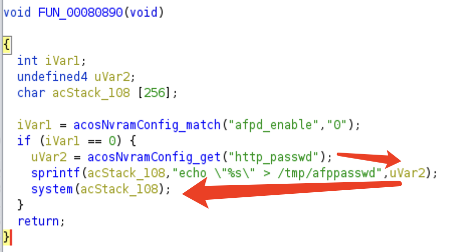

# AFP passwd Command Injection/Buffer Overflow

An attacker authenticated as admin can change the http_passwd in admin_account.cgi, set afpd_enable to 1, and trigger the vulnerability in functions that set paddword of AFP.

# Affected Versions

Following are products and versions where we found the vulnerability. Other products and versions may also be vulnerable to this vulnerability.

* R6300v2
  * 1.0.4.8
* R6700v3
  * 1.0.4.98
* R6400v2
  * 1.0.4.98
* R7300DST
  * 1.0.0.74
* R8300
  * 1.0.2.94
* R6250
  * 1.0.4.8
* R8500
  * 1.0.2.94
* R6200v2
  * 1.0.3.12

## The Vulnerability

An authenticated attacker can change the `http_passwd` in `admin_account.cgi` functionality, which reside in `usr/sbin/httpd` binary and trigger the vulnerability by setting the nvram variable `"afpd_enable"` to `1` and the vulnerability can be triggered.

To trigger the vulnerability, the attacker can set password to a long string like `'a' * 0x200` or a command starting and ending with `';'` through admin.cgi, where the password is not validated before writing to nvram

Here I present the vulnerable functions in R6300v2 1.0.4.8 and R6700v3 1.0.4.98 firmware respectively.

R6300v2:

R6700v3:

## Timeline
