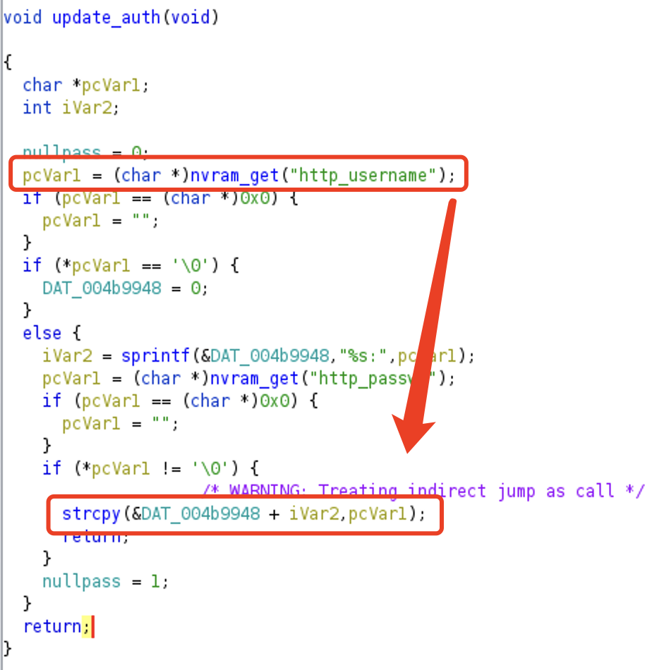
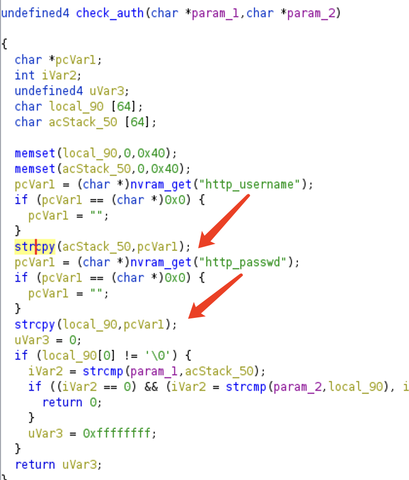

# Buffer Overflow in Netgear auth functions

An buffer overflow was found in update_auth and check_auth function of multiple products of Netgear. An authenticated attacker can set the http_passwd and http_username nvram field to a long string to exploit this vulnerability.

## Affected Version

* [JWNR2000v2](https://www.netgear.com/support/product/jwnr2000v2)
  * [1.0.0.11](https://www.downloads.netgear.com/files/GDC/JWNR2000V2/JWNR2000v2_WNR1500-V1.0.0.11_1.0.1.zip) (Latest)
  * [1.0.0.8 (All regions except North America)](https://www.downloads.netgear.com/files/GDC/JWNR2000V2/JWNR2000v2%20Firmware%20Version%201.0.0.8%20(All%20regions%20except%20North%20America).zip)

* [XWN5001](https://www.netgear.com/support/product/xwn5001)
  * [0.4.1.1](https://www.downloads.netgear.com/files/GDC/XWN5001/XWN5001-V0.4.1.1.zip) (Latest)
* [XAVN2001v2](https://www.netgear.com/support/product/xavn2001v2)
  * [0.4.0.7](https://www.downloads.netgear.com/files/GDC/XAVN2001/XAVN2001-V0.4.0.7.zip) (Latest)

## The Vulnerability

Take JWNR2000v2 1.0.0.11 as an example, the attacker can change password through `password` function at 0x413258 in `usr/sbin/uhttpd`. If he change the password to a long string, it will trigger the vulnerability in `update_auth` function or `check_auth` function.

## Timeline