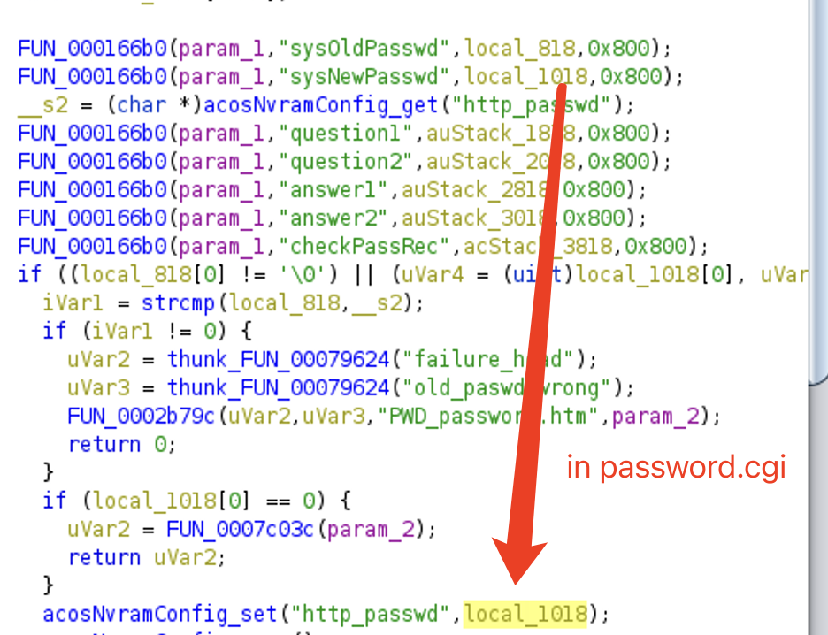
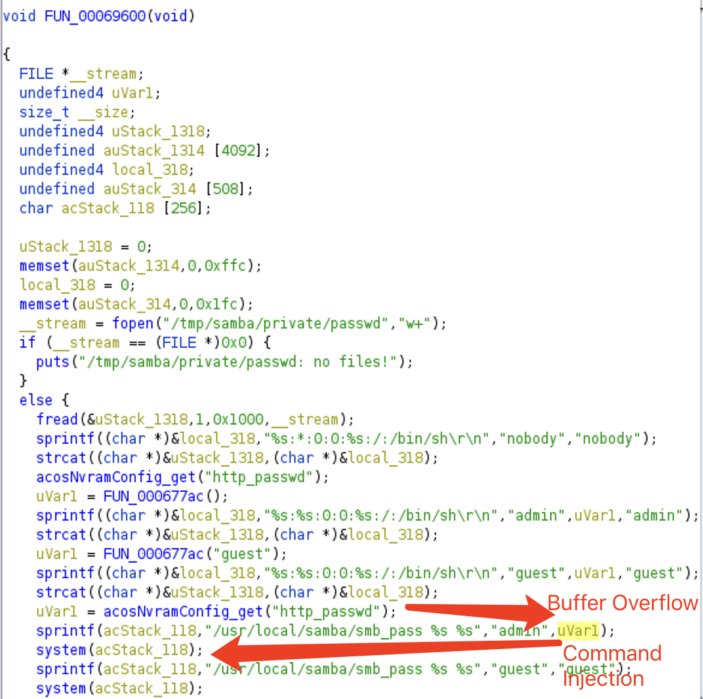

# SMB smb_pass Buffer Overflow & Command Injection Vulnerabilities

An authenticated attacker may leverage http_passwd and http_username field in nvram to trigger command injection and buffer overflow vulnerabilities to execute arbitary commands when httpd invoking smb_pass command.

## Affected Product & Versions

Following are versions where we found the vulnerabilities. Other versions may also be vulnerable.

* [DC112A](https://www.netgear.com/support/product/dc112a)
  * [1.0.0.64](https://www.downloads.netgear.com/files/GDC/DC112A/DC112A_V1.0.0.64_1.0.64.zip) Latest
* [EX6200](https://www.netgear.com/support/product/ex6200)
  * [1.0.3.94](https://www.downloads.netgear.com/files/GDC/EX6200/EX6200-V1.0.3.94_1.1.128.zip) Latest
* [R6300v2](https://www.netgear.com/support/product/r6300v2)
  * [1.0.4.8](https://www.downloads.netgear.com/files/GDC/R6300V2/R6300v2-V1.0.4.8_10.0.77.zip) Old

## The Vulnerability

Following I will showcase the vulnerability in DC112A

First, the attacker can set `http_passwd` parameter in nvram via password.cgi

Then, when the system set smb password with smb_pass, there is a potential buffer overflow and command injection vulnerability. Attackers can set the password to a long enough string, e.g., `'a' * 0x200` to trigger buffer overflow; or they can set the password to `';$(CMD)'` to execute arbitary command to take the full control of the system.

The attacker can also control EX6200 1.0.3.94 with password.cgi at 0x24d58 and the vulnerable function at 0x42d94.

Beside, the `http_username` field may be also vulnerable to this kind of attack.

## Timeline