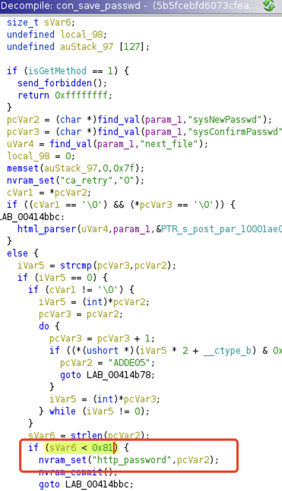
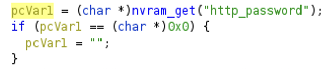
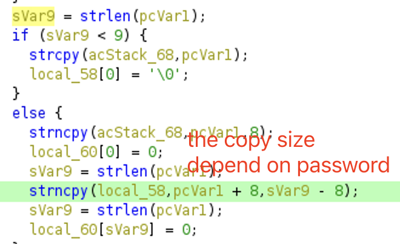

# Buffer Overflow in DGN3500 create_smb_cfg

An authenticated attacker may leverage http_password and field in nvram to trigger buffer overflow vulnerabilities, causing DOS in Netgear DGN3500.

## Affected Product & Versions

We found this vulnerability in [DGN3500](https://www.netgear.com/support/product/dgn3500) [1.1.00.37 (North America Only)](https://www.downloads.netgear.com/files/GDC/DGN3500/DGN3500-V1.1.00.37NA.zip).

## The Vulnerability

First, an authenticated attacker can set `http_password` parameter in nvram via setup.cgi, which limit the length of password to 0x80

But in `/usr/sbin/rc` `create_smb_cfg` function use a smaller buffer starting at sp-0x58 to hold the password. So the attacker can craft a password like `'a' * 0x80` to overflow the stack, causing denial of service

## Timeline