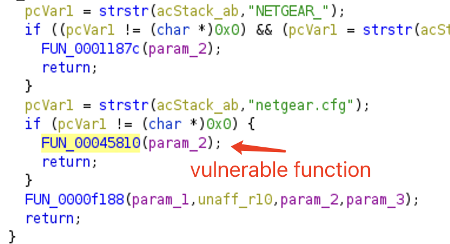

# Netgear NVRAM SSID-like Vulnerabilities

A lot of ssid-like nvram key are vulnerable to buffer overflow, and could be leveraged by authenticated attackers to cause (permanent) denial of service or arbitrary command injection.

## Cause of These Vulnerabilities

These vulnerabilities are caused because developers don't validate the length ssid-like fields before setting them or when using them.
Specifically, they are usually read from http requests and are directly written into nvram with `acosNvramConfig_set`.

Therefore, to fix these vulnerabilities, developers can validate the length of each ssid read from http requests or nvram.
I also strongly recomment developers to check every use of `ssid-`related fields.

In following sections, we denote sites of invocation of `acosNvramConfig_set` as setting sites, and sites of triggering buffer overflow vulnerabilities as triggering sites.

## Affected Products

Based on our analysis, we found following product models whose latest firmware is potentially vulnerable to attacks:

* [R6700v3](https://www.netgear.com/support/product/r6700v3)
  * version: [1.0.4.98](https://www.downloads.netgear.com/files/GDC/R6700v3/R6700v3-V1.0.4.98_10.0.71.zip)
* [R6900](https://www.netgear.com/support/product/r6900)
  * version: [1.0.2.8](https://www.downloads.netgear.com/files/GDC/R6900/R6900-V1.0.2.8_10.0.38.zip)
* [R6900P](https://www.netgear.com/support/product/r6900p)
  * version: [1.3.3.154](https://www.downloads.netgear.com/files/GDC/R6900P/R6900P-V1.3.3.154_10.1.86.zip)
* [EX6200](https://www.netgear.com/support/product/ex6200#download)
  * version: [1.0.3.94](https://www.downloads.netgear.com/files/GDC/EX6200/EX6200-V1.0.3.94_1.1.128.zip)
* [XR300](https://www.netgear.com/support/product/xr300#download)
  * version: [1.0.3.78](https://www.downloads.netgear.com/files/GDC/XR300/XR300-V1.0.3.78_10.3.58.zip)
* [R6400](https://www.netgear.com/support/product/r6400)
  * version[1.0.1.78](https://www.downloads.netgear.com/files/GDC/EX7300/EX7300-EX6400-V1.0.1.78.zip)
* [R6400v2](https://www.netgear.com/support/product/r6400v2)
  * version: [1.0.4.98](https://www.downloads.netgear.com/files/GDC/R6400v2/R6400v2-V1.0.4.98_10.0.71.zip)
* [DG834Gv5](https://www.netgear.com/support/product/dg834gv5#download)
  * version: [1.6.01.34](https://www.downloads.netgear.com/files/GDC/DG834GV5/DG834Gv5-V1.6.01.34.zip)
* MBR624GU (very old product, may not be used)

I believe other product models and versions also suffer this kind of vulnerability. I will show several affected products.

## EX6200

`"wla_temp_ssid"` and can be manipulated in following sites.
These sites invoke `acosNvramConfig_set` to set the key to an unvalidated network inputs in `usr/sbin/httpd`. Here I list some of them, but note that there are more other similar setting sites. Many other keys formatted like `"wla_*ssid"` and `"wlg_*ssid"` are also potentially vulnerable.

|Key|Entry|Entry Addr|Set Addr|
|--|--|--|--|
|wla_temp_ssid|ia_select_network.cgi|0x642fc|0x64fa8|
|wla_temp_ssid|ia_select_network.cgi|0x642fc|0x64d80|
|wla_temp_ssid|wiz_manual_set.cgi|0x66608|0x666a4|
|wla_temp_ssid|ia_ap_setting.cgi|0x05d218|0x5e3d4|
|wla_temp_ssid|ia_apclient_set.cgi|0x631bc|0x6322c|
|wla_temp_ssid|ia_manual_ssid.cgi|0x62970|0x629e0|
|wla_temp_ssid|ia_ap_setting.cgi|0x5d218|0x5e3d4|

Then, when users or attackers access `ia_select_network.cgi`, the vulnerability can be triggered in function at 0x61144.
Following figure shows some vulnerable sites.

## XR300

Similar to previous vulnerabilities. The setting site can be in `genie_ap_wifi_change.cgi`, and the triggering sites can be `nd_wireless.cgi` for `"wla_ssid"` and `"wlg_ssid"`.

## R6900P

`"wla_ssid"` and `"wlg_ssid"` can be exploited
* Setting sites: `ia_ap_setting.cgi` handling function at 0xc0cfc and many others

* Triggering sites: function starting at 0x90744

## DG834Gv5

`"wla_ssid"` and `"wla_temp_ssid"` can be manipulated by attackers through `bsw_ssid.cgi`. 

By setting `"wla_temp_ssid"` to a long string (e.g., 'a' * 0x100) the attacker can trigger the buffer overflow vulnerability in `blk_getssid` function

This attacker can also trigger the vulnerability through `wla_ssid` by accessing `netgear.cfg`.

## Disclosure