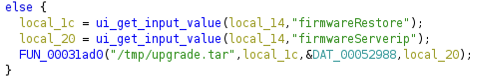
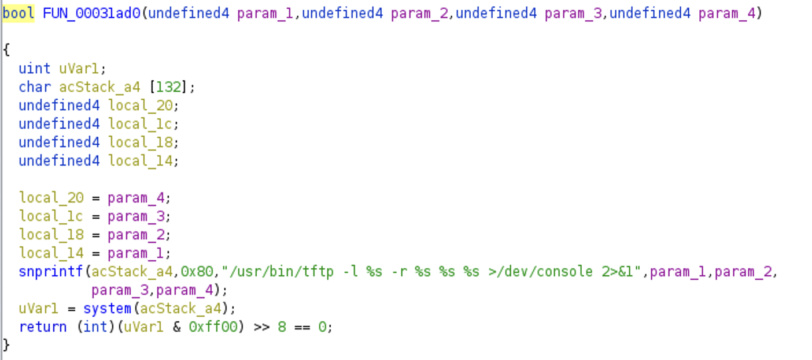

# Netgear路由器upgrade_handler命令注入漏洞

Netgear的WG302v2和WAG302v2产品存在系统级命令注入漏洞。一个认证后的攻击者可以通过网页中固件升级的功能中的firmwareServerip和firmwareRestore参数来执行任意命令。

## 已知受影响产品和版本

* [WG302v2](https://www.netgear.com/support/product/wg302v2#download)
  * [5.2.9](https://www.downloads.netgear.com/files/GDC/WG302V2/WG302v2%20Firmware%20Version%205.2.9.zip)
* [WAG302v2](https://www.netgear.com/support/product/wag302v2#download)
  * [5.1.19](https://www.downloads.netgear.com/files/GDC/WAG302V2/WAG302v2%20Firmware%20Version%205.1.19%20(North%20America).zip)

## 漏洞描述

在upgrade_handler函数中，firmwareRestore和firmwareServerip这两个参数用于从用户的HTTP请求中读取网络地址输入，这些输入被发送到下图所示的FUN_00031ad0函数中，用于下载对应的固件。

在FUN_00031ad0这个函数中，上述的两个参数被拼接到格式化字符串中，紧接着格式化后的字符串被传入system()用于命令执行。然而这两个参数没有在这个过程中被检查。所以攻击者可以构造以';'字符开头和结尾的输入来注入恶意命令，从而可以随意操控修改路由器

类似漏洞之前已经在D-Link的路由器中被被发现，见[CVE-2019-20500](https://nvd.nist.gov/vuln/detail/CVE-2019-20500)，但是没有在Netgear的路由器产品中被披露。由于CVE-2019-20500经常被攻击者利用，已经被美国联邦民事行政部门要求必须修复，见[下文](https://m.freebuf.com/articles/371012.html)。
