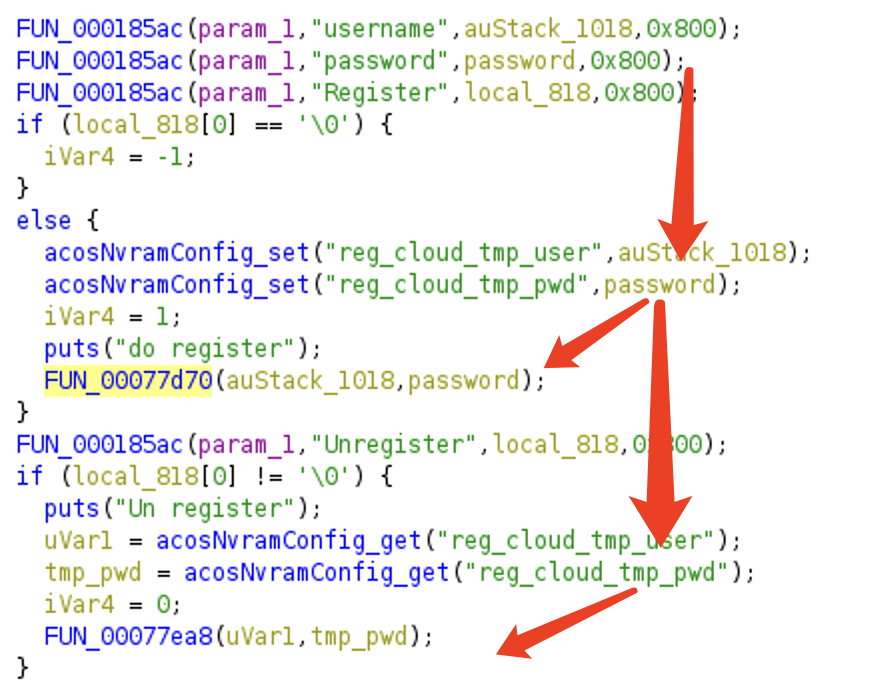
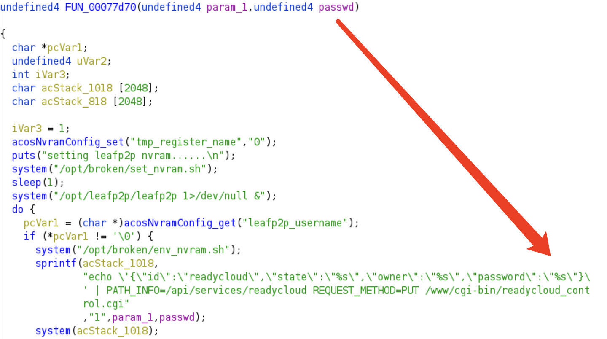
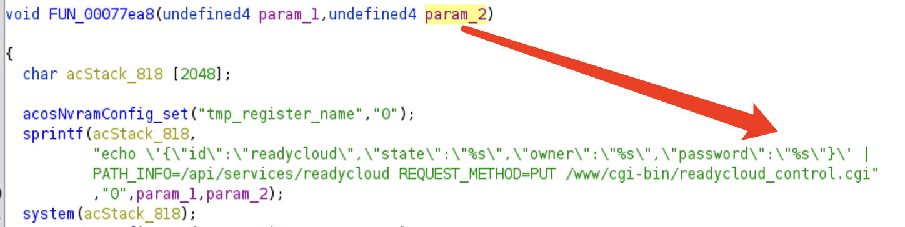

# Netgear usb_remote_invite.cgi unvalidated password

A command injection vulnerability was found in the latest version netgear R7100LG firmware. The vulnerability can be exploited by attacker through password parameter of usb_remote_invite.cgi

## Affected Range

the latest version ([1.0.0.78](https://www.downloads.netgear.com/files/GDC/R7100LG/R7100LG_V1.0.0.78_1.0.6.zip )) of [R7100LG](https://www.netgear.com/support/product/r7100lg)

## Exploit Approach

The attacker can use password parameter in usb_remote_invite.cgi to trigger command injection or buffer overflow.

The two function FUN_00077d70 and FUN_00077ea8 are vulnerable to CWE-134: use of externally controled formatted string

## Timeline